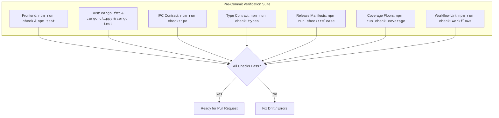

# Contributing to GitPulse

Thank you for contributing to GitPulse! We welcome pull requests, bug reports, and feature proposals.

---

## 1. Development Prerequisites

Ensure you have the following tools installed on your development machine:

| Tool | Version | Why this floor |
| --- | --- | --- |
| **Node.js** | `22.x` or later | The version CI runs (`.github/workflows/ci.yml`). Vite 6 and Vitest 3 require `>=20`; 22 is what release builds are verified against. |
| **Rust** | `stable`, edition 2021 | Needs the `clippy` and `rustfmt` components — CI fails on either. `rustup component add clippy rustfmt` |
| **cargo-llvm-cov** | latest | Generates the Rust LCOV report that `npm run ci:local` enforces coverage floors against. `rustup component add llvm-tools-preview` then `cargo install cargo-llvm-cov --locked` |
| **actionlint** | latest | Lints the GitHub Actions workflows in `npm run ci:local`. `release.yml` runs only on a `v*` tag, so this is the only gate that reads it before a release. `brew install actionlint` |
| **Git** | any maintained release | Not just for version control: GitPulse shells out to `git` for every repository operation, so the binary on your `PATH` is part of the runtime. |
| **GitHub CLI** (`gh`) | optional | Only the GitHub panel (PRs, issues, workflow runs, Dependabot alerts) uses it. Everything else works without it. |

**Platform toolchains** — Tauri builds a native binary, so each OS needs its own:

- **macOS**: Xcode Command Line Tools (`xcode-select --install`). Universal release builds additionally need the `aarch64-apple-darwin` and `x86_64-apple-darwin` targets.
- **Windows**: the MSVC build tools and the WebView2 runtime (preinstalled on Windows 11 and current Windows 10).
- **Linux (Ubuntu/Debian)**:
  ```sh
  sudo apt-get install -y libwebkit2gtk-4.1-dev libgtk-3-dev build-essential curl wget file libxdo-dev libssl-dev libayatana-appindicator3-dev librsvg2-dev pkg-config
  ```

---

## 2. Getting Started

Clone the repository and launch the development environment:

```sh
# 1. Clone the repo
git clone https://github.com/bharathvbcr/GitPulse.git
cd GitPulse

# 2. Install frontend dependencies
npm install

# 3. Start Tauri in development mode (hot-reloads Rust & Svelte)
npm run tauri dev
```

> [!NOTE]
> The dev launcher automatically finds a free Vite port (5173, falling back through 5174–5193). Set `GITPULSE_DEV_PORT=<port>` to pin a custom port.

---

## 3. Running the Tests

**One command runs everything CI runs:**

```sh
npm run ci:local
```

That is the gate. If `npm run ci:local` is green, `.github/workflows/ci.yml` and
`.github/workflows/coverage.yml` will both be green on all three platforms. Run it
before opening a pull request.

It expands to the full suite — frontend type check, Vitest under V8 coverage, Vite
build, `cargo fmt`, `cargo clippy -D warnings`, the Rust suites under `cargo llvm-cov`,
and `npm run check:coverage` to enforce the floors against the two LCOV reports those
runs just produced. It regenerates both reports rather than trusting whatever is left
on disk, so a stale `lcov.info` can never be mistaken for a passing check. While
iterating you will usually want the narrower commands instead:

| Command | Scope | Typical runtime |
| --- | --- | --- |
| `npm test` | Vitest suite (~1,890+ tests across `src/`) | seconds |
| `npx vitest run src/lib/graph` | One directory | sub-second |
| `npx vitest watch` | Re-runs on save | continuous |
| `npm run coverage` | Vitest with V8 coverage into `coverage/` | ~1 min |
| `cargo test --manifest-path src-tauri/Cargo.toml` | Rust unit + integration suites (~200+ tests) | ~1 min |
| `cargo test --manifest-path src-tauri/Cargo.toml updates::` | One Rust module | seconds |
| `npm run check:coverage` | Validate both LCOV reports and enforce floors (needs a prior `npm run coverage` and `cargo llvm-cov` run) | seconds |

### Test conventions

- **Frontend tests sit next to the code** — `foo.ts` is tested by `foo.test.ts`, or by
  `__tests__/foo.test.ts` where a directory has many. Both layouts are in use; match
  the directory you are editing.
- **Suffixes carry meaning.** `.stress.test.ts` covers scale and pathological
  topologies, `.fuzz.test.ts` feeds randomized input, `.property.test.ts` asserts
  invariants rather than examples. A change to the graph renderer or lane solver is
  expected to keep the existing stress suites green, not to weaken them.
- **Rust tests are inline `#[cfg(test)] mod tests`** in the module they cover.
  Anything touching the filesystem uses `tempfile` and sets an explicit git identity —
  CI runners have no global `user.name`, and a test that assumes one fails only there.
- **Every bug fix ships with a test that fails against the unfixed code.** This is the
  one review comment you can count on receiving.

---

## 4. Contract Verification

GitPulse enforces strict contracts between the Rust backend and TypeScript frontend.
These are not style checks — each one catches a class of drift that types alone cannot:



| Command | Purpose |
| --- | --- |
| `npm run check` | Runs `svelte-check` and `tsc` type validation |
| `npm test` | Runs the Vitest frontend unit and integration test suite (1,890+ tests) |
| `npm run check:ipc` | Verifies the Rust `cmd_*` registry (95 handlers) and frontend `invoke()` calls match with zero untracked orphans |
| `npm run check:types` | Verifies that coverage and terminal serde structs in Rust match TypeScript interfaces field-for-field (62 fields) |
| `npm run check:release` | Asserts all version manifests (`package.json`, `package-lock.json`, `tauri.conf.json`, `Cargo.toml`, `Cargo.lock`) are in sync |
| `npm run check:coverage` | Validates both LCOV reports structurally and enforces the coverage floors (frontend 90% lines / 85% branches, Rust 80% lines); a report that cannot be parsed fails loudly rather than passing by default. `--json` emits the same verdict for a machine |
| `npm run check:workflows` | Lints every workflow with actionlint; a missing actionlint exits 2 (could not run) rather than 1 (workflows are faulty) |
| `npm run release:notes -- --tag vX.Y.Z` | Prints the changelog section the release workflow will use as the release body; exits 1 if that tag has no section |
| `npm run ci:local` | Executes the complete local CI suite (format, clippy, tests, builds, coverage floors) in one command |
| `cargo clippy --manifest-path src-tauri/Cargo.toml --all-targets -- -D warnings` | Rust linting (warnings treated as errors) |
| `cargo test --manifest-path src-tauri/Cargo.toml` | Rust backend test suite |

---

## 5. Architecture Orientation

GitPulse is a **Tauri 2** desktop app: a Rust core that owns every privileged
operation, and a Svelte 5 frontend that owns rendering and interaction. They meet at
exactly one seam — `invoke("cmd_*")` — and that seam is machine-checked (§4).

```
GitPulse/
├── src/                  Svelte 5 + TypeScript frontend
│   ├── lib/stores/       Reactive state (repo, graph, filter, theme, toasts, modals)
│   ├── lib/components/   UI components; one .svelte + one .test.ts each
│   ├── lib/canvas/       GPU-accelerated commit-graph renderer
│   ├── lib/views/        View registry + navigation (routerless, 13 views)
│   └── lib/<domain>/     Pure logic: files, diff, filter, graph, coverage, health…
└── src-tauri/src/        Rust core
    ├── commands/         #[tauri::command] handlers — the ONLY IPC entry points (95 handlers)
    ├── engine/           git CLI wrapper: reader, writer, worktrees, sandboxing
    ├── graph/            Lane solver, topology index, bezier geometry, folding
    ├── analyzer/         Language detection, LOC, coverage, dependency health
    ├── harness/          MANVI policy gate, sidecar protocol
    ├── github/           gh CLI integration (PRs, issues, runs, Dependabot)
    ├── updates/          Opt-in release check
    └── terminal/ diff/ storage/ watcher/ stack/ ai/ desktop/
```

### The layers, and what each one owns

**1. Rust core — the only thing that touches the system.**
No frontend code shells out, reads a file, or opens a socket. Every such operation is
a `cmd_*` handler. `engine/git_cli.rs` is the canonical owner of process execution: it
strips ambient `GIT_*` configuration, disables terminal prompts and interactive
credential helpers, and bounds both output size and wall-clock time. New code that
runs a process goes **through** it, not beside it.

**2. The IPC seam — narrow, typed, and verified.**
A command is added in four places, in this order: implement in
`src-tauri/src/commands/`, register in `src-tauri/src/lib.rs`, invoke from a store or
component, then run `npm run check:ipc`. A handler with no caller and a call with no
handler both fail the build.

**3. Svelte 5 stores — the state machines.**
State lives in stores, not components. `repoStore` owns the repository lifecycle
(open, tabs, status polling, mutations); `graphStore` owns history loading and lane
layout; `filterStore`, `themeStore`, `interfaceStore`, `modalStore`, and `toastStore`
own their slices. Components subscribe and render; they do not own durable state.

**4. Views — routerless.**
There is no router. `src/lib/views/viewRegistry.ts` is the single source of truth for
which views exist and how they are reached. Adding a view means adding a registry
entry, not a route.

**5. The canvas renderer — the hot path.**
The commit graph is drawn on a canvas, not in the DOM, because thousands of rows in
the DOM will not hold 60fps. Everything under `src/lib/canvas/` is performance-
sensitive and covered by stress and fuzz suites. Treat a regression there as a bug
even when the picture still looks right.

### Async hygiene

Repository switching is the source of most race conditions in this codebase: a slow
response for repository A must never paint into repository B. Any component-level
async work uses `createAsyncGuard` (`src/lib/async/guard.ts`), which discards results
whose request is no longer current. This is not optional — it is the reason tab
switching is safe.

For the full treatment — runes and dependency injection, subsystem responsibilities,
renderer internals — see **[docs/ARCHITECTURE.md](docs/ARCHITECTURE.md)**.

---

## 6. Coding Standards

1. **One canonical owner.** Do not stand up a second registry, utility, or command
   path beside an existing one. Extend the view registry, the command handlers, and
   `git_cli` rather than duplicating them.
2. **Strict IPC contracts.** See §4 and §5. `npm run check:ipc` must report zero drift.
3. **Async hygiene.** Use `createAsyncGuard` for component-level async work.
4. **No unchecked casts.** No `any`, no loose casts. Model every IPC payload with a
   strict type; the Rust struct and the TypeScript interface must agree field for
   field.
5. **A check that could not run must not report success.** When an operation cannot be
   performed — no `gh`, no network, no manifest — say so explicitly. "Could not check"
   and "checked, nothing found" are different answers, and the codebase keeps them
   distinct (see `warnings` / `error` fields on the GitHub and coverage payloads).
6. **Bound every external interaction.** Timeouts, output caps, and result limits are
   required, not defensive extras. Report truncation rather than silently returning a
   partial list as if it were complete.
7. **Atomic changes.** One coherent concern per pull request.

---

## 7. Submitting a Pull Request

1. Branch from `main`.
2. Make the change, with tests.
3. Run `npm run ci:local` until it is green.
4. Open the PR and fill in
   [the template](.github/PULL_REQUEST_TEMPLATE.md) — it is a short checklist, not
   paperwork.
5. Use [Conventional Commits](https://www.conventionalcommits.org/) for commit
   subjects (`feat:`, `fix:`, `docs:`, `test:`, `chore:`, `perf:`). GitPulse parses
   these in its own commit filter, so the repository holds itself to them.

### Looking for something to work on?

- **[docs/GOOD_FIRST_ISSUES.md](docs/GOOD_FIRST_ISSUES.md)** — a curated backlog of
  scoped, self-contained tasks with the files to touch and how to verify each one.
- Issues labelled [`good first issue`](https://github.com/bharathvbcr/GitPulse/labels/good%20first%20issue)
  and [`help wanted`](https://github.com/bharathvbcr/GitPulse/labels/help%20wanted).

### Recognition

Every kind of contribution counts — code, documentation, design, bug reports, testing,
ideas. GitPulse uses the [All Contributors](https://allcontributors.org/)
specification; contributors are listed in the README. To add someone (including
yourself), comment on any issue or PR:

```
@all-contributors please add @username for code, doc
```

---

## 8. Reporting Security Issues

Do **not** open a public issue for a security vulnerability. Follow
**[docs/SECURITY.md](docs/SECURITY.md)**.
