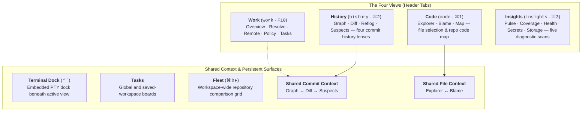
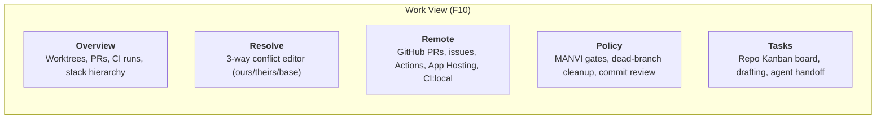
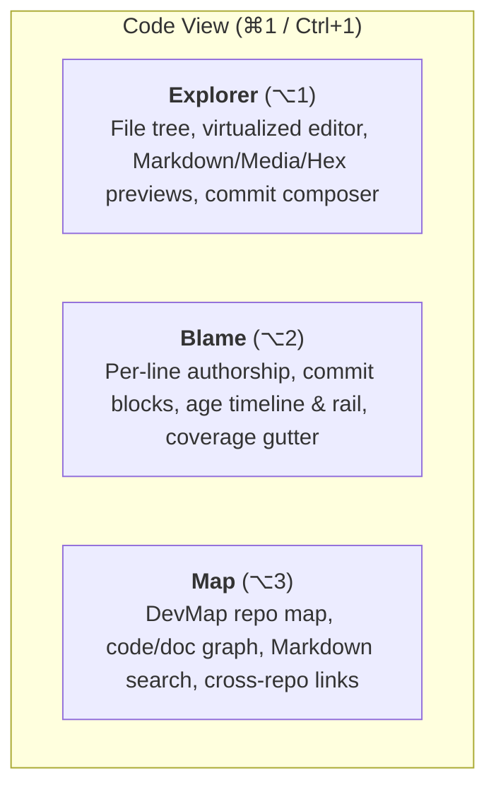
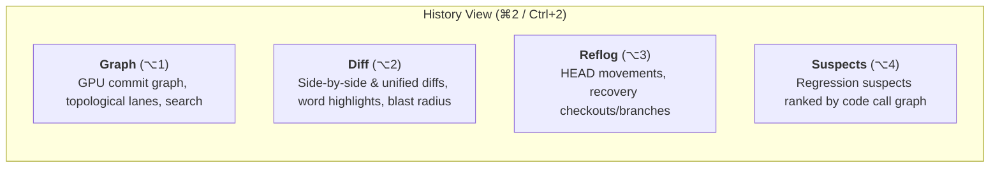
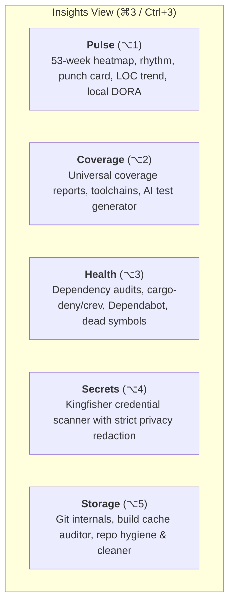

# GitPulse Features & View Catalog

GitPulse is a high-performance native desktop client for Git, repository management, task planning, and code intelligence, built with Rust (Tauri 2) and Svelte 5.

---

## Four views, one workspace

GitPulse has 4 application views. Each view keeps related sections together.

| View | What you do here | Sections |
| --- | --- | --- |
| **[Work](#1-work-work)** | Track work in flight, resolve conflicts, organize tasks | Overview · Resolve · Remote · Policy · Tasks |
| **[Code](#2-code-code)** | Browse files, inspect authorship, explore structure | Explorer · Blame · Map |
| **[History](#3-history-history)** | Follow commits, review changes, find recovery points | Graph · Diff · Reflog · Suspects |
| **[Insights](#4-insights-insights)** | Inspect activity, coverage, dependencies, secrets, and disk usage | Pulse · Coverage · Health · Secrets · Storage |

**Shared Context across sections:**
- **Graph, Diff and Suspects** share the selected commit (`selectedCommitId` in `graphStore`), so switching lenses never loses the commit or regression window you are reviewing.
- **Explorer and Blame** share the selected file (`selectedFilePath` in `repoStore`), so jumping from syntax editing to line authorship keeps your active file.
- **Overview** embeds the branch stack hierarchy directly as a collapsible card, linking stacked branches to active worktrees and pull requests.
- **[Fleet](#53-fleet--the-whole-workspace-at-once-cmdshiftf)** compares repositories across the workspace, evaluating uncommitted churn, sync state, and health.
- **[Tasks](#54-global--saved-workspace-tasks)** opens global and saved-workspace Kanban and list boards across repositories.
- The **[Terminal dock](#51-terminal--a-dock-not-a-view-ctrl)** stays available beneath whichever view is on screen, preserving PTY output across view switches.

---

## Product Stack & Design Principles

1. **Modular Engine**: DevCouncil provides independently updatable modules (`devmap` CLI, SQLite code intelligence store, and code graph). Manvi wraps DevCouncil modules to enforce command/file-write policy gates, workbench sessions, and agent hosting. GitPulse uses these modules without forcing a monolithic suite requirement.
2. **Local-First & Private**: Repository analysis, blame computation, graph lane solving, and search run entirely on-device. No telemetry, code snippets, or secrets leave your machine.
3. **Honest Accounting**: A check that did not run is never badged as clean. If a scan was capped by a payload limit or cancelled, it explicitly reports `shown / total / truncated` or `unverified`, rather than implying a passing result.
4. **Desktop Native UI**: On macOS, GitPulse features glass surfaces and liquid transitions over a transparent, desktop-blurring window (`MACOS_APPEARANCE.md`), with high-contrast opaque code, diff, and graph viewports.

---

## 1. Work (`work` · Shortcut: `F10`)

Everything in flight, and the actions that unblock it. Keyed on the **worktree** (the physical place changes live), or on a DevCouncil task when a store exists.

### 1.1 Overview
- **One Row Per Place Work Is Happening**: Merges linked worktrees, active pull requests, workflow runs, policy verdicts, and grants into one row each.
- **Keyed On Physical State**: When a DevCouncil store is present, rows join by task. Without one, the unit is the **worktree**, where uncommitted changes, parked operations, and branches actually reside.
- **Agent Worktree Detection**: Detects worktrees created under `/.<agent>/worktrees/` (Claude Code, Cursor, Codex) based on directory layout (never by branch name). Stale agent workspaces and manual worktrees are distinguished to prevent accidental pruning.
- **Blocked Worktrees Outrank Active Ones**: Any worktree parked mid-merge, rebase, cherry-pick, or revert is highlighted at the top, since it requires human intervention. Clicking a blocked row opens that worktree directly in Resolve.
- **Standing Branch Status Strip**: Above the rows, a dedicated strip displays the checked-out branch status: upstream tracking (`↑`/`↓`), commits behind default branch, and uncommitted working-tree churn (staged, unstaged, conflicted). Progressive passes state *"sync not measured yet"* rather than displaying a misleading `0↑ 0↓`.
- **Count Tiles as Filter Doors**: Tiles in the summary strip act as filters for matching rows. Strip and row lists share an identical predicate, ensuring count indicators match visible cards.
- **Worktree Copy-on-Write Build Cache Sync**: Automatically clones build caches (`node_modules`, `target`, `.venv`, `.build`) from the main checkout using APFS `clonefile` on macOS or `FICLONE` on Linux, saving gigabytes of disk space and setup time.
- **Worktree Named Localhost Routing**: Detects running `portless` instances to assign named localhost URLs (`http://<worktree>.localhost/`), or falls back to stable deterministic ports derived from the worktree name.
- **Worktree Lifecycle Hooks**: Trusted repositories can configure `post_create`, `pre_merge`, and `post_merge` shell hooks in `.gitpulse/hooks.toml`. Untrusted repositories refuse lifecycle hook execution.
- **Embedded Branch Stack Hierarchy**: Renders stacked branches as a tree (parents above, children indented). Displays upstream tracking and commit distance. Restacking recomputes fork points from recorded tips (immune to reflog expiration) and rebases parent-before-child with rollback safety.
- **Remotes, Submodules & Stash Management**: Collapsible drawer to add, rename, re-point, or prune remotes; initialize and sync submodules; preview and apply stashes.

### 1.2 Resolve
- **3-Way Visual Conflict Editor**: Clear three-pane visual comparison between *ours* (current branch), *theirs* (incoming branch), and *base* (common ancestor).
- **One-Click Chunk Resolution**: Dedicated buttons to accept current, accept incoming, or combine both changes sequentially.
- **Marker Navigation**: Step directly through conflict markers (`<<<<<<<`, `=======`, `>>>>>>>`) across all conflicted files in the repository.
- **Operation Unblocking**: Resolving conflicts automatically updates Git index state, allowing one-click completion of parked merges, rebases, or cherry-picks.

### 1.3 Remote & Local CI
- **Dual-Column Layout**: The wide column displays pull requests and issues for fast review; the CI rail groups workflows, active runs, and releases.
- **PR & Issue Management**: Filter chips (`All`, `Awaiting review`, `Failing`, `Drafts`) with live count badges. Includes one-click checkout of PR branches and compare links.
- **Actions Dispatch & Live Polling**: View GitHub Actions workflow runs, inspect jobs/steps, and trigger manual `workflow_dispatch` runs. While runs are active, GitPulse polls run status with backoff; polling stops once runs settle.
- **Run Duration & Verdict Timelines**: Scaled visual timeline of recent CI runs showing pass rate fractions (e.g. `60% (3/5)`), median run duration, and verdict coloring. Queue wait time is excluded from execution metrics.
- **Firebase App Hosting Rollout Monitoring**: For projects with `firebase.json` or `.firebaserc`, GitPulse lists App Hosting backends and maps rollouts to exact commit SHAs. Two-step confirmation prevents accidental deployments to production.
- **CI:Local Test Runner**: Runs the repository test matrix locally before pushing. When DevMap is indexed, test commands are scoped to **affected test files**; if the index is stale or partial, it fails closed to the full suite with an explanatory badge.

### 1.4 Policy (Manvi Wrap)
- **Policy Gate Monitor**: Real-time inspection of Manvi command execution and file write gates.
- **Dead-Branch Cleanup**: Scans local and remote branches for age, protection, and merged status (including squash and rebase merges via `git merge-tree`). Before deletion, branch tips are backed up to the ledger; each deletion requires authorization and can be restored with one click.
- **Commit Review**: Audits unpushed outgoing commits against review rules, displaying reviewed vs total counts.
- **Release Publisher**: Preflight checks (clean working tree, synced upstream) before tagging and publishing SemVer releases.

### 1.5 Tasks
- **Repository Task Board**: Kanban board and list views for repository bugs, issues, features, and tasks.
- **Faceted Filters & Search**: Full-text search with priority, type, owner, label, and due-date filters.
- **Manvi AI Drafting Suggestions**: Proposes title and description enhancements against saved task revisions with field locks and explicit acceptance.
- **Agent Handoff**: One-click copying of structured task briefs or drafts tailored for coding agents (Claude Code, Cursor, Codex).
- **Archive Dock & Deletion**: Dedicated dock for archived tasks (auto-archived when Done); allows full search, load-more, and restoring to active boards.

---

## 2. Code (`code` · Shortcut: `⌘1` / `Ctrl+1`)

The working tree and code intelligence view. Explorer and Blame share the selected file (`selectedFilePath`), while Map provides structural graph navigation.

### 2.1 Explorer
- **IDE File Tree**: Recursive tree navigation with real-time Git status badges (staged, unstaged, untracked, ignored).
- **High-Performance Virtualized Code Viewer**: Line-virtualized rendering capable of opening multi-megabyte source files without UI lag. Proportional row-height zoom scaling (`scaledRowHeight`, 70%–160%) prevents line clipping.
- **Dual-Backend Syntax Highlighting**: MarkDev tree-sitter grammars for Rust, JavaScript, TypeScript, Python, JSON, and shell; optimized regex tokenization for all other languages.
- **In-File Search & Go to Line**: Regex (`.*`) and case-sensitive (`Aa`) search with match counters, previous/next navigation, and modal line jumping (1–N).
- **Inline Text Editor**: Instant toggle between syntax viewing and in-memory text editing with `⌘S` save shortcuts and dirty-state indicators.
- **Responsive Header Controls & Scroll Cues**: Toolbars feature horizontal auto-scrolling with `ScrollCue` visual markers and boundary-aware tooltip placement (`placeTooltipBubble`).
- **Specialized Preview Modes**:
  - **Markdown / MarkDev**: Rust flat parse model (UTF-16 offsets), outline navigation, task lists, tables, callout blocks, math rendering, and backlink exploration.
  - **Media & Images**: High-resolution image preview with dimensions, aspect ratios, and format inspection.
  - **Binary Hex Viewer**: Formatted byte-offset hex dump with ASCII decoded gutters.
- **Live Pulse Dashboard & Commit Composer**: Working-tree churn overview, instant staging buttons, and structured commit drafting (type, scope, subject). Features on-device Apple Intelligence fallback on macOS for phrasing suggestions, and pre-commit blast radius markers via `devmap preview`.
- **Status Bar Language Mix**: Toggle between lines-of-code (`loc`) and percentage (`percentage`) mode. Clicking a language filters Explorer to matching files.

### 2.2 Blame
- **Line Authorship Gutter**: Line-by-line commit author, commit age, and SHA, backed by stale-while-revalidate (SWR) caching and deep equality checks.
- **Commit Blocks**: Consecutive lines from the same commit are grouped under one header; hovering any line highlights the entire commit block across the file.
- **Code Age Timeline**: Chronological bar chart above the gutter showing the percentage of the file last modified in each time period (adapts from daily to yearly). Clicking any period filters the gutter to those exact lines.
- **Off-Axis Line Accounting**: Uncommitted, undated, and clock-skewed lines are represented as dedicated chips beside the timeline, ensuring 100% of file lines are accounted for.
- **Code Age Rail**: Right-edge heatmap strip showing where fresh vs mature code resides in the file, with an interactive viewport band for navigation.
- **Coverage Gutter**: Per-line test coverage hit counts displayed alongside authorship gutters, with explicit *Coverage unavailable* indicators if coverage data is missing.
- **Direct Commit Navigation**: Single click on any commit hash navigates straight to that commit's diff in History.

### 2.3 Map (DevMap Code Intelligence)
- **Repo Map Navigator**: Reads the resolved `repo_map.json` (`.devmap/repo_map.json` or `.devcouncil/repo_map.json`), exposing subsystems, entry points, critical files, and role-file counts.
- **Interactive Code & Doc Graph Canvas**: Visual canvas mapping symbols, dependencies, and documentation relationships. Includes filters to hide notes and Markdown nodes.
- **Repo Docs Vault**: Indexes all Git-tracked Markdown files (`git ls-files`). Features full-text search, broken link reports, and document backlinks.
- **Freshness & Incremental Builds**: Live status strip from `devmap status --json` (schema version, freshness, generation ID). Incremental watcher rebuilds stale indexes automatically (`devmap build --manifest`), respecting background `devmap serve` daemon locks.
- **Cross-Repository Search & Links**: Synchronizes open workspace tabs into `workspace.json`, enabling cross-repo symbol search and import-link candidate discovery.
- **Honest Diagnostics**: Capped results, schema mismatches, and `walk_incomplete` notices are explicitly displayed.

---

## 3. History (`history` · Shortcut: `⌘2` / `Ctrl+2`)

Four lenses on repository commit and regression history. Graph, Diff, and Suspects share the active commit (`selectedCommitId`), and the commit filter bar filters all sections simultaneously.

### 3.1 Graph
- **GPU Canvas Rendering**: High-performance canvas capable of rendering repositories with 100,000+ commits at 60 FPS.
- **Topological Lane Solver**: Stable-column lane assignment with nogap lookback guarantees. The default branch (`main` / `origin/main`) is pinned to the leftmost lane in a dedicated color.
- **Lineage-Preserving Commit Search**: Commit filter (`⌘F` / `FilterBar`) applies `author:`, `sha:`, `type:`, `path:`, and text terms in Rust before lane solving. Filtered-out commits hand lineage to their children, keeping surviving commits connected to their ancestors.
- **Badges & Avatars**: Author avatars, local head markers, remote tracking badges, and release tags.
- **Context Actions**: Right-click any commit to cherry-pick, revert, or create a branch.

### 3.2 Diff
- **True Side-By-Side Split & Unified Modes**: Derived from a single unified row model. Replacement blocks align deletions and additions across rows, avoiding horizontal stagger.
- **Horizontal Scrolling with Pinned Gutter**: Entire diff surface scrolls horizontally with line-number gutters pinned to the left margin.
- **Intra-Line Word Highlighting**: Highlights exact character and token additions/deletions within modified lines.
- **Embedded File Rail & Commit Picker**: Browse changed files and step through recent commits without switching back to Graph. Features path compression (e.g. `analyzer/mod.rs`), directory tree toggle, and file filtering.
- **Selective Patch Staging**: Stage or unstage individual diff hunks or selected line ranges directly from the view.
- **Diff Symbol Groups**: Semantic grouping of diff hunks under their enclosing functions or classes.
- **Symbol-Level Collision Notes**: Correlates active worktrees with DevMap symbol spans to warn if another branch touches the exact same function or symbol.
- **Layered Blast Radius & Rung Filter**: Explores upstream callers and downstream dependencies impacted by changed files, with hop-level breakdown and min-rung thresholds.
- **Image Comparison Modes**: Side-by-side, 2-up, and swipe comparison tools for image assets.

### 3.3 Reflog
- **Full HEAD Movement Audit**: Comprehensive history of checkouts, commits, rebases, amends, and resets.
- **One-Click Recovery Points**: Check out or create branches directly from detached reflog entries, easily recovering discarded or orphaned commits.

### 3.4 Suspects
- **Regression Suspects Finder**: Pinpoints which commit between a known-good ref and a failing commit introduced a defect.
- **Call-Graph Ranked Candidates**: Joins blame history with DevMap's symbol graph (`dc-regress`), ranking candidate commits by call-graph reachability from the symptom rather than simple chronological recency.
- **Direct Diff Inspection**: Clicking any suspect jumps straight to its diff.

---

## 4. Insights (`insights` · Shortcut: `⌘3` / `Ctrl+3`)

Five on-demand diagnostic and health scans. Every section is lazily loaded and adheres to strict honesty contracts: capped scans name their limits, and unrun checks are never reported as clean.

### 4.1 Pulse
- **53-Week Contribution Heatmap**: Visual activity grid of commits and code churn across all local and remote branches. Click any day to filter History.
- **Rhythm & Punch Card**: Longest streaks, active-day rates, and hour-of-week distribution with after-hours percentage.
- **LOC Trend & Churn by Extension**: Reconstructs lines-of-code growth by walking Git numstat backwards from the current language scan.
- **Commit Hygiene & Hotspot Risk**: Conventional-commit rates, signed-commit percentages, co-authorship rates, and files ranked by churn × coverage.
- **Local DORA Metrics**: Local approximations for deploy frequency, lead time, change-failure rate, and restore time derived from release tags.
- **Exportable SVG Card**: Generate standalone, self-contained SVG summary cards suitable for GitHub READMEs.

### 4.2 Coverage
- **Universal Report Discovery**: Automatically parses LCOV (`lcov.info`), Cobertura XML, Go cover (`cover.out`), Istanbul/NYC JSON, JaCoCo XML, and Clover XML.
- **Per-File Line & Branch Coverage**: Highlights covered, uncovered, and partially covered branches directly in the code viewer.
- **Toolchain Diagnostics**: Detects missing test coverage tools (`cargo-llvm-cov`, `pytest-cov`, `vitest`, etc.) and provides 1-click install suggestions.
- **DevCouncil Component Inventory**: Probes installed CLI tools (`devmap`, `manvi`, `dcstore`) and reports `devmap doctor` health checks.
- **MANVI AI Test Generator**: Analyzes uncovered functions and suggests runnable unit test scripts.

### 4.3 Health
- **Multi-Ecosystem Manifest Audits**: Scans package manifests using `npm audit`, `cargo-audit`, `pip-audit`, `govulncheck`, `composer audit`, and `bundler-audit`.
- **Supply-Chain Security Parsers**: Integrates `cargo deny` (SARIF) licenses/advisories and `cargo crev` (JSONL) trust reviews.
- **GitHub Dependabot & Code Scanning**: Fetches remote security alerts via the GitHub CLI (`gh`).
- **Dead-Symbol Analysis**: Identifies unreferenced symbols and dead code paths using DevMap call graph analysis.
- **Actionable AI Remediation**: Generates step-by-step dependency upgrade recommendations.

### 4.4 Secrets
- **Kingfisher Secret Scanner**: Deep scans working tree files for exposed API keys, private tokens, passwords, and certificates.
- **Strict Privacy Redaction**: Findings record rule ID, file path, and line number only. Secret values, matches, and surrounding code lines are never kept in memory, logged, or saved to disk.
- **Fail-Closed Verification**: Cancelled, truncated, or failed scans report as unverified, never as clean.

### 4.5 Storage
- **Git Internals Audit**: Breaks down disk usage across packfiles, loose objects, reflogs, Git LFS assets, and submodules.
- **Build & Cache Auditor**: Identifies unignored build directories (`target/`, `node_modules/`, `.venv/`, `dist/`).
- **Repo Hygiene & Build Cleaner**: Configurable cleanup policies for stale build output across Rust, Node, Go, Python, and JVM projects, with preview dry-runs and safe restoration.

---

## 5. Surfaces Beside the Views (Workspace & Global Features)

These features operate across views and repository boundaries.

### 5.1 Terminal — A Dock, Not a View (`⌃\``)
- **Embedded PTY Dock**: Native terminal emulator powered by `portable-pty` and `@xterm/xterm`, docked beneath whichever view is active.
- **Non-Intrusive**: Reading terminal output alongside a failing test, diff, or file requires no view switching.
- **Explicit Agent Sessions**: When launching Claude Code, Manvi, or Codex, a separate supervised agent session opens in the dock without reading or modifying ordinary user shell history.
- **Persistence**: Sessions survive view switching, repository tab switching, and hiding the dock.

### 5.2 Agents & MCP Integration (MCP 2.0)
- **Model Context Protocol**: Native support for MCP 2026-07-28 (`server/discover`, `resultType`, cacheable tool lists) and legacy 2024/2025 specs.
- **Plugin Bundle**: Canonical package under `plugins/gitpulse/` with Codex `.codex-plugin/plugin.json`, `.mcp.json`, and shared agent skills.
- **Read-Only Inspection Tools**: Exposes `gitpulse_insights`, `gitpulse_collision_risk`, `gitpulse_change_context`, and `gitpulse_active_changes` to connected agents.

### 5.3 Fleet — The Whole Workspace at Once (`⌘⇧F`)
- **Workspace Comparison Grid**: Compare all open and recent repositories in a unified table.
- **Three-Tier Cost Model**:
  - **Tier 0 (Free)**: In-memory working tree changes, sync counts, conflicts, stash, and parked operations.
  - **Tier 1 (Cheap Git)**: Worktrees, agent sessions, commit rhythm, and last activity timestamp.
  - **Tier 2 (Opt-In Deep Scans)**: Lines of code, language mix, disk usage, security audits, and coverage.
- **Fleet Pulse**: Aggregated 90-day commit rhythm and combined language mix across all open repositories.
- **Severity Bands**: Groups repositories into *Blocked by conflicts*, *Parked mid-operation*, and *Uncommitted work*.
- **Bulk Operations**: Multi-repository fetch, pull, and tab group organization.

### 5.4 Global & Saved-Workspace Tasks
- **Workspace-Level Task Management**: Reached via the **Tasks** button beside Fleet.
- **Saved Workspaces**: Group repositories and tasks into named workspaces that survive window restarts.
- **Full Drag & Keyboard Reordering**: Move tasks across Kanban status columns with keyboard shortcuts or drag-and-drop.

### 5.5 Command Palette (`⌘K` / `Ctrl+K`)
Fast multi-mode launcher across the entire application:
- `>` **Commands**: Access Git actions, views, sections, settings, and themes.
- `/` **Files**: Fuzzy search tracked and non-ignored files, opening them in Code → Explorer.
- `%` **Repositories**: Switch between open tabs or recent repositories.
- `#` **Commits**: Search commit history by SHA, message, or author, opening selected diffs.
- `@` **Branches**: Search local and remote branches with instant checkout.
- `:` **Symbols (Repository)**: Query DevMap symbols in the active repository.
- `::` **Symbols (Workspace)**: Cross-repository symbol search across open workspace tabs.
- `?` **Help & Shortcuts**: Keyboard shortcuts cheat sheet and documentation links.

---

## 6. Keyboard Shortcuts Reference

### 6.1 View & Section Navigation

| Target | macOS | Windows / Linux |
| --- | --- | --- |
| **Work View** | `F10` | `F10` |
| **Code View** | `⌘ 1` | `Ctrl+1` |
| **History View** | `⌘ 2` | `Ctrl+2` |
| **Insights View** | `⌘ 3` | `Ctrl+3` |
| **Fleet View** | `⌘ ⇧ F` | `Ctrl+Shift+F` |
| **Toggle Terminal Dock** | `⌃ \`` | `Ctrl+\`` |
| **Switch Sections within View** | `⌥ 1` – `⌥ 5` | `Alt+1` – `Alt+5` |

### 6.2 Workspace & Repositories

| Action | macOS | Windows / Linux |
| --- | --- | --- |
| **Open Repository…** | `⌘ O` / `⌘ T` | `Ctrl+O` / `Ctrl+T` |
| **Clone Repository…** | `⌘ ⇧ O` | `Ctrl+Shift+O` |
| **Close Repository Tab** | `⌘ ⇧ W` | `Ctrl+Shift+W` |
| **Reopen Closed Tab** | `⌘ ⇧ Y` | `Ctrl+Shift+Y` |
| **Next / Previous Tab** | `Ctrl Tab` / `Ctrl ⇧ Tab` | `Ctrl+Tab` / `Ctrl+Shift+Tab` |
| **Jump to Tab 1–9** | `Ctrl ⌥ 1–9` | `Ctrl+Alt+1–9` |
| **Settings / Preferences** | `⌘ ,` | `Ctrl+,` |
| **Command Palette** | `⌘ K` | `Ctrl+K` |

### 6.3 Git Operations

| Action | macOS | Windows / Linux |
| --- | --- | --- |
| **Refresh Repository** | `⌘ R` | `Ctrl+R` |
| **Fetch from Remote** | `⌘ ⇧ K` | `Ctrl+Shift+K` |
| **Pull from Remote** | `⌘ ⇧ P` | `Ctrl+Shift+P` |
| **Push to Remote** | `⌘ ⇧ U` | `Ctrl+Shift+U` |
| **Commit Composer (Send)** | `⌘ Enter` | `Ctrl+Enter` |
| **Search / Filter Commits** | `⌘ F` | `Ctrl+F` |
