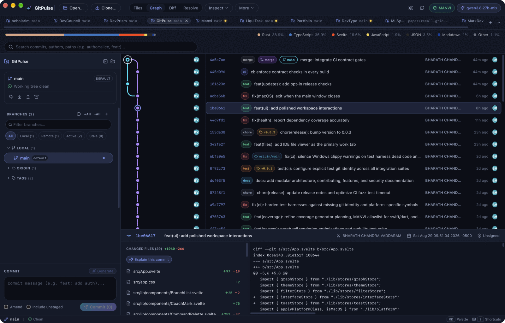
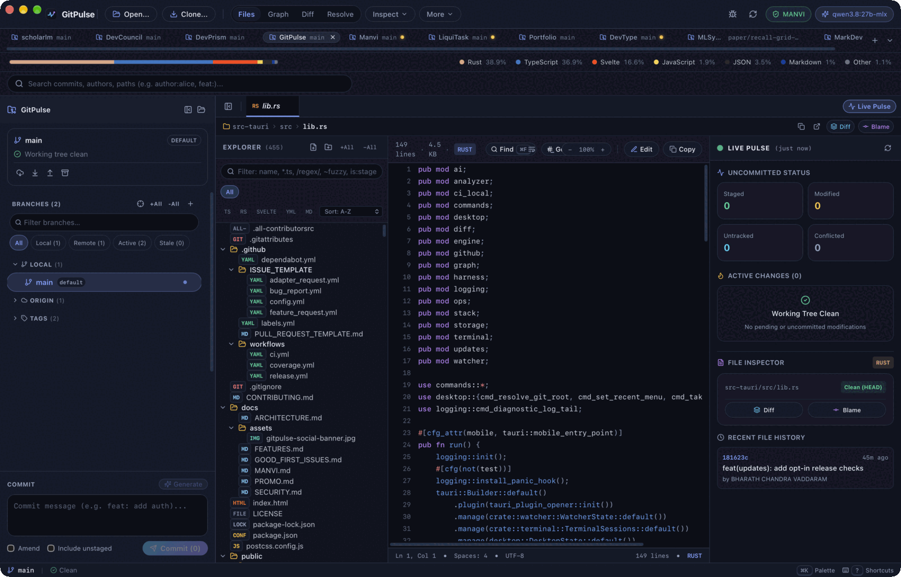
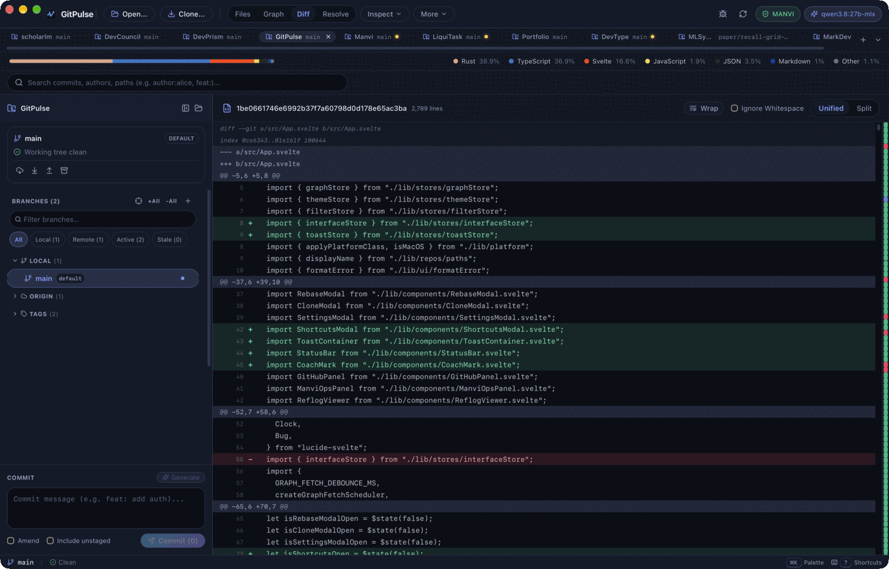
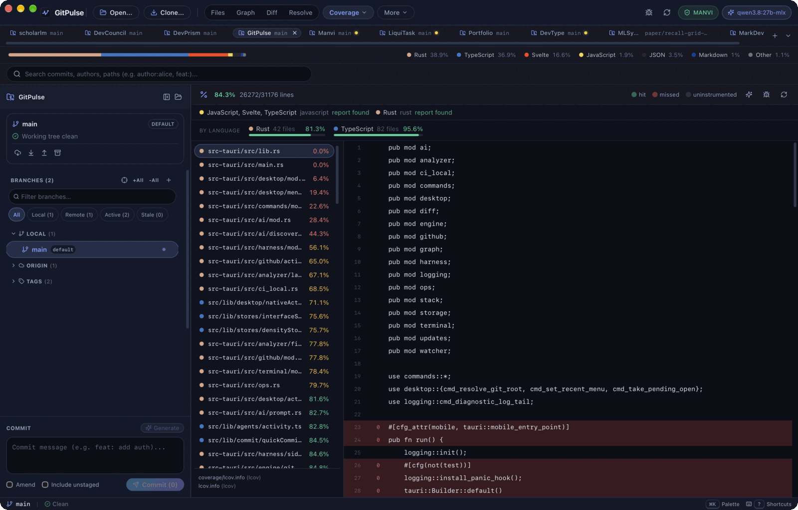
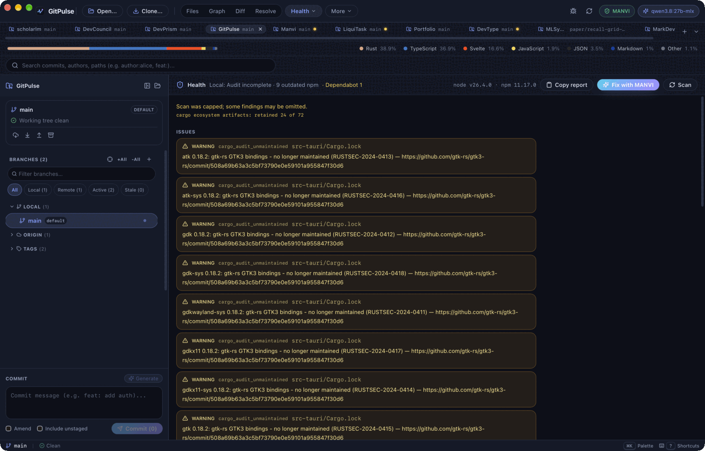
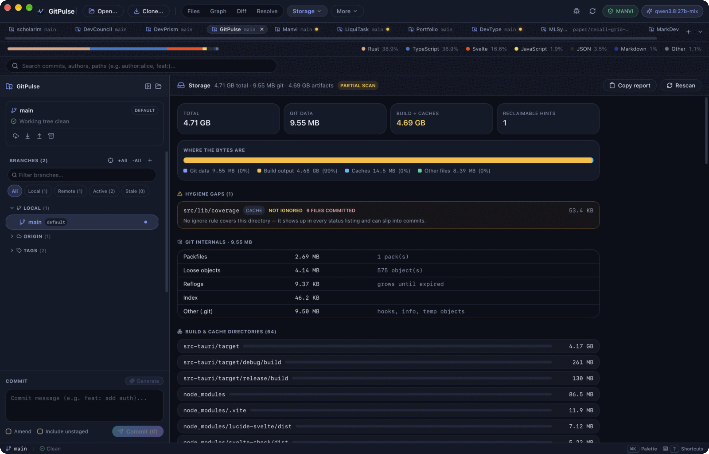
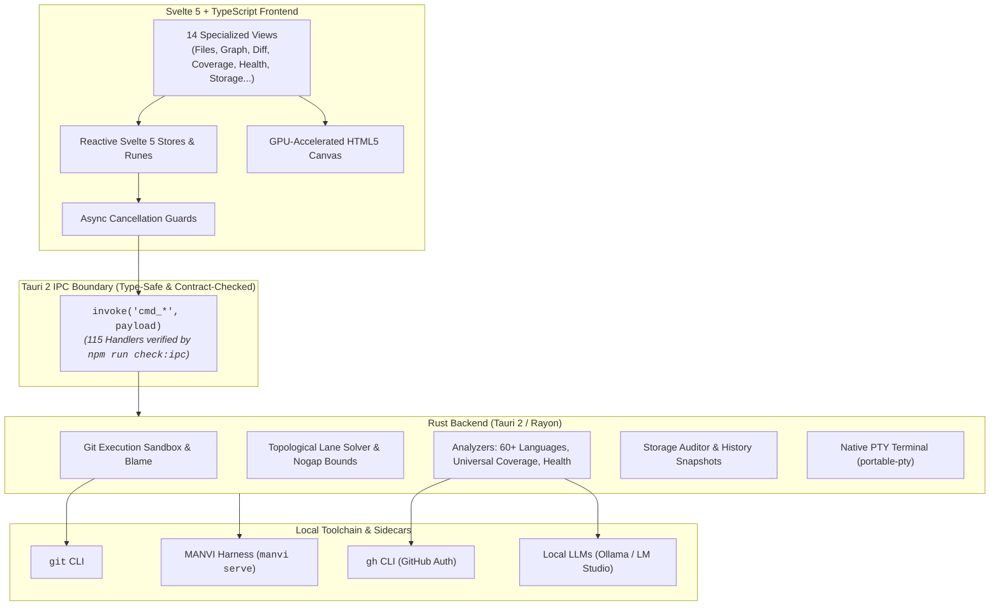
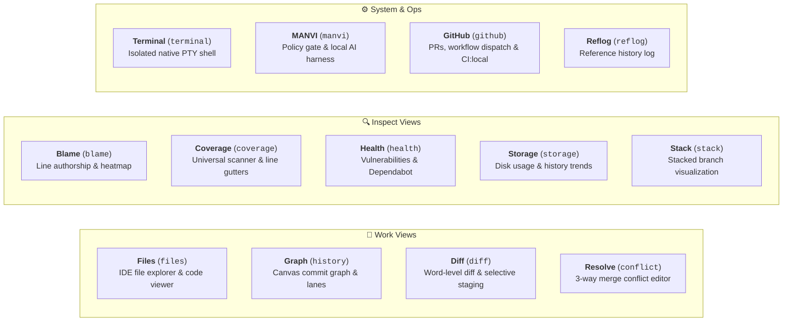
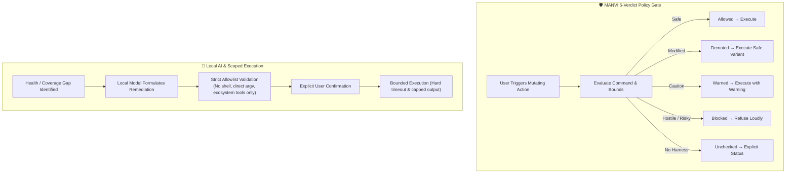

# GitPulse

<p align="center">
  <a href="https://github.com/bharathvbcr/GitPulse/actions/workflows/ci.yml"></a>
  <a href="https://github.com/bharathvbcr/GitPulse/actions/workflows/coverage.yml"></a>
  <a href="https://github.com/bharathvbcr/GitPulse/releases"></a>
  <a href="LICENSE"></a>
  
  
</p>

<p align="center">
  <strong>High-performance, local-first native Git desktop client.</strong><br>
  Engineered with a native Rust backend and a reactive Svelte 5 frontend for instant graph rendering, universal code coverage, deep repository auditing, and safe on-device AI.
</p>

<p align="center">
  
</p>

---

## Screenshots

Captured from GitPulse running on macOS against its own repository.

| Files — IDE explorer & live pulse | Diff — unified commit diff |
| --- | --- |
| [](docs/assets/screenshot-files.png) | [](docs/assets/screenshot-diff.png) |
| **Coverage — universal scanner** | **Health — dependency & vulnerability audit** |
| [](docs/assets/screenshot-coverage.png) | [](docs/assets/screenshot-health.png) |
| **Storage — disk usage & hygiene audit** | |
| [](docs/assets/screenshot-storage.png) | |

---

## Architecture at a Glance

GitPulse operates completely locally on your machine with strict IPC boundaries and zero remote telemetry:



---

## View Catalog & Workflows

GitPulse organizes 14 purpose-built views into three intuitive functional groups:



---

## Key Features

### 🚀 Core Git & Visualization
| Feature | Description |
| --- | --- |
| **IDE File Explorer & Code Viewer** | Integrated file tree with live Git status (staged, unstaged, untracked, ignored), virtualized syntax highlighting for 60+ languages, in-file search, line jump, and multi-file tabs. |
| **GPU-Accelerated Graph** | Ultra-smooth canvas commit graph with avatar rendering, lane smoothing, nogap lookback bounds, branch folding, and ref decorations solved natively in Rust. |
| **Precision Diff Viewer** | File, commit, and range diffs with word-level intra-line highlighting, image diff modes, and one-click selective hunk/line patch staging. |
| **3-Way Conflict Resolver** | Dedicated merge conflict editor with syntax highlighting, marker jumping, and instant ours/theirs/both resolution. |
| **Worktree & Stack Manager** | Complete linked-worktree lifecycle (add, remove, lock, dirty counts) and stacked branch navigation. |

### 🛡️ Code Intelligence & Auditing
| Feature | Description |
| --- | --- |
| **Universal Test Coverage** | Discovers and renders line coverage across all major formats: **LCOV**, **Cobertura**, **Go cover**, **Istanbul/NYC JSON**, **JaCoCo**, and **Clover**. Includes virtualized file navigation, missing toolchain detection & installation guidance, actionable generation failure recovery, and copyable diagnostics. |
| **Multi-Language Analysis** | Fast, comment-aware line-of-code breakdown for **60+ programming languages** with official GitHub Linguist color palettes. |
| **Storage & Hygiene Audit** | Full disk-usage breakdown (packfiles, loose objects, reflogs, LFS, submodules, build artifacts, ignored files) with historical trend sparklines. |
| **Multi-Ecosystem Health** | Automated security and staleness scans via `npm audit/outdated`, `cargo-audit`, `pip-audit`, `govulncheck`, `composer audit`, `bundler-audit`, and GitHub Dependabot. |

### 🤖 Local AI & Policy Safety Gate
| Feature | Description |
| --- | --- |
| **MANVI Policy Gate** | Mutating Git actions are evaluated against a 5-verdict safety ladder (*Allowed*, *Demoted*, *Warned*, *Blocked*, *Unchecked*). Asymmetric degradation ensures wedged sidecars fail closed safely. |
| **On-Device AI Assistance** | Context-calibrated AI assistance for commit messages, commit explanations, and branch naming against local LLMs (Ollama, LM Studio, llama.cpp, vLLM). |
| **Scoped Action Allowlist** | AI-suggested coverage generation and dependency fixes execute via a purpose-limited command allowlist (`cmd_manvi_run_action`) across all major ecosystems (npm, cargo, pytest, go, swift, dart, etc.) requiring explicit user confirmation. |



---

## Local CI & Release Pipeline

GitPulse includes **`CI:local`** (`cmd_ci_local`), allowing you to execute the exact pre-flight test matrix locally on your machine before pushing code:

```mermaid
flowchart LR
    subgraph LocalCI["CI:Local (Single Click)"]
        Detect["Scan Manifests<br/>(package.json, Cargo.toml)"] --> Plan["Plan Step Matrix"]
        Plan --> Run["Sequential Run<br/>(Svelte Check → Vitest → Cargo Clippy → Cargo Test)"]
        Run --> Outcome["Honest Accounting<br/>(Passed / Failed / Skipped)"]
    end

    subgraph ReleasePipeline["GitHub Actions Release Pipeline"]
        TagPush["Push Tag <code>vX.Y.Z</code>"] --> VerGate["Version Gate Validation<br/>(5 manifests must match)"]
        VerGate --> Matrix["Cross-Platform Matrix<br/>(macOS, Linux, Windows)"]
        Matrix --> Verify["Draft Release Asset Verification"]
        Verify --> Publish["Draft Ready for Publishing"]
    end

    Outcome --> TagPush
```



---

## Installation

Download pre-built installers from the [latest release](https://github.com/bharathvbcr/GitPulse/releases/latest):

| Platform | Format | Architecture | Notes |
| --- | --- | --- | --- |
| **macOS** | `.dmg` | Universal (Apple Silicon & Intel) | Unsigned binary. Run quarantine command below. |
| **Linux** | `.AppImage`, `.deb` | x86_64 | Built on Ubuntu 22.04 (glibc 2.35+) |
| **Windows** | `.msi`, `.exe` | x64 | Windows 10/11 installer |

### macOS Unsigned Gatekeeper Note
macOS quarantines unsigned downloads. After dragging GitPulse to `/Applications`, run:

```sh
xattr -dr com.apple.quarantine /Applications/GitPulse.app
```

### Staying Up To Date

GitPulse does **not** auto-update, and it does not check for updates unless you ask
it to. Updating is a manual download from the releases page.

There is an opt-in convenience in **Settings → Updates**:

- **Off by default.** With the toggle off, GitPulse makes no network request about
  itself, ever — consistent with the zero-telemetry model.
- **When enabled**, it compares release tags against this repository at most once a
  day and shows a notification if a newer version exists. It reads the public tag
  list with `git ls-remote` — no account, no token, and nothing is sent about you or
  your repositories.
- **Check now** runs a single check on demand regardless of the toggle.
- It never downloads or installs anything. The notification links to the release
  page; the download is yours to make.

A check that cannot complete says so. "Could not check" is never reported as "up to
date".

---

## Quickstart & Development

### Prerequisites
- **Node.js**: `22.x+`
- **Rust**: `stable` (edition 2021)
- **Git**: Recent version
- **cargo-llvm-cov**: required by `npm run ci:local` for the Rust coverage floor —
  `rustup component add llvm-tools-preview && cargo install cargo-llvm-cov --locked`
- **actionlint**: required by `npm run ci:local` to lint the GitHub Actions
  workflows — `brew install actionlint` (see [install docs](https://github.com/rhysd/actionlint/blob/main/docs/install.md))

### Getting Started

```sh
# 1. Install dependencies
npm install

# 2. Launch full desktop application with hot-reload
npm run tauri dev
```

### Essential Developer Commands

| Command | Description |
| --- | --- |
| `npm run tauri dev` | Launch desktop app with frontend hot-reload and backend live-rebuild |
| `npm run dev` | Run Vite development server only (browser UI mode) |
| `npm run check` | Run `svelte-check` and `tsc` TypeScript type validation |
| `npm run check:ipc` | Verify 115 Rust commands match frontend `invoke()` calls with zero drift |
| `npm run check:types` | Validate that Rust serde structs match TypeScript interfaces field-for-field (coverage & terminal) |
| `npm run check:release` | Assert all 5 version manifests agree (`package.json`, `Cargo.toml`, `tauri.conf.json`, etc.) |
| `npm run ci:local` | Run full local CI suite (checks, tests, builds, clippy, cargo tests, coverage floors) |
| `npm test` | Run Vitest unit and integration test suite (2,000+ tests) |
| `npm run coverage` | Generate Vitest v8 code coverage report |
| `npm run check:coverage` | Validate both LCOV reports and enforce coverage floors (frontend 90% lines / 85% branches, Rust 80% lines) |
| `npm run check:workflows` | Lint `.github/workflows/*` with actionlint — the only gate that reads `release.yml`, which CI otherwise sees only on a tag |
| `npm run build` | Build frontend production bundle |
| `npm run tauri build` | Bundle native installers for the host platform |

---

## In-Depth Documentation

For deep technical details, refer to the dedicated guides in [`docs/`](docs/):

- 📜 **[Changelog](CHANGELOG.md)** — Release history. The release workflow reads the section matching the tag it builds, so a tag with no section fails the build rather than shipping empty notes.
- 🏗️ **[Architecture Guide](docs/ARCHITECTURE.md)** — In-depth breakdown of Svelte 5 runes, stores, IPC contracts, and GPU canvas rendering.
- 📋 **[Complete Features Catalog](docs/FEATURES.md)** — Comprehensive documentation for all 14 application views and keyboard shortcuts.
- 🤝 **[Contributing Guide](CONTRIBUTING.md)** — Development setup, how to run the tests, architecture orientation, and contract check enforcement.
- 🌱 **[Good First Issues](docs/GOOD_FIRST_ISSUES.md)** — A curated backlog of scoped, self-contained tasks for new contributors.
- 🔒 **[Security Policy](docs/SECURITY.md)** — Zero-telemetry model, local credential safety, and vulnerability reporting.

---

## Contributing

Pull requests, bug reports, and feature proposals are welcome. Start with the
**[Contributing Guide](CONTRIBUTING.md)** for development setup, how to run the
tests, and an architecture orientation — then pick something from the
**[curated backlog](docs/GOOD_FIRST_ISSUES.md)**.

### Contributors

Thanks to everyone who has contributed to GitPulse. This project follows the
[all-contributors](https://github.com/all-contributors/all-contributors)
specification: **code is one kind of contribution among many** — documentation,
design, bug reports, testing, reviews, and ideas are all recognised here.

<!-- ALL-CONTRIBUTORS-LIST:START - Do not remove or modify this section -->
<!-- prettier-ignore-start -->
<!-- markdownlint-disable -->
<!-- ALL-CONTRIBUTORS-LIST:END -->
<!-- markdownlint-restore -->
<!-- prettier-ignore-end -->

To add someone (including yourself), comment on any issue or pull request:

```
@all-contributors please add @username for code, doc
```

The bot opens a pull request updating this section and `.all-contributorsrc`.
See the [emoji key](https://allcontributors.org/docs/en/emoji-key) for contribution
types.

---

## License

Distributed under the MIT License. See [LICENSE](LICENSE) for details.

© 2026 Bharath Chandra Vaddaram
