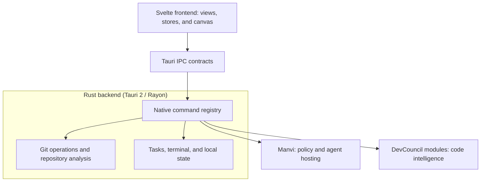

# GitPulse

<p align="center">
  <a href="https://gitpulse.vbcr.dev/"></a>
  <a href="https://github.com/bharathvbcr/GitPulse/actions/workflows/ci.yml"></a>
  <a href="https://github.com/bharathvbcr/GitPulse/actions/workflows/coverage.yml"></a>
  <a href="https://github.com/bharathvbcr/GitPulse/releases"></a>
  <a href="LICENSE"></a>
  
  
</p>

**Git, code, and tasks in one local-first desktop workspace.**

Review changes, follow branch history, organize tasks, and inspect repository
health from a native Rust / Tauri 2 app with a Svelte 5 frontend.

[Download](https://github.com/bharathvbcr/GitPulse/releases/latest) ·
[Getting started](docs/GETTING_STARTED.md) ·
[Documentation](docs/README.md) ·
[Website](https://gitpulse.vbcr.dev/) ·
[Release notes](CHANGELOG.md)


## Get started

1. [Install GitPulse](docs/INSTALLATION.md) and Git for your platform.
2. Open a repository and review **Trust and Open**. Trust allows its hooks,
   helpers, and project tools to run with your account permissions.
3. Use **Work** for changes in flight, **History** to review a commit, and
   **Code** to explore files. Open the command palette with `⌘K` / `Ctrl+K`.
4. Use **Walkthrough** in the title bar whenever you want a guided tour.

GitHub CLI, DevMap, Manvi, and local model servers are optional; install the
ones needed for the features you use. The [first repository guide](docs/GETTING_STARTED.md)
walks through a review, task creation, and optional setup.

## Four views, one workspace

GitPulse has 4 application views. Each view keeps related sections together.

| View | What you do here | Sections |
| --- | --- | --- |
| **Work** | Track work in flight, resolve conflicts, organize tasks | Overview · Resolve · Remote · Stack · Policy · Tasks |
| **Code** | Browse files, inspect authorship, explore structure | Explorer · Blame · Map |
| **History** | Follow commits, review changes, find recovery points | Graph · Diff · Reflog |
| **Insights** | Inspect activity, coverage, dependencies, and disk usage | Pulse · Coverage · Health · Storage |

Graph and Diff share the selected commit; Explorer and Blame share the selected
file. **Fleet** compares repositories across the workspace, **Tasks** opens global
and saved-workspace boards, and the **terminal dock** stays available across views.

## From a change to the next step

- **Review and commit.** Canvas commit graph, unified and side-by-side diffs,
  word highlighting, image comparisons, selective staging, stash previews,
  and a three-way conflict resolver.
- **Organize the work.** Quick add parses priority, labels, owner, repository,
  due date, and notes. Customize board/list layouts, use the Archive dock,
  review drafting suggestions, and hand a task to an agent from its board.
- **Explore the code.** File navigation and blame are built in. Add DevMap for
  structural navigation, symbol search, dependencies, impact, and candidate tests.
- **Inspect the repository.** Coverage reports, dependency audits, storage cleanup
  previews, and Pulse activity summaries distinguish results from scans that did
  not run. Capped results identify their limits.
- **Work from the desktop.** Native menus, a command palette, a docked PTY terminal,
  and an optional macOS menu-bar status popover keep frequent actions close.

The [feature reference](docs/FEATURES.md) describes each surface and its limits.
The [changelog](CHANGELOG.md) records release changes; [open qualification](docs/QUALIFICATION.md)
tracks remaining platform, provider, and performance checks.

| File explorer | Diff review |
| --- | --- |
|  |  |
| Coverage | Dependency health |
|  |  |

Screenshots are captures from the macOS app; appearance varies by release and platform.

## Local state and explicit permissions

Repository and task state are stored locally. The desktop app has no remote
telemetry. Git remotes, GitHub operations, optional tool downloads, release checks,
and configured agent providers can use the network.

Built-in local AI connects to loopback model servers. Task enhancement and agent
runs use their configured provider; supported Mac builds can also use Apple
Intelligence for task titles and descriptions. These are distinct execution paths.

Repository trust is an execution decision. A worktree is not an OS sandbox.
Policy verdicts preserve **unchecked** separately from **allowed**, and the
read-only MCP server cannot grant repository trust. Read the
[security and trust model](docs/SECURITY.md) before configuring agents.

## Architecture

DevCouncil is **components and modules**. Manvi wraps them. GitPulse uses Manvi
for policy, workbench, and agent hosting, and selected DevCouncil components
for code intelligence. Modules can be updated independently.



See [architecture](docs/ARCHITECTURE.md) for ownership and contracts, and
[module integration](docs/MODULE_INTEGRATION.md) for the boundaries between projects.
GitPulse succeeds the deprecated [LiquiTask](https://github.com/bharathvbcr/LiquiTask)
workbench; this does not imply complete feature parity.

## Build and contribute

Use Node.js 22.x (22.12 or newer), stable Rust, Git, and your platform's native
build tools. The [contributor guide](CONTRIBUTING.md) covers setup and platform prerequisites.

```sh
git clone https://github.com/bharathvbcr/GitPulse.git
cd GitPulse
npm ci
git config core.hooksPath .githooks
npm run tauri dev
```

| Command | Purpose |
| --- | --- |
| `npm run check` | Svelte and TypeScript checks |
| `npm test` | Frontend and contract tests |
| `npm run check:ipc` | Match frontend calls to the native command registry |
| `npm run check:types` | Compare Rust and TypeScript wire contracts |
| `npm run check:release` | Check version manifest consistency |
| `npm run build` | Build the frontend bundle |
| `npm run tauri build` | Build native bundles for the host |
| `npm run ci:local` | Full local checks, browser regressions, coverage, and native gates |

A frontend build alone does not qualify the native application. Follow the
[release procedure](CONTRIBUTING.md) before publishing a build.

## Documentation

The [documentation index](docs/README.md) organizes user guides, integration
references, contributor contracts, and historical evidence. Start with
[installation](docs/INSTALLATION.md), [your first repository](docs/GETTING_STARTED.md),
or [tasks and workspaces](docs/TASKS_AND_WORKSPACES.md).

Bug reports, documentation, design, tests, and code contributions are welcome.
See [CONTRIBUTING.md](CONTRIBUTING.md) and [good first issues](docs/GOOD_FIRST_ISSUES.md).

### Contributors

Thanks to everyone who has contributed to GitPulse. This project follows the
[all-contributors](https://github.com/all-contributors/all-contributors)
specification: **code is one kind of contribution among many** — documentation,
design, bug reports, testing, reviews, and ideas are all recognised here.

<!-- ALL-CONTRIBUTORS-LIST:START - Do not remove or modify this section -->
<!-- prettier-ignore-start -->
<!-- markdownlint-disable -->
<!-- ALL-CONTRIBUTORS-LIST:END -->
<!-- markdownlint-restore -->
<!-- prettier-ignore-end -->

To add someone (including yourself), comment on any issue or pull request:

```
@all-contributors please add @username for code, doc
```

The bot opens a pull request updating this section and `.all-contributorsrc`.
See the [emoji key](https://allcontributors.org/docs/en/emoji-key) for contribution
types.

---

## License

Distributed under the MIT License. See [LICENSE](LICENSE) for details.

© 2026 Bharath Chandra Vaddaram
