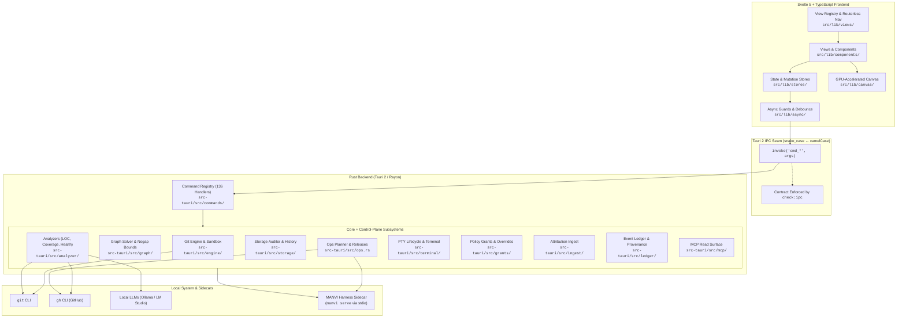
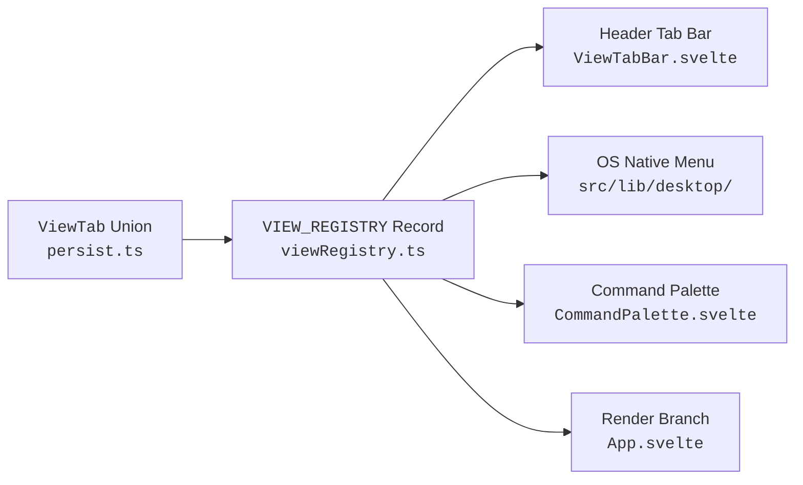
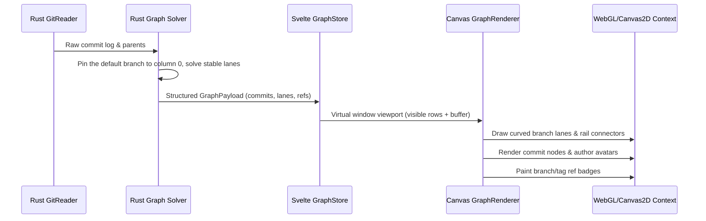

# GitPulse Architecture

GitPulse is built as a high-performance, local-first native desktop client combining a **Rust backend (Tauri 2)** with a **Svelte 5 + TypeScript frontend**.

---

## 1. Frontend Architecture

### Routerless View Architecture
GitPulse does not use a virtual DOM router. Views are members of the `ViewTab` union defined in [`src/lib/repos/persist.ts`](file:///Users/bharath/Code/devtools/gitpulse/src/lib/repos/persist.ts).

Every view is registered in [`src/lib/views/viewRegistry.ts`](file:///Users/bharath/Code/devtools/gitpulse/src/lib/views/viewRegistry.ts). TypeScript enforces that adding a view requires:
1. Adding the identifier to the `ViewTab` union in `persist.ts`.
2. Adding its metadata to `VIEW_REGISTRY` in `viewRegistry.ts`.
3. Adding the render branch in `App.svelte`.

### The one workspace-scoped surface

**Fleet** ([`src/lib/components/FleetView.svelte`](file:///Users/bharath/Code/devtools/gitpulse/src/lib/components/FleetView.svelte)) is deliberately outside that registry. A `ViewTab` is stored on the *active repository's* session and its pane is rendered inside `{#key currentPath}`; Fleet answers a question about the whole workspace, so being a view would both scope it wrongly and destroy and rebuild it on every repository switch.

It therefore lives beside the repository pane rather than inside it, and the two are swapped by **hiding, never unmounting** — the repository subtree holds the live terminal PTY, which dies with its pane. Its open state is a UI preference in `interfaceStore`, not part of the persisted workspace blob, so remembering it does not require a workspace schema bump (which would make an older build fall back to legacy keys and lose the user's tabs). Because none of the registry machinery covers it, [`scripts/fleet-surface-contract.test.ts`](file:///Users/bharath/Code/devtools/gitpulse/scripts/fleet-surface-contract.test.ts) pins its three entry points, its Rust/TypeScript action-id agreement, and the hide-don't-unmount rule.

Its data is tiered by cost, and the tier boundary is visible to the reader:

| Tier | Source | Cost per repository | When |
| --- | --- | --- | --- |
| 0 — changes, sync, conflicts, stash, parked operation, watch | `repoStore.repoFacts()`, already hydrated | none | always, reactively |
| 1 — worktrees, agent sessions, last activity | `cmd_fleet_snapshot` (rayon, one round trip) | 2 `git` spawns | when the repository set changes |
| 2 — lines of code, storage, dependency audit, coverage | the same commands the Storage/Health/Coverage views run | seconds to minutes | explicit scan only |

`cmd_fleet_snapshot` is deliberately narrower than `cmd_insights_snapshot`: the latter probes every worktree for a parked operation, counts dirty files in up to 32 of them, and cross-scans up to 16 for colliding paths — correct for one repository on screen, and several hundred subprocesses across a workspace. Tier 2 results are cached per repository in that repository's own ledger (`fleet_metrics`), each family carrying its own value *and* its own timestamp, and are read back with a read-only, no-create SQLite open so rendering a row for a repository in the recents list never writes a `.devcouncil/` directory into it.

### Svelte 5 Runes & Dependency Injection
- **Component State**: Uses modern Svelte 5 runes (`$state`, `$derived`, `$effect`) for local, reactive component state.
- **Store Architecture**: Domain stores (e.g. `repoStore`, `graphStore`, `filterStore`, `harnessStore`) are instantiated using factory functions with injectable dependencies (`createRepoStore(deps)`), enabling 100% headless unit testing without requiring Tauri runtime mocks.
- **Domain Modules**: Pure business logic is isolated under `src/lib/` (`files/`, `coverage/`, `health/`, `diff/`, `canvas/`, `terminal/`, `branches/`, `stack/`, `work/`, `github/`, `text/`), completely independent of the DOM. Presentation helpers that still need no DOM of their own live beside them in `ui/`, and the few that genuinely touch elements are quarantined in `dom/`.

### One owner per cross-pane behaviour

Several behaviours are needed by more than one pane, and each was independently
reimplemented at least once before being pulled into a shared module. The rule
is that the pane calls the owner rather than carrying its own copy, and a
contract test holds the panes to it:

| Behaviour | Owner | Enforced by |
|---|---|---|
| Row height for every fixed-row surface | [`src/lib/ui/density.ts`](../src/lib/ui/density.ts) | `density.test.ts` greps each pane for `rowHeight("<surface>", $densityStore)` |
| Tablist roving focus and arrow keys | [`src/lib/dom/tablist.ts`](../src/lib/dom/tablist.ts) | `tablist.test.ts` checks every `role="tablist"` implements what it announces |
| Bounded in-file / in-diff search | [`src/lib/text/lineSearch.ts`](../src/lib/text/lineSearch.ts) | `lineSearch.test.ts` covers the cap, the deadline and the backtracking refusal |
| UI scale | [`src/lib/ui/uiScale.ts`](../src/lib/ui/uiScale.ts) | writes `--ui-font-scale` to `documentElement` |

Two of these are worth stating plainly, because both were live defects:

- **`--ui-font-scale` must be written to the root.** It was previously declared
  on a `
` inside `<body>` and read by a rule on `body` — an ancestor of the
  element declaring it. Custom properties inherit *downward only*, so the rule
  resolved the `:root` default of `1` forever and the setting moved nothing.
- **In-file search must go through `lineSearch`.** A hand-rolled `RegExp` loop
  is unbounded: it can spin forever on a zero-width match, and a pattern like
  `(a+)+c` cannot be interrupted once a JavaScript regex starts backtracking.
  The owner refuses such a pattern, caps the match list, and stops at a
  wall-clock deadline — reporting `2 of 5+` rather than presenting a capped
  sample as a total.

### Async Hygiene & Cancellation Guards
When switching between repositories or triggering fast refilters, in-flight IPC calls could return out of order. GitPulse guards asynchronous calls using `createAsyncGuard` ([`src/lib/async/guard.ts`](file:///Users/bharath/Code/devtools/gitpulse/src/lib/async/guard.ts)). When a repository changes or a new query starts, pending promises from prior invocations are automatically invalidated and dropped.

---

## 2. Rust Backend & Subsystems

```mermaid
classDiagram
    class CommandRegistry {
        +136 Registered Handlers
        +Checked by scripts/check-ipc-contract.mjs
    }
    class GitEngine {
        +validate_repo()
        +git_text()
        +GitReader
    }
    class GraphSolver {
        +solve_lanes()
        +nogap_bounds()
        +avatar_resolution()
    }
    class Analyzers {
        +detect_languages()
        +scan_coverage()
        +audit_dependencies()
    }
    class StorageAuditor {
        +audit_repository()
        +track_snapshots()
    }
    class GrantsStore {
        +list_grants()
        +revoke_grant()
        +read_policy_override()
    }
    class IngestPipeline {
        +replay_reflog()
        +replay_transcripts()
        +normalize_actor()
    }
    class LedgerStore {
        +append()
        +cursor_tail()
        +query_range()
        +redact_credentials()
    }
    class OpsPlanner {
        +plan_merged_branch_cleanup()
        +review_outgoing_commits()
        +plan_release_publish()
    }
    class MCPServer {
        +discover_tools()
        +snapshot_tools()
        +cache_capabilities()
    }
    class HarnessSidecar {
        +guard_command()
        +guard_file()
        +probe_model()
        +prepare_prompt()
        +settle_reply()
    }

    CommandRegistry --> GitEngine
    CommandRegistry --> GraphSolver
    CommandRegistry --> Analyzers
    CommandRegistry --> StorageAuditor
    CommandRegistry --> OpsPlanner
    CommandRegistry --> HarnessSidecar
    CommandRegistry --> GrantsStore
    CommandRegistry --> IngestPipeline
    CommandRegistry --> LedgerStore
    CommandRegistry --> MCPServer
```

### Subsystem Responsibilities
- **`engine/`**: Git execution sandbox, output parsers, safe diff generation, blame readers, and repository status pollers.
- **`graph/`**: Native commit-history lane solver — stable columns by interval allocation, a pinned mainline (the default branch's first-parent chain holds column 0 for the whole window), history simplification for server-side commit filters (a dropped commit hands its lineage to its children, git-style, so a filtered graph stays connected and the mainline re-anchors on the chain's first survivor), parent-child edge layout, and nogap lookback bounds.
- **`analyzer/`**: 
  - `language.rs`: Multi-language classifier (60+ languages), GitHub Linguist color mappings, and fast line-of-code breakdown.
  - `coverage.rs`: Universal coverage artifact scanner (LCOV, Cobertura, Go cover, Istanbul, JaCoCo, Clover), toolchain installer detection, and file-level metrics.
  - `health.rs`: Ecosystem vulnerability checkers (`npm audit`, `cargo-audit`, `pip-audit`, `govulncheck`, `composer audit`, `bundler-audit`, GitHub Dependabot).
- **`storage/`**: Deep disk-usage auditor (packfiles, loose objects, reflogs, LFS, submodules, caches, oversized files) with time-series history tracking.
- **`ops.rs`**: Safe, read-only MANVI operation planners for merged branch cleanups, outgoing commit review, and release publishing.
- **`harness/`**: Sidecar client managing policy gates and local model communication via NDJSON stdio.
- **`terminal/`**: Native PTY lifecycle manager (`portable-pty`) with preserved command diagnostics and subprocess exit status tracking.
- **`grants/`**: Policy grant model, scoped overrides, and override lifecycle for elevated paths.
- **`ingest/`**: Attribution sources beyond live commands (reflog and transcript replay) that feed durable provenance and audit history.
- **`ledger/`**: WAL-backed action store with redaction, cursors, and bounded replay for history projection.
- **`mcp/`**: Read-only MCP 2.0 + Agent Plugins 1.0 server surface, including tool caching and capability discovery.
- **`logging.rs`**: Diagnostics for the backend. A 1,000-entry in-memory ring behind the `log` facade, a panic hook that records the payload, the location and a bounded backtrace, and a durable append-only mirror under the platform log directory (`~/Library/Logs/GitPulse` on macOS, `%LOCALAPPDATA%\\GitPulse\\logs` on Windows, `$XDG_STATE_HOME/gitpulse` otherwise; `GITPULSE_LOG_DIR` overrides all three). See [Diagnostics](#5-diagnostics) below.

---

## 3. High-Performance Commit Graph Renderer

The commit graph utilizes a GPU-accelerated HTML5 Canvas with custom paint scheduling:

- **Ref scope — the walk and the labels are one decision** (`graph/ref_scope.rs`): the history walk and the decoration listing are derived from a single list, so the graph cannot open a lane it has no name for. `RefScope::Named` (the default) walks `HEAD --branches --remotes --tags` and labels `refs/heads`, `refs/remotes`, `refs/tags`; `RefScope::All` walks git's `--all` and labels everything under `refs/` as `RefKind::Other`. `--all` used to be hard-coded on the walk side alone, so machine-written namespaces (agent turn checkpoints, `refs/prefetch/*`, CI `refs/pull/*`) opened anonymous lanes — on one real repository, 18 such refs took 65 commits of straight history to 101 rows and 35 lanes. Whatever a named walk leaves out is counted and named in the payload's `warnings` (`probe_hidden_history`), because history that is not drawn must not look like history that does not exist — and the count is of hidden COMMITS, not hidden refs, since a `refs/archive/*` pointing at an ancestor of `main` is drawn and hides nothing. The same named set feeds the Pulse report, so contributor and churn metrics measure people rather than tooling. Two rules are load-bearing and each has a test that fails without it: the named set matches on PATH COMPONENTS (`refs/headsfoo/x` is not a branch, and `tests/graph_ref_scope_stress.rs` checks the classifier against git itself rather than against our belief about git), and the walk carries `--ignore-missing` because naming `HEAD` otherwise fails outright on an unborn HEAD — a fresh repository or any `git checkout --orphan` branch. Decoration lists are capped per kind (`REFS_TAG_CAP`, `REFS_OTHER_CAP`) and a `RefListing` reports how many were dropped, so a CI mirror's six figures of `refs/pull/*` can neither reach the IPC payload nor pass for a complete label set.
- **Topological Lane Solver**: Runs natively in Rust (`graph/lane_solver.rs`), single-threaded — one linear pass over the `--topo-order` walk. History is decomposed into first-parent segments, each holding one column for its whole lifetime (in-flight connectors included) by greedy interval allocation, so the graph is exactly as wide as its peak concurrent occupancy.
- **Pinned mainline**: The default branch's first-parent chain (`resolve_mainline_hint` in `commands/mod.rs`: the repository's default branch, local tip first, extended through a remote-tracking copy that is ahead; HEAD as the fallback; the newest commit otherwise) is reserved before any row is walked and pinned to column 0 in palette colour 0 for the entire window. Feature chains close INTO that column and can never claim a main ancestor first, so `main` is one straight rail however the walk interleaved merged branches with it; at a window cut the rail ends with a stub rather than continuing into a merged-in branch. Rows carry `is_mainline`, the payload carries `mainline_id`/`mainline_name`, and the graph tooltip names the rail.
- **Async runtime**: `rayon` is the only direct concurrency dependency in `src-tauri/Cargo.toml`. Blocking work leaves the IPC thread through `tauri::async_runtime::spawn_blocking` (see `off_thread` in `commands/mod.rs`). Tokio is present, but transitively through Tauri — nothing here depends on it directly, so `use tokio::…` will not compile without adding the crate first.
- **Nogap Lookback Bounds**: Prevents disconnected lane lines across virtualized scrolling regions.
- **Author Avatars**: Fast on-canvas rendering with caching for author initials, identicons, and GitHub avatars.
- **Frame Scheduling**: Renders at 60/120 FPS using requestAnimationFrame batches, avoiding UI thrashing during rapid kinetic scrolling.

---

## 4. Strict IPC & Type Contracts

GitPulse enforces compile-time and pre-commit contract safety across the Rust/TypeScript boundary:

| Contract Tool | Command | Description |
| --- | --- | --- |
| **IPC Checker** | `npm run check:ipc` | Verifies all 136 Rust `cmd_*` handlers match frontend `invoke()` calls with zero untracked orphans. |
| **Type Sync Checker** | `npm run check:types` | Asserts Rust Serde structs match TypeScript interfaces field-for-field and wire-type-for-wire-type across 762 data fields, in 48 contracts. The IPC payload types that remain unchecked are enumerated with a reason each in `scripts/ipc-type-coverage-contract.test.ts`. |
| **Release Version Gate** | `npm run check:release` | Validates that `package.json`, `package-lock.json`, `tauri.conf.json`, `Cargo.toml`, `Cargo.lock`, and every discovered plugin manifest agree. Plugin manifests are found under `plugins/<name>/` rather than hardcoded, because one package ships a manifest per agent client and the newest one is the likeliest to be missed. |
| **MCP Install Doctor** | `npm run mcp:doctor` | Handshakes the `gitpulse-mcp` on PATH — the binary the plugin manifests spawn — and asserts the version it reports is this tree's. Reports *absent*, *unresponsive*, and *stale* as distinct failures. |

---

## 5. Diagnostics

Everything that goes wrong is recorded on both sides of the IPC boundary, and
the two halves differ in one way that matters: **only the durable half can
describe a crash, because the other half dies with the process it was
describing.**

| | Frontend | Backend |
| --- | --- | --- |
| Owner | `src/lib/diagnostics/` | `src-tauri/src/logging.rs` |
| Captures | uncaught errors, unhandled rejections, `console.error/warn`, `<svelte:boundary>` pane crashes, panel catches via `reportPanelError` | `log::*` calls and the panic hook (payload, location, bounded backtrace) |
| In memory | 500-entry ring, coalesced by fingerprint | 1,000-entry ring |
| Survives a crash | yes — persisted to `localStorage` | yes — appended to `<log dir>/<binary>.log` |
| Read back by | the Diagnostics panel | `cmd_diagnostic_log_tail` (this session) and `cmd_diagnostic_persisted_log` (durable, spans sessions) |

Each of the three shipped binaries — `gitpulse`, `gitpulsed`, `gitpulse-mcp` —
installs the logger and the panic hook and writes its own log file. The file is
appended rather than truncated at startup, so the lines above a session marker
are the previous run's: after a crash and a relaunch, the reason is still there
to read. It rotates to `<binary>.log.1` at 1 MB, bounding the record at two
generations.

Three properties are deliberate and are pinned by
`scripts/diagnostics-contract.test.ts`:

1. **The panic hook is installed after `logging::init()`, never before.** It
   captures its logger at install time, so an early install binds nothing and
   every later panic is recorded where no one can read it — a hook that looks
   installed and is inert.
2. **Nothing on the sink's write path can panic.** A panic raised while a panic
   is being handled aborts the process immediately, destroying the evidence at
   the one moment it matters. Write failures are recorded, not raised.
3. **A log that could not be written never looks like a quiet one.**
   `PersistedLog` carries `path` and `degraded` beside its lines, and the copied
   report always writes the section — so "nothing went wrong", "nothing could be
   recorded" and "this build keeps no log" stay three distinct answers.

There is no remote crash reporting, by design: nothing here leaves the machine.
The Diagnostics panel copies the whole report to the clipboard and the user
decides where it goes.
