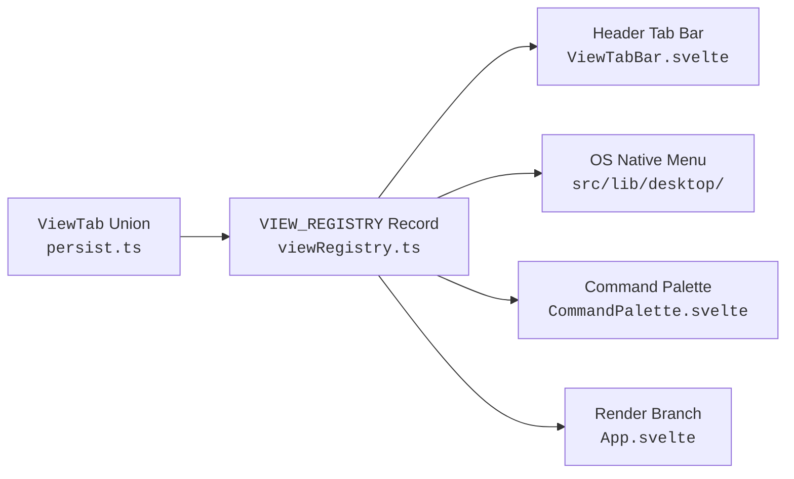
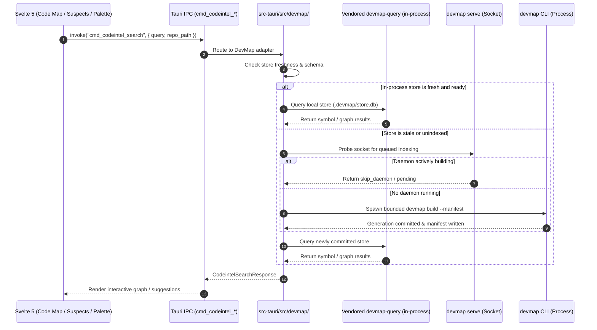
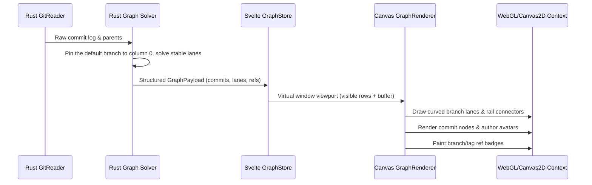

# GitPulse Architecture

[Documentation index](README.md) · [Contributing](../CONTRIBUTING.md) · [Module integration](MODULE_INTEGRATION.md)

GitPulse is built as a local-first native desktop client combining a **Rust backend (Tauri 2)** with a **Svelte 5 + TypeScript frontend**.

**Product stack.** [DevCouncil](https://github.com/bharathvbcr/DevCouncil) is
**components and modules**. [Manvi](https://github.com/bharathvbcr/Manvi) wraps
them into a coding-agent harness. GitPulse uses **Manvi** for policy, workbench,
and agent hosting, and **DevCouncil components** (`devmap` CLI and crates,
verification reads) for code intelligence. Modules stay independently
updatable; this app takes only the subset it needs. See
[Module integration](MODULE_INTEGRATION.md).

```mermaid
flowchart TB
    subgraph Frontend["Svelte 5 + TypeScript Frontend"]
        direction TB
        UI["Views & Components (17 Sections)<br/><code>src/lib/components/</code>"]
        Stores["State & Mutation Stores<br/><code>src/lib/stores/</code>"]
        Registry["View Registry & Routerless Nav<br/><code>src/lib/views/</code>"]
        Canvas["Canvas 2D Rendering<br/><code>src/lib/canvas/</code>"]
        Async["Async Guards & Cancellation<br/><code>src/lib/async/</code>"]
        
        UI --> Stores
        UI --> Canvas
        Stores --> Async
        Registry --> UI
    end

    subgraph IPC["Tauri 2 IPC Seam (snake_case ↔ camelCase)"]
        direction TB
        Invoke["<code>invoke('cmd_*', args)</code>"]
        ContractCheck["248 Handlers Enforced by <code>check:ipc</code>"]
        Invoke -.-> ContractCheck
    end

    subgraph Backend["Rust Backend (Tauri 2 / Rayon)"]
        direction TB
        CmdRegistry["Command Registry (248 Handlers)<br/><code>src-tauri/src/commands/</code>"]
        
        subgraph Subsystems["Core Subsystems & In-Process Modules"]
            GitEngine["Git Engine & Sandbox<br/><code>src-tauri/src/engine/</code>"]
            GraphSolver["Graph Solver & Nogap Bounds<br/><code>src-tauri/src/graph/</code>"]
            Analyzers["Analyzers (LOC, Coverage, Health)<br/><code>src-tauri/src/analyzer/</code>"]
            SecretsScanner["Secrets Scanner (Kingfisher)<br/><code>src-tauri/src/secrets/</code>"]
            AIEngine["AI Phrasing & Commit Brief<br/><code>src-tauri/src/ai/</code>"]
            StorageAuditor["Storage Auditor & History<br/><code>src-tauri/src/storage/</code>"]
            OpsPlanner["Ops Planner & Releases<br/><code>src-tauri/src/ops.rs</code>"]
            PtyTerminal["PTY Lifecycle & Terminal<br/><code>src-tauri/src/terminal/</code>"]
            Grants["Policy Grants & Overrides<br/><code>src-tauri/src/grants/</code>"]
            Ledger["Event Ledger & Provenance<br/><code>src-tauri/src/ledger/</code>"]
            MCP["MCP Read Surface<br/><code>src-tauri/src/mcp/</code>"]
            HarnessBridge["Harness Policy Client<br/><code>src-tauri/src/harness/</code>"]
            WorkbenchBridge["Workbench Command Bridge<br/><code>src-tauri/src/commands/workbench.rs</code>"]
            DevmapSubsystem["DevMap Gate & Query Subsystem<br/><code>src-tauri/src/devmap/</code>"]
            VendoredDevCouncil["Vendored DevCouncil Readers<br/><code>src-tauri/vendored/devmap-*</code>"]
        end
        
        CmdRegistry --> Subsystems
    end

    subgraph External["Local System & Sidecars"]
        direction TB
        subgraph ManviSidecar["Manvi Sidecar"]
            ManviHost["<code>manvi serve --posture host</code><br/>(NDJSON stdio: policy ladder & workbench API)"]
        end
        subgraph DevCouncilExternal["DevCouncil Tools & Daemon"]
            DevMapCLI["<code>devmap</code> CLI (build, search, impact)"]
            DevMapDaemon["<code>devmap serve</code> (background watcher socket)"]
        end
        subgraph HostTools["Host Tools & Services"]
            LocalGit["<code>git</code> CLI"]
            LocalGh["<code>gh</code> CLI (GitHub)"]
            LocalLLM["Local LLMs on Loopback (Ollama / LM Studio)"]
        end
    end

    Async --> Invoke
    Invoke --> CmdRegistry
    GitEngine --> LocalGit
    Analyzers --> LocalGit
    Analyzers --> LocalGh
    Analyzers --> LocalLLM
    OpsPlanner --> LocalGh
    HarnessBridge <-->|NDJSON Stdio| ManviHost
    WorkbenchBridge <-->|IPC request| ManviHost
    DevmapSubsystem <-->|CLI invocations| DevMapCLI
    DevmapSubsystem <-->|Socket probe| DevMapDaemon
    VendoredDevCouncil -.->|In-process read| DevmapSubsystem
```

---

## 1. Frontend Architecture

### Routerless View Architecture
GitPulse does not use a virtual DOM router. Views are members of the `ViewTab` union defined in [`src/lib/repos/persist.ts`](../src/lib/repos/persist.ts).

```mermaid
flowchart LR
    Persist["<code>ViewTab</code> Union<br/><code>persist.ts</code>"] --> ViewRegistry["<code>VIEW_REGISTRY</code> Record<br/><code>viewRegistry.ts</code>"]
    ViewRegistry --> HeaderTabs["Header Tab Bar<br/><code>ViewTabBar.svelte</code>"]
    ViewRegistry --> NativeMenu["OS Native Menu<br/><code>src/lib/desktop/</code>"]
    ViewRegistry --> CommandPalette["Command Palette<br/><code>CommandPalette.svelte</code>"]
    ViewRegistry --> AppRender["Render Branch<br/><code>App.svelte</code>"]
```

Every view is registered in [`src/lib/views/viewRegistry.ts`](../src/lib/views/viewRegistry.ts). TypeScript enforces that adding a view requires:
1. Adding the identifier to the `ViewTab` union in `persist.ts`.
2. Adding its metadata to `VIEW_REGISTRY` in `viewRegistry.ts`.
3. Adding the render branch in `App.svelte`.

The native menu is built in `src-tauri/src/desktop/menu.rs` during Tauri startup.
`actions.rs` parses IDs, `desktop/mod.rs` emits `gitpulse-menu`, and
`nativeActions.ts` dispatches to App's handlers. Section navigation uses a
native projection of `viewRegistry.ts`, with a bidirectional ID/label contract
test. It calls `setActiveTab(view, section)` and reveals the repository pane
when Fleet is open. App and RepoTabBar share platform-aware native shortcut
ownership in `webviewShortcuts.ts`. `menuStateStore.ts` derives availability,
checks, labels and optional status-icon contents from the existing stores.
`menuSync.ts` serializes and coalesces updates to `cmd_set_menu_state`; Rust
validates the payload and updates menu/tray objects on the GUI thread. Events
capture repository identity and `menuCommands.ts` revalidates context after
prompts. Git work remains in the guarded `repoStore` mutation owner, which also
publishes activity for menu state and bounded quit waits. With the icon enabled,
window close hides the main window; icon removal reveals it before removing the
escape path. `popover.rs` owns a separate, lazily created status window anchored
under the tray icon. Its `status.html` / `StatusApp.svelte` entry receives validated
presentation snapshots and routes a limited set of actions to the existing main
webview. It creates no repository store or polling loop. The status capability
grants only event listen/unlisten; its snapshot/action/resize commands validate
the calling window and action context. `StatusPopover.svelte` renders compact
metric cards, insight chips, navigation/utility shortcuts and expandable details.
See [macOS menus](MACOS_MENUS.md).

### Workspace surfaces

**Fleet** ([`src/lib/components/FleetView.svelte`](../src/lib/components/FleetView.svelte)) is deliberately outside that registry. A `ViewTab` is stored on the *active repository's* session and its pane is rendered inside `{#key currentPath}`; Fleet answers a question about the whole workspace, so being a view would both scope it wrongly and destroy and rebuild it on every repository switch.

It therefore lives beside the repository pane rather than inside it, and the two are swapped by **hiding, never unmounting** — the repository subtree holds the live terminal PTY, which dies with its pane. Its open state is a UI preference in `interfaceStore`, not part of the persisted workspace blob, so remembering it does not require a workspace schema bump (which would make an older build fall back to legacy keys and lose the user's tabs). Because none of the registry machinery covers it, [`scripts/fleet-surface-contract.test.ts`](../scripts/fleet-surface-contract.test.ts) pins its three entry points, its Rust/TypeScript action-id agreement, and the hide-don't-unmount rule.

Its data is tiered by cost, and the tier boundary is visible to the reader:

| Tier | Source | Cost per repository | When |
| --- | --- | --- | --- |
| 0 — changes, sync, conflicts, stash, parked operation, watch | `repoStore.repoFacts()`, already hydrated | none | always, reactively |
| 1 — worktrees, agent sessions, commit rhythm, last activity | `cmd_fleet_snapshot` (rayon, one round trip) | 2 `git` spawns, 3 for a repository quiet all quarter | when the repository set changes |
| 2 — lines of code, language mix, storage, dependency audit, coverage | the same commands the Storage/Health/Coverage views run | seconds to minutes | explicit scan only |

**The commit-rhythm probe** (`fleet_commit_stats`) is the one piece of Tier 1 that reads history. It walks a bounded number of commits — `MAX_FLEET_COMMITS`, currently 20,000 — with `git log -n <cap> --format=%ct%x1f%ae` and buckets them into rolling 24-hour spans in Rust. Two decisions in it are load-bearing:

- **It is bounded by count, not by `--since`.** `git log --since` *prunes*: it stops descending a parent chain at the first commit older than the cutoff, so one out-of-order committer date — a cherry-pick, an imported history, a skewed clock — hides every genuine in-window commit behind it and reports the short answer as a complete one. Reproduced against git 2.50 and pinned by `commit_stats_survive_an_out_of_order_commit_date`. Reading by count is exact for any history shape and costs a measured 90 ms for 20,000 commits on a 200,000-commit repository (against 810 ms for that history in full). Hitting the cap sets `truncated`, which makes every count a floor.
- **Every repository in one sweep shares an `anchor_epoch`.** The Fleet Pulse chart sums the per-repository series bucket for bucket, which is only meaningful if bucket 40 covers the same span on every row. The anchor is taken once in `fleet_snapshot` and passed down, and it rides on both the snapshot and each facet so a consumer can check the windows agree rather than assume it — `fleetPulse` counts a row whose window disagrees as `mismatched` rather than adding it at the wrong offset.

Buckets are rolling 24-hour spans rather than local calendar days because the backend has no timezone of its own; picking one would file a commit under a different day than the per-repository Pulse view, which *does* bucket by local calendar day.

`cmd_fleet_snapshot` is deliberately narrower than `cmd_insights_snapshot`: the latter probes every worktree for a parked operation, counts dirty files in up to 32 of them, and cross-scans up to 16 for colliding paths — correct for one repository on screen, and several hundred subprocesses across a workspace. Tier 2 results are cached per repository in that repository's own ledger (`fleet_metrics`), each family carrying its own value *and* its own timestamp, and are read back with a read-only, no-create SQLite open so rendering a row for a repository in the recents list never writes a `.devcouncil/` directory into it. The language scan additionally caches its per-language breakdown in `fleet_languages`, a separate table rather than columns on `fleet_metrics` — the ledger applies its schema with `CREATE TABLE IF NOT EXISTS` and has no `ALTER TABLE` path, so a new table degrades cleanly on an existing ledger where new columns would not. `FleetLanguageStat` mirrors `RepoLanguageStat` field for field, held there by `LanguageStatContract` in `src/lib/fleet/languages.ts`, so cached rows fold through the same `pickLanguageBarStats` the status bar's language segment uses instead of a second, drifting definition of what a language reading is.

### Svelte 5 Runes & Dependency Injection
- **Component State**: Uses modern Svelte 5 runes (`$state`, `$derived`, `$effect`) for local, reactive component state.
- **Store Architecture**: Domain stores (e.g. `repoStore`, `graphStore`, `filterStore`, `harnessStore`) are instantiated using factory functions with injectable dependencies (`createRepoStore(deps)`), enabling 100% headless unit testing without requiring Tauri runtime mocks.
- **Domain Modules**: Pure business logic is isolated under `src/lib/` (`files/`, `coverage/`, `health/`, `diff/`, `canvas/`, `terminal/`, `branches/`, `stack/`, `work/`, `github/`, `text/`), completely independent of the DOM. Presentation helpers that still need no DOM of their own live beside them in `ui/`, and the few that genuinely touch elements are quarantined in `dom/`.

### One owner per cross-pane behaviour

Several behaviours are needed by more than one pane, and each was independently
reimplemented at least once before being pulled into a shared module. The rule
is that the pane calls the owner rather than carrying its own copy, and a
contract test holds the panes to it:

| Behaviour | Owner | Enforced by |
|---|---|---|
| Row height for every fixed-row surface | [`src/lib/ui/density.ts`](../src/lib/ui/density.ts) | `density.test.ts` greps each pane for `rowHeight("<surface>", $densityStore)` |
| Tablist roving focus and arrow keys | [`src/lib/dom/tablist.ts`](../src/lib/dom/tablist.ts) | `tablist.test.ts` checks every `role="tablist"` implements what it announces |
| Bounded in-file / in-diff search | [`src/lib/text/lineSearch.ts`](../src/lib/text/lineSearch.ts) | `lineSearch.test.ts` covers the cap, the deadline and the backtracking refusal |
| UI scale | [`src/lib/ui/uiScale.ts`](../src/lib/ui/uiScale.ts) | writes `--ui-font-scale` to `documentElement` |

Two of these are worth stating plainly, because both were live defects:

- **`--ui-font-scale` must be written to the root.** It was previously declared
  on a `
` inside `<body>` and read by a rule on `body` — an ancestor of the
  element declaring it. Custom properties inherit *downward only*, so the rule
  resolved the `:root` default of `1` forever and the setting moved nothing.
- **In-file search must go through `lineSearch`.** A hand-rolled `RegExp` loop
  is unbounded: it can spin forever on a zero-width match, and a pattern like
  `(a+)+c` cannot be interrupted once a JavaScript regex starts backtracking.
  The owner refuses such a pattern, caps the match list, and stops at a
  wall-clock deadline — reporting `2 of 5+` rather than presenting a capped
  sample as a total.

### Async Hygiene & Cancellation Guards
When switching between repositories or triggering fast refilters, in-flight IPC calls could return out of order. GitPulse guards asynchronous calls using `createAsyncGuard` ([`src/lib/async/guard.ts`](../src/lib/async/guard.ts)). When a repository changes or a new query starts, pending promises from prior invocations are automatically invalidated and dropped.

---

## 2. Rust Backend & Subsystems

```mermaid
classDiagram
    class CommandRegistry {
        +248 Registered Handlers
        +Checked by scripts/check-ipc-contract.mjs
    }
    class GitEngine {
        +validate_repo()
        +git_text()
        +GitReader
    }
    class GraphSolver {
        +solve_lanes()
        +nogap_bounds()
        +avatar_resolution()
    }
    class Analyzers {
        +detect_languages()
        +scan_coverage()
        +audit_dependencies()
    }
    class StorageAuditor {
        +audit_repository()
        +track_snapshots()
    }
    class GrantsStore {
        +list_grants()
        +revoke_grant()
        +read_policy_override()
    }
    class IngestPipeline {
        +replay_reflog()
        +replay_transcripts()
        +normalize_actor()
    }
    class LedgerStore {
        +append()
        +cursor_tail()
        +query_range()
        +redact_credentials()
    }
    class OpsPlanner {
        +plan_merged_branch_cleanup()
        +review_outgoing_commits()
        +plan_release_publish()
    }
    class MCPServer {
        +discover_tools()
        +snapshot_tools()
        +cache_capabilities()
    }
    class HarnessSidecar {
        +guard_command()
        +guard_file()
        +probe_model()
        +prepare_prompt()
        +settle_reply()
    }
    class WorkbenchStore {
        +cmd_workbench_request()
        +read_profile_briefs()
        +sync_task_records()
    }
    class DevMapSubsystem {
        +devmap_status()
        +devmap_query()
        +devmap_build()
        +preview_blast_radius()
    }

    CommandRegistry --> GitEngine
    CommandRegistry --> GraphSolver
    CommandRegistry --> Analyzers
    CommandRegistry --> StorageAuditor
    CommandRegistry --> OpsPlanner
    CommandRegistry --> HarnessSidecar
    CommandRegistry --> GrantsStore
    CommandRegistry --> IngestPipeline
    CommandRegistry --> LedgerStore
    CommandRegistry --> MCPServer
    CommandRegistry --> WorkbenchStore
    CommandRegistry --> DevMapSubsystem
```

### DevMap Code Intelligence Query Flow

```mermaid
sequenceDiagram
    autonumber
    participant UI as Svelte 5 (Code Map / Suspects / Palette)
    participant IPC as Tauri IPC (cmd_codeintel_*)
    participant Subsystem as src-tauri/src/devmap/
    participant Vendored as Vendored devmap-query (in-process)
    participant Daemon as devmap serve (Socket)
    participant CLI as devmap CLI (Process)

    UI->>IPC: invoke("cmd_codeintel_search", { query, repo_path })
    IPC->>Subsystem: Route to DevMap adapter
    Subsystem->>Subsystem: Check store freshness & schema
    alt In-process store is fresh and ready
        Subsystem->>Vendored: Query local store (.devmap/store.db)
        Vendored-->>Subsystem: Return symbol / graph results
    else Store is stale or unindexed
        Subsystem->>Daemon: Probe socket for queued indexing
        alt Daemon actively building
            Daemon-->>Subsystem: Return skip_daemon / pending
        else No daemon running
            Subsystem->>CLI: Spawn bounded devmap build --manifest
            CLI-->>Subsystem: Generation committed & manifest written
        end
        Subsystem->>Vendored: Query newly committed store
        Vendored-->>Subsystem: Return symbol / graph results
    end
    Subsystem-->>IPC: CodeintelSearchResponse
    IPC-->>UI: Render interactive graph / suggestions
```

### Subsystem Responsibilities

Finite subprocesses share `engine/git_cli.rs::run_observed`: admission, execution
and Git lock retries consume one command budget. Unix owns nonblocking stdin,
stdout and stderr on the waiting thread; the blocking-platform fallback retains
bounded shared output and keeps its admission permit until every worker exits.
After child exit, output gets one shared two-second EOF grace. Incomplete output
remains distinguishable from complete empty output. Structured-output callers
require complete streams; partial diff and command views retain explicit reasons.
Optional tool installation uses this same runner with cancellation and bounded
progress callbacks. See the [archived subprocess audit](archive/SUBPROCESS_DIAGNOSTICS_AUDIT.md)
for contracts, regression evidence and platform verification limits.

- **`engine/`**: Git execution sandbox, output parsers, safe diff generation, blame readers, and repository status pollers. Also owns dead-branch evaluation and safe deletion planning (`deadbranch.rs`), copy-on-write worktree cache sync via APFS clonefile / Linux FICLONE (`cow_clone.rs`), portless and deterministic worktree route matching (`portless.rs`), and repository-trust-gated lifecycle hooks (`worktree_hooks.rs`). Repeated reads are answered from two caches. `ref_cache.rs` serves ref listings, the config listing and history walks from a file stamp of the ref store, and keeps them in memory only. `churn_store.rs` keeps branch churn across restarts in `churn.v1.sqlite`, under the platform cache directory (`~/Library/Caches/GitPulse`, `%LOCALAPPDATA%\GitPulse\Cache` or `$XDG_CACHE_HOME/gitpulse`). It measures with the tip's own attributes (`--attr-source=<tip>`) and keys each answer on the diff config, replace refs, `shallow`, `info/grafts`, the attributes files outside the worktree and the git version. The file holds commit ids, counts and 64-bit hashes, never a path. Only the app writes it; deleting it costs recomputation.
- **`graph/`**: Native commit-history lane solver — stable columns by interval allocation, a pinned mainline (the default branch's first-parent chain holds column 0 for the whole window), history simplification for server-side commit filters (a dropped commit hands its lineage to its children, git-style, so a filtered graph stays connected and the mainline re-anchors on the chain's first survivor), parent-child edge layout, and nogap lookback bounds.
- **`analyzer/`**: 
  - `language.rs`: Multi-language classifier (60+ languages), GitHub Linguist color mappings, and fast line-of-code breakdown.
  - `coverage.rs`: Universal coverage artifact scanner (LCOV, Cobertura, Go cover, Istanbul, JaCoCo, Clover), toolchain installer detection, and file-level metrics.
  - `health.rs`: Ecosystem vulnerability checkers (`npm audit`, `cargo-audit`, `pip-audit`, `govulncheck`, `composer audit`, `bundler-audit`, GitHub Dependabot, GitHub Code Scanning), plus supply-chain parsers for `cargo deny` SARIF and `cargo crev` JSONL.
- **`secrets/`**: Kingfisher scanner integration for working-tree secret discovery. Each finding crosses IPC as rule ID and name, repo-relative path, line, confidence, its Git location (tracked, untracked, ignored, `.git` metadata, nested repository), and a per-scan ordinal grouping rows that hold the same value; values, matched context, Kingfisher fingerprints and redaction hashes never leave Rust. Kingfisher's own audit decides completeness, so a partial scan is never reported clean; scanner stdout is unlogged; a newer scan cancels an older one, so at most one Kingfisher runs.
- **`ai/`**: Structured commit briefs classified from the patch (`commit_brief.rs`: type, scope, subject), loopback LLM completion transport, and optional on-device Apple Intelligence fallback for commit phrasing.
- **`storage/`**: Deep disk-usage auditor (packfiles, loose objects, reflogs, LFS, submodules, caches, oversized files) with time-series history tracking. `storage/hygiene/` owns expiring cleanup previews, activity and filesystem revalidation, exact-entry local removal, and native shared-cache maintenance. The existing policy gate judges every mutation; the Storage UI reuses the inventory and never supplies executable commands. See [Repository hygiene](REPOSITORY_HYGIENE.md) for the contract and platform limits.
- **Global hygiene**: Fleet/Settings invoke the native `storage/hygiene/global.rs` service. Versioned policy, explicit lock release, write-ahead history and cross-process cancellation are shared by the in-app timer and optional macOS headless worker. `devmap-query::hygiene` is the canonical DevCouncil policy; hosts retain mutation and scheduling. See [the hygiene contract](REPOSITORY_HYGIENE.md).
- **`ops.rs`**: Safe, read-only MANVI operation planners for merged branch cleanups, outgoing commit review, and release publishing.
- **`codeintel/`**: In-process DevMap queries against schema-20 stores bound to the requested worktree (search, impact, layered impact, neighbors, explore, affected tests, clones, dead symbols) with `walk_incomplete`, rung, and freshness metadata. A readable stale snapshot remains navigable; `source_freshness: null` explicitly means a query did not verify the current tree. Status preserves the store's freshness verdict and reason. Failed or degraded freshness checks prevent affected-test selection from being treated as complete. The parser-free embedder cannot certify compiled grammar identity; that limitation is reported, not inferred away. Schema handshake surfaces readable mismatch reasons.
- **`devmap/`**: CLI driver for build / refresh / status / preview, repo-map JSON reader, viz payloads, and watcher-gated live refresh (single build per repo). The live-index scheduler retains dirty events during a manual build and retries at the existing one-second minimum spacing, up to 30 retries; exhaustion reports failure. Hidden/inactive repositories retain pending work until eligible, and closed repositories discard it.
- **`markdown/`** + **`syntax/`**: MarkDev's parse model, rendering through MarkDev's `markdev-html` fragment API with reads confined to the repository (`FileAccess::Vault`), and tree-sitter highlight spans for the six MarkDev languages. The frontend inserts rendered HTML only through `MarkdownContent.svelte`, which namespaces ids and judges every link (`src/lib/files/markdownLinks.ts`).
- **`docs/`**: Repo markdown vault from `git ls-files`, search / broken links / backlinks / doc graph, and link-preserving rename (`git mv` + staged rewrites).
- **`workspace_registry`**: Registers open tabs into DevMap's workspace for cross-repo `::` search.
- **`harness/`**: Sidecar client managing policy gates and local model communication via NDJSON stdio.
- **`terminal/`**: Native PTY lifecycle manager (`portable-pty`) with preserved diagnostics and exit status. Each reader has a 256 KiB output window, released by renderer acknowledgements. Writes lock their own session; Close waits for reaping and capacity release. The frontend lifecycle controller prepares event listeners before spawn, serializes restart and input, and retains failed-close ownership in the global session registry. See [Terminal](TERMINAL.md) and the [archived terminal audit](archive/TERMINAL_AUDIT.md).
- **`grants/`**: Policy grant model, scoped overrides, and override lifecycle for elevated paths.
- **`ingest/`**: Attribution sources beyond live commands (reflog and transcript replay) that feed durable provenance and audit history.
- **`ledger/`**: WAL-backed action store with redaction, cursors, and bounded replay for history projection.
- **`mcp/`**: Read-only MCP 2.0 + Agent Plugins 1.0 server surface, including tool caching and capability discovery.
- **`logging.rs`**: Diagnostics for the backend. A 1,000-entry in-memory ring behind the `log` facade, a panic hook that records the payload, the location and a bounded backtrace, and a durable append-only mirror under the platform log directory (`~/Library/Logs/GitPulse` on macOS, `%LOCALAPPDATA%\\GitPulse\\logs` on Windows, `$XDG_STATE_HOME/gitpulse` otherwise; `GITPULSE_LOG_DIR` overrides all three). See [Diagnostics](#5-diagnostics) below.

---

### Core Git mutation contracts (1.0.0)

`repoStore` captures the originating repository and selection. Bulk staging
uses `cmd_change_index` and `GitWriter::change_index_with`, which validates literal
paths, holds the shared repository mutation lock, judges every command plan,
and executes the same argv. Requests are limited to 20,000 paths, 4 MiB of path
bytes and 4,096 bytes per path; chunks contain at most 128 paths and a 12 KiB
argument estimate. All policy checks precede writes. A later Git failure names
the completed prefix, and the frontend refreshes under the same activity owner.
This is bounded sequential execution, not rollback across chunks.

`FileStatus` remains one record per path for repository totals. Its two
porcelain columns are independent. Native status includes staged and unstaged
churn separately; `fileStatus.ts` projects either side for sidebar/diff rows,
filters, staging, explorer actions and native menu availability. Status polling
compares each side's counts so redistributing edits across the index refreshes
views even when aggregate churn stays the same.

Selected-file commits use Git's `--only` and NUL-delimited literal pathspecs so
unrelated staged work stays in the index. Path-limited unstaging changes only the
index and supports unborn branches. The UI expands staged renames to both paths.

Clone attempts allocate a private sibling directory. `fs_entry` owns atomic
publication without replacement, shared with conflict recovery. Unix conflict
recovery retains its pinned parent descriptors; Windows retains its pinned
ancestors and verbatim path conversion. macOS and Linux use exclusive rename
syscalls; Windows uses `MoveFileExW` without replacement. Unsupported platforms
or filesystems return an error. Cleanup removes only the calling attempt's
staging directory, with retained paths reported when cleanup fails.

The stash list returns `{ entries, truncated }` with a 500-entry/2 MiB cap.
Previews return `DiffPayload` with an 8 MiB cap and truncation reason. The UI
validates listing records, keys entries by position plus OID, guards async
previews against repository changes, and uses the existing read-only CodeViewer.
Stash creation defaults to including untracked files and not keeping the index;
explicit options are shared by policy evaluation and Git execution.

## 3. High-Performance Commit Graph Renderer

The commit graph utilizes a GPU-accelerated HTML5 Canvas with custom paint scheduling:

```mermaid
sequenceDiagram
    participant Git as Rust GitReader
    participant Solver as Rust Graph Solver
    participant Store as Svelte GraphStore
    participant Canvas as Canvas GraphRenderer
    participant GPU as WebGL/Canvas2D Context

    Git->>Solver: Raw commit log & parents
    Solver->>Solver: Pin the default branch to column 0, solve stable lanes
    Solver->>Store: Structured GraphPayload (commits, lanes, refs)
    Store->>Canvas: Virtual window viewport (visible rows + buffer)
    Canvas->>GPU: Draw curved branch lanes & rail connectors
    Canvas->>GPU: Render commit nodes & author avatars
    Canvas->>GPU: Paint branch/tag ref badges
```

- **Ref scope — the walk and the labels are one decision** (`graph/ref_scope.rs`): the history walk and the decoration listing are derived from a single list, so the graph cannot open a lane it has no name for. `RefScope::Named` (the default) walks `HEAD --branches --remotes --tags` and labels `refs/heads`, `refs/remotes`, `refs/tags`; `RefScope::All` walks git's `--all` and labels everything under `refs/` as `RefKind::Other`. `--all` used to be hard-coded on the walk side alone, so machine-written namespaces (agent turn checkpoints, `refs/prefetch/*`, CI `refs/pull/*`) opened anonymous lanes — on one real repository, 18 such refs took 65 commits of straight history to 101 rows and 35 lanes. Whatever a named walk leaves out is counted and named in the payload's `warnings` (`probe_hidden_history`), because history that is not drawn must not look like history that does not exist — and the count is of hidden COMMITS, not hidden refs, since a `refs/archive/*` pointing at an ancestor of `main` is drawn and hides nothing. The same named set feeds the Pulse report, so contributor and churn metrics measure people rather than tooling. Two rules are load-bearing and each has a test that fails without it: the named set matches on PATH COMPONENTS (`refs/headsfoo/x` is not a branch, and `tests/graph_ref_scope_stress.rs` checks the classifier against git itself rather than against our belief about git), and the walk carries `--ignore-missing` because naming `HEAD` otherwise fails outright on an unborn HEAD — a fresh repository or any `git checkout --orphan` branch. Decoration lists are capped per kind (`REFS_TAG_CAP`, `REFS_OTHER_CAP`) and a `RefListing` reports how many were dropped, so a CI mirror's six figures of `refs/pull/*` can neither reach the IPC payload nor pass for a complete label set.
- **Topological Lane Solver**: Runs natively in Rust (`graph/lane_solver.rs`), single-threaded — one linear pass over the `--topo-order` walk. History is decomposed into first-parent segments, each holding one column for its whole lifetime (in-flight connectors included) by greedy interval allocation, so the graph is exactly as wide as its peak concurrent occupancy.
- **Pinned mainline**: The default branch's first-parent chain (`resolve_mainline_hint` in `commands/mod.rs`: the repository's default branch, local tip first, extended through a remote-tracking copy that is ahead; HEAD as the fallback; the newest commit otherwise) is reserved before any row is walked and pinned to column 0 in palette colour 0 for the entire window. Feature chains close INTO that column and can never claim a main ancestor first, so `main` is one straight rail however the walk interleaved merged branches with it; at a window cut the rail ends with a stub rather than continuing into a merged-in branch. Rows carry `is_mainline`, the payload carries `mainline_id`/`mainline_name`, and the graph tooltip names the rail.
- **Async runtime**: `rayon` is the only direct concurrency dependency in `src-tauri/Cargo.toml`. Blocking work leaves the IPC thread through `tauri::async_runtime::spawn_blocking` (see `off_thread` in `commands/mod.rs`). Tokio is present, but transitively through Tauri — nothing here depends on it directly, so `use tokio::…` will not compile without adding the crate first.
- **Nogap Lookback Bounds**: Prevents disconnected lane lines across virtualized scrolling regions.
- **Author Avatars**: Fast on-canvas rendering with caching for author initials, identicons, and GitHub avatars.
- **Frame Scheduling**: Renders at 60/120 FPS using requestAnimationFrame batches, avoiding UI thrashing during rapid kinetic scrolling.

---

## 4. Strict IPC & Type Contracts

GitPulse enforces compile-time and pre-commit contract safety across the Rust/TypeScript boundary:

| Contract Tool | Command | Description |
| --- | --- | --- |
| **IPC Checker** | `bun run check:ipc` | Verifies all 248 Rust `cmd_*` handlers match frontend `invoke()` calls with zero untracked orphans. |
| **Type Sync Checker** | `bun run check:types` | Asserts Rust Serde structs match TypeScript interfaces field-for-field and wire-type-for-wire-type across 1362 data fields, over 197 structs, in 77 contracts. The IPC payload types that remain unchecked are enumerated with a reason each in `scripts/ipc-type-coverage-contract.test.ts`. |
| **Release Version Gate** | `bun run check:release` | Validates that `package.json`, `tauri.conf.json`, `Cargo.toml`, `Cargo.lock`, and every discovered plugin manifest agree. Plugin manifests are found under `plugins/<name>/` rather than hardcoded, because one package ships a manifest per agent client and the newest one is the likeliest to be missed. |
| **MCP Install Doctor** | `bun run mcp:doctor` | Handshakes the `gitpulse-mcp` on PATH — the binary the plugin manifests spawn — and asserts both its version and its manifest's store schema match this tree, then asks what source both binaries were built from against the digest `mcp:install` recorded. Version is the release identity and cannot see a fix that landed between releases; the digest can. Missing schema identity is unresponsive, never a pass, and an unrecorded install is *unverifiable*, never an OK. Reports *absent*, *unresponsive*, *stale*, and *unverifiable* as distinct failures. |

---

## 5. Diagnostics

Diagnostics capture reported errors and performance observations on both
sides of IPC. Frontend entries persist in localStorage; backend entries mirror
to a bounded log file. Neither is a complete profiler or proof that an
unreported operation was healthy.

| | Frontend | Backend |
| --- | --- | --- |
| Owner | `src/lib/diagnostics/` | `src-tauri/src/logging.rs` |
| Captures | uncaught errors, unhandled rejections, `console.error/warn`, `<svelte:boundary>` pane crashes, panel catches via `reportPanelError`, visible-window event-loop delays | `log::*` calls, slow commands through `off_thread`, and the panic hook (payload, location, bounded backtrace) |
| In memory | 500-entry ring, coalesced by fingerprint | 1,000-entry ring |
| Survives a crash | when `localStorage` is writable; failed saves are visible | when the durable mirror is writable; degradation is reported |
| Read back by | the Diagnostics panel | `cmd_diagnostic_log_tail` (this session) and `cmd_diagnostic_persisted_log` (durable, spans sessions) |

Each of the four shipped binaries — `gitpulse`, `gitpulsed`, `gitpulse-mcp`, `gitpulse-hook` —
installs the logger and the panic hook and writes its own log file. The file is
appended rather than truncated at startup, so the lines above a session marker
are the previous run's: after a crash and a relaunch, the reason is still there
to read. It rotates to `<binary>.log.1` at 1 MB, bounding the record at two
generations.

Three properties are deliberate and are pinned by
`scripts/diagnostics-contract.test.ts`:

1. **The panic hook is installed after `logging::init()`, never before.** It
   captures its logger at install time, so an early install binds nothing and
   every later panic is recorded where no one can read it — a hook that looks
   installed and is inert.
2. **Nothing on the sink's write path can panic.** A panic raised while a panic
   is being handled aborts the process immediately, destroying the evidence at
   the one moment it matters. Write failures are recorded, not raised.
3. **A log that could not be written never looks like a quiet one.**
   `PersistedLog` carries `path` and `degraded` beside its lines, and the copied
   report always writes the section — so "nothing went wrong", "nothing could be
   recorded" and "this build keeps no log" stay three distinct answers.

There is no remote crash reporting, by design: nothing here leaves the machine.
The Diagnostics panel copies the whole report to the clipboard and the user
decides where it goes.

The frontend exposes storage readiness, successful saves, memory-only failures,
incomplete restored history, and the count of suppressed development reload
messages. A failed write suspends automatic retries until **Retry saving**;
the in-memory ring continues recording. Production module-load, WebView, and
ResizeObserver errors are retained. Saved duplicate IDs are repaired before
rendering; invalid calendar dates are rejected with an incomplete-history note.

Entries carry both the app version and a unique bundle ID, so consecutive
errors from different builds never coalesce. Pane crashes snapshot navigation,
stack head/tail, and the visible Code subpane's bounded request IDs before a
deferred store write. `bun run build` saves matching chunks, SHA-256 hashes,
and source maps under `.build-evidence/<build-id>/`; source maps are removed
from `dist/`. This directory is ignored and stays local. The distributable
`build-info.json` contains only build ID, version, time, Git revision, and
dirty-state metadata. Retain the matching evidence directory for any build
being diagnosed; no remote source-map upload is configured.
Retention runs only after a build has written every output file, so a failed
build prunes nothing. It keeps the three newest dirty (dev) snapshots younger
than 14 days, every clean snapshot whose revision a tag points at (any tag,
including `safety/…-before-retag`), and the five newest other clean ones. A
snapshot whose manifest is unreadable or does not name its own directory is
never pruned, nor is any clean one while tags cannot be listed
(`pruneEvidence` in `scripts/build-evidence.mjs`).

`bun run test:browser` and the macOS `bun run test:webkit` mount the actual
Code components and Diagnostics window with explicit IPC fixtures. Both
require the duplicate-key crash canary and every assertion to complete.

### Performance observations

`logging/performance.rs` observes the existing `off_thread` command boundary:
commands taking at least one second produce `[performance]` warnings with a
compiler-provided operation label, outcome, blocking-pool queue time, and work
time. The label is diagnostic text, not a stable command identifier. No
arguments, result bodies, or error payloads enter these records. Each label
reports at most once per 30 seconds; subsequent reports include accumulated
slow-call counts and separate queue/work maxima. State holds at most 256
labels plus an explicitly grouped overflow bucket. Fast commands take clock
readings without acquiring the timing-state mutex. Commands that never finish
cannot emit a completion timing; existing panic logging remains independent.

`diagnostics/responsiveness.ts` samples the visible, focused UI every 500 ms and
records timer lateness of at least 250 ms under `performance:ui`. It stops
while the document is hidden or the window is unfocused, drops unreported
samples on the way out, rebases on return, and aggregates repeated observations
into at most one report per 30 seconds. Gaps of 30 seconds or more are labelled
as possibly including system sleep or suspension. Restore also folds consecutive
observations that differ only in sample counts, so a blob written before that
masking does not reopen as dozens of distinct warnings. This detects scheduling
delays, not frame rate or root cause, and does not cover every short stall.

`async/pacedQueue.ts` owns bounded background scheduling for document and
code-index refreshes. Each service admits one scan across the workspace, with
a one-second pause after completion. Its 200 ms debounce has a one-second
maximum wait before a request becomes eligible; queue and active-scan time can
add further delay. A change during a rebuild retains one follow-up. Each queue
holds 64 repository paths and reports overflow through Diagnostics. Reset
cancels pending work without pretending an issued native command has stopped;
old code-index outcomes cannot repopulate reset state. Index status retention
is capped at 65 entries. Explicit document queries and native callers do not
pass through this background scheduling gate.

`async/backgroundScope.ts` connects the queues to the open repository tabs,
active repository and document visibility. Hidden and inactive repositories
retain coalesced dirty work without scheduling polling timers. Closing a tab
forgets its pending work and invalidates any old index publication; reopening
cannot revive that old result. Activation gives rendering a 200 ms grace
period, and the normal completion cooldown still applies. Explicit queries
remain available immediately. This scope applies to the docs/index queues;
repository state and metrics retain their own refresh policies.

The native document cache retains eight vaults, evicting the least recently used entry.
Queries hold an immutable vault snapshot after releasing the cache mutexes, so graph
layout and search do not block cache access for other repositories. Concurrent cold loads share a slot per resident repository;
invalidation detaches the slot, so an older build cannot restore stale cached
state. A vault
admits at most 5,000 files and 32 MiB of source text; metadata and actual reads
are both bounded, and the existing `truncated` field reports a resource cap.
Reads require regular files within the repository. These are input/retention
bounds, not a hard process-RSS ceiling; parsed indexes and active readers add
memory.

Refresh rereads admitted source bytes and borrows previously parsed notes
whose path and exact text match. An unchanged note set and scan status reuse
the entire indexed snapshot. Changed notes are parsed and link/search indexes
are rebuilt; size and modification time alone never establish freshness.
The Git pathspecs use the parser's canonical extension list with case-insensitive
matching, retaining tracked-file authority for all supported Markdown variants.

Git commands resolve their executable against the child's extended PATH on
Unix to preserve Rust's `posix_spawn` fast path on macOS. Relative PATH entries
retain OS resolution semantics and the fork fallback. The subprocess deadline
includes admission to the process gate and child runtime. Pipe settlement has
an additional bounded grace period. Unix stdin writers use nonblocking writes
and readiness polling, allowing cancellation without throttling input with a
fixed sleep. On other platforms the caller still bounds its wait, but a
blocked OS write may outlive that caller until the pipe closes.

Automatic indexing and watcher-triggered document refresh carry a synchronous
background-process scope. Background children may hold at most a quarter of
the global slots (at least one); a waiting background class reserves the next
available slot when none is running. This leaves interactive capacity while
allowing indexing to progress under foreground traffic. Timeout and panic
cleanup release both counts and reservations. Priority is restored before a
blocking worker is reused, and is not inherited by unrelated new threads.
Explicit document refresh defaults to foreground priority through the optional
`background` IPC argument. This is application admission priority, not an OS
QoS assignment.

See [Performance diagnostics](PERFORMANCE.md) for capture instructions and
verification limits.

## Agentic workbench (implemented core; broader qualification in progress)

`TaskBoard.svelte` presents global, persistent-workspace and repository scopes over
one profile task store. `src/lib/workbench/client.ts` validates responses and sends
typed operations through `cmd_workbench_request`. The native adapter bounds request
admission and runs storage off the UI thread. Manvi's vendored `dc-store` owns all
schemas, row transactions, revisions, receipts, membership and proposal lifecycle;
these profile records are separate from repository execution tasks and leases.
The user-facing workflow is documented in [Tasks and workspaces](TASKS_AND_WORKSPACES.md).

`TaskBoard` reuses this client for board/list layouts, selection, context actions,
status/priority edits and deletion. Full-text search goes to the store;
`taskOrganize.ts` applies facets to loaded pages, so filtered cards and selection
are not a complete-profile query. `taskMenu.ts` derives actions from selection.
`taskDelete.ts` serializes at most 50 deletions, with per-attempt deadlines and
stable request IDs for retries inside a pass; failed and skipped records remain
visible. Bulk edits report per-task failures and are not an all-or-nothing transaction.

`TaskEditor` and `TaskManviAssist` seed title/description from notes, save before
requesting a proposal, and accept changes against task/proposal revisions.
`QuickEnhanceSheet` presents the existing task details and proposal lifecycle
without adding a storage or provider endpoint. Field locks exclude title and/or
description from enhancement. Generation, acceptance and dismissal remain
separate operations owned by Manvi.

Apple Intelligence is a second engine for that same lifecycle, not a second
lifecycle. `src-tauri/swift/AppleIntelligence.swift` is the whole Swift side:
three C entry points over Apple's Foundation Models framework, compiled by
`build.rs` only when the selected macOS SDK actually contains
`FoundationModels.framework`, and linked behind the `apple_intelligence` cfg.
`ai/apple.rs` bounds and validates a request before any model runs, and keeps
three negatives apart that a single boolean would merge: **not compiled in**
(a fact about the build), **unsupported OS** (this Mac is below macOS 26), and
**unavailable** with the framework's own reason (Apple Intelligence switched
off, device not eligible, model not ready). `cmd_apple_intelligence_status` is
infallible for the same reason — every "no" is a state a reader may be able to
act on.

`runAppleEnhancement` in `taskEnhance.ts` creates the proposal in the local
store exactly as Manvi does, runs the model on this thread instead of routing
`enhancements.generate` to the sidecar, then publishes the result with
`enhancements.complete`. The proposal keeps its id, revision, source revision
and history, so acceptance, undo, dismissal, the suggestion picker and field locks
never learn which engine wrote the text. A generation that fails is written
back as a failed proposal before the error is rethrown: a `pending` record
holds the store's one-live-attempt lock for its whole 180-second lease. Nothing
in a request reaches a socket — no model selection travels with it, and the
`GITPULSE_DISABLE_APPLE_INTELLIGENCE=1` build reports "not compiled in" rather
than claiming anything about the reader's Mac.

`taskCompose.ts` formats new, unsaved drafts with an explicit draft label. Saved
tasks always copy `items.brief.get` at their saved revision; unsaved editor changes
are excluded and named. Board copying attempts at most eight saved tasks and
reports partial results. Neither copy path launches a process.

`items.brief.get` generates the canonical task export inside the store's read
transaction. It requires the editor's saved revision and includes the exact task
plus all ordered repository references and the home workspace, each with a
revision. Copying no longer depends on the frontend's paginated repository list.
The operation omits repository identities/remotes, refuses stale or incomplete
snapshots, and starts no model worker. The export opens with an `## Agent guidance`
section (dc-store `AGENT_GUIDANCE`: read the repository and its code before
writing, GitPulse / DevMap / DevCouncil, the engineering and verification rules),
so every lane that delivers it, from a clipboard copy to a terminal launch to a
managed run, tells the agent the same thing and the run snapshot records it.
Lanes add only what they alone know (the completion rule for the permission mode),
and the `tasks/` brief reader skips the section on import.

Schema-five run records retain one immutable brief per attempt, bounded active
reservations, and a one-use launch claim. A reservation belongs to a checkout
(its `git_dir`), not to the repository: agents in separate worktrees of one
repository run concurrently, a second attempt in the same working tree is
refused as `checkout_busy`, and the profile holds at most the user's limit of live attempts (`agent_launch.max_live_runs` in `tools.json`, 1–64, default 8; a block of its own because v1.3.5 reads `agent_defaults` with `deny_unknown_fields`), which the host passes to the store as `runs.prepare`'s `max_active_runs` on every preparation. Raw `runs.prepare` is host-only. Managed launches are exclusive per attempt (`managed_launches`), not per host. `workbench/terminal_launch.rs` adds
native `runs.prepare_terminal` through existing workbench IPC, observing actual
cwd, Git directories, commit and branch before preparation. Native `runs.claim`
rechecks those observations and then delegates snapshot/CAS validation to Manvi.
An exact claim replay returns `claim_consumed`; process exit never accepts a task.
The agent moves its own task instead: `gitpulse_complete_task` (MCP,
`workbench/intake.rs::complete_task`) changes only the status to in progress,
review or done, appends the agent's summary to the task logs, honours an
`expected_revision`, never reopens a done task, and resolves the task through
the same trusted-repository gate as the other task tools.
`gitpulse_delete_task` (`intake.rs::delete_task`) and `gitpulse_merge_tasks`
(`intake_merge.rs::merge_tasks`) are the destructive task tools. Both remove a
card through `intake.rs::record_and_delete`: the required reason is appended to
the task's logs with `items.put`, then the store's own `items.delete` — the soft
delete the board performs — runs at exactly the revision that write produced,
so the deleted revision carries the reason. That is two store writes, because
`items.delete` takes no payload; a change between them leaves the task live
and nothing deleted. A task already deleted is found through `items.history`
(which, unlike `items.get`, still sees it) and answered `unchanged`; a task
linked to other repositories is refused as `shared_task`, and one with a live
agent attempt (prepared and unexpired, starting, running or unresolved, read
from `runs.list`) as `task_in_use` unless the caller passes `even_if_running`.
There is no undelete over MCP. `find_live_task` answers a read or completion of
a deleted task with `task_deleted` (its reason) or `task_merged` (the target,
parsed from the merge block), not `not_found`.
A merge cannot be one transaction — each store request is its own — so its
order is the guarantee: the target is written first with a `## Merged from
<item_id>` section per source (and the criteria and label unions, the most
urgent priority, highest severity and earliest due date), and only then is each
source deleted, conditionally on the revision whose content was copied. A
source edited mid-merge fails that condition and is copied again; a target
edited mid-merge is re-read and folded on top of; a target deleted mid-merge
stops every further delete. Re-running a partial merge recognises sections by
their text, so nothing is copied twice. Every check (reason, bounds, shared,
live runs, a done target with open sources, a locked target description) runs
before the first write, so a refusal writes nothing; any failure after the
first write is reported as `partial` with every source's outcome, never as a
bare error. `add_task` refuses a key that is the board id of a removed card
(`task_merged` / `task_deleted`) rather than filing a twin under it.
Agent overwrites honour the person's `locked_fields`: `place` refuses one that
would change a locked title or description as `field_locked`. Retry detection
(`ends_with_block`) matches only the last block a tool wrote, never text that
merely ends the logs.
`intake.rs::add_task` gates creation, never overwrite: `related_open_tasks`
pages `items.list` one open column at a time (bounded at 2,000 open cards, with
`scan_complete` reporting whether that was all of them) and treats a card as
related when it shares two significant title words, or one and a label that is
not that same word. Any related card not named in `reviewed_related` refuses the
add as `related_tasks_exist`. `place` accepts a board item id as the key under
`replace`, so related work can be folded into a card the person made on the
board; `keep_unsent` keeps every field the call did not send, so a fold-in never
resets the person's status, priority, owner, criteria or logs.
Real Git tests cover linked worktrees, distinct clones, malformed/bare/unavailable
checkouts, unborn/broken HEAD, changed sources, and branch changes at the same
commit. Observations do not lock external Git writers or identify an otherwise
identical clone substituted at the same path.

`TaskHandoffForm.svelte` prepares a selected saved revision and starts a
task-bound tab in the existing terminal dock without changing what is on
screen: `workbench/taskTerminal.ts::startTaskTerminal` queues the request and
opens the checkout as a background repository tab, and `TerminalDock` hosts
any open tab a queued task terminal waits for (`repoHosts.ts`, matched by
`taskLaunches.ts::awaitedTabIds`), so the agent starts with the dock closed
and the reader stays on the task. A terminal started out of sight spawns at
24 × 80 rather than at what xterm measures inside `display: none`
(`viewControls.ts::spawnGridSize`). Only `showTaskTerminal` — the pane's Show
terminal and the launch toast's action — brings it on screen, through
`focusTerminalSession`. It is the single implementation of a handoff:
`TaskAgentPanel.svelte` renders it in the task sheet's Agents pane, which lists
the attempts working now with the state of each one's terminal in this window
(`workbench/taskSessions.ts` joins the store's run with the renderer's session
registry and launch queue: running, starting, waiting for a slot, not
connected) above the ended attempts. Live attempts are read per holding state
(`client.ts::listLiveTaskRuns`), apart from the history page, and ordered by
`taskSessions.ts::attemptUrgency`. Each session's glance (`agentGlance`) joins
`terminal/sessionActivity.ts` — output recency and OSC title from the
session's own output path, and the agent's last notice from the alerts
worker's `gitpulse-session-attention` event, announced on its own 1 s
coalescing whatever the banner policy decided — with the checkout's changed
count from its open repository tab (`checkoutChanges`, null for any status
not actually read). One attempt is judged in one place,
`taskSessions.ts::monitorAttempt`; the board's cards read the same judgement
per task (`taskAgentSummaries`) from `workbench/boardAgents.ts`, which reads
every task's holding runs and their pending requests (pending-filtered, since
the store lists a run's requests oldest first), polls only while one is live
and in front, and wakes on `workbench-changed`. A failed read clears the
marks. `TaskHandoffSheet.svelte` renders it
in a modal reached from a board card's context menu. The form resolves the working checkout from
the repository tabs GitPulse already has open (falling back to the folder beside
the repository's git common directory, labelled as derived), re-reads the saved
task and refuses a revision that moved, and locks every control while a
preparation outcome is unknown so a retry replays the request it was given.
Settings are remembered across launches except `bypass`, which is downgraded
before it can be stored. `cmd_workbench_launch_terminal` probes the installed
provider's version/help and requested option values, writes a private temporary
brief, and delegates to the existing PTY manager with a native run observer.
The observer consumes the one-use claim immediately before spawn and records the
actual PID and OS creation identity before output can be delivered. Repeating a
launch attaches to the same live native binding; it cannot consume another claim.
The frontend's reconnect path preserves that process and its scrollback. Ended
attempts require an explicit new launch from task details.

Task launches normalize conflicting Git roots and child-only `DEVCOUNCIL_ROOT`
without changing global configuration or ordinary shells. Requested permission
modes are explicit argv; advanced bypass needs acknowledgment on each new attempt.
CLI help proves advertised controls, not effective account policy or containment
of an unrestricted child. These terminals remain user-controlled; managed runs
use the separate verified-configuration protocol below.

Manvi schema eight supplies the durable request binding for those protocols.
`AgentDecisions.svelte` reads one run's bounded request pages and verifies the
captured payload hash before saving Allow once, Deny or an answer. Saved decisions,
one-use delivery claims and provider resolution stay distinct. The renderer
cannot capture callbacks, consume claims or write provider resolution. The Go
client hashes exact capture/claim payloads; the canonical store owns revision,
identity and expiry checks shared by the inspector and notification eligibility.
Existing terminal handoffs have no structured callback producer yet. Opening the
request panel starts no model or process and reuses the visible run refresh.

Schema ten retains the terminal/managed distinction introduced in schema nine. Native
`workbench/managed_run.rs` prepares through the existing checkout validator,
spawns Codex through the profile Manvi host, requires preparation protocol version
two, and observes its process birth before initialization. Manvi then verifies
effective settings before sending one model turn. The UI cannot supply process evidence or
write provider progress. Manvi owns the stdio connection, effective configuration,
callback capture, one-use response and completion receipts. Managed launch retries
reuse the saved attempt; a stopped/restarted host cannot replay a consumed claim.
Known unstarted failures release capacity; uncertain launches retain it. A failed
handshake retains native process identity and a separate provider failure state.
Run history renders that failure without inventing a thread ID, and the durable
inbox classifies it as failure even when the helper's exit code is zero.

The inspector presents structured question fields and one-time approval/denial.
Complete request text remains available unchanged. Run lists omit output and
settings; those are loaded only when requested, with explicit retention limits.
The installed Claude Code 2.1.278 read-only path passed the native
GitPulse-to-Manvi-to-provider test, which asserts the recorded configuration
carries that build's own handshake identity. The Codex path passed the same
tests against 0.153.4 when they were written; it is currently unverifiable on
this machine, whose Codex account rejects its configured model. Actual account
approval variants, escaped process descendants and full crash recovery remain
unqualified.

Process reaping evidence is carried separately from exit status. An unconfirmed
exit stays unresolved in the store. During shutdown, new work is refused while
already-owned native observers may persist receipts into the existing store; PTY
cleanup retains its slot until the callback returns. Private brief files are
removed on normal cleanup, and a crashed GitPulse's are removed at the next
startup: the brief directory's name records its writer's pid and creation
instant, and `reconcile::sweep_briefs` removes it only when
`process_birth::running_since` says that writer is gone — never a symlink,
never recursively, never a directory holding anything but the brief.

A receipt the store refuses — closed, locked, a full disk — is not lost.
`workbench/receipts.rs` owns the observer's start/finish decision and, on a
refused write, journals the *observation* (start identity, exit, spawn
failure) to `run-receipts/{run_id}.json` beside the profile database. A store
request cannot be journaled instead: it needs the run's current revision, and
the read that supplies it fails with the store. Reconciliation replays the
journal through the same decision before it judges anything, so an observed
exit code beats `outcome_uncertain`; replay is idempotent through the fixed
per-owner request ids and the early returns for an ended run.

An owner that crashed never finishes its attempt, so `workbench/reconcile.rs`
releases attempts whose owner can no longer report, through the store's
`runs.reconcile`. It releases only on a definite *gone* from
`process_birth::{probe, running_since}`, which separate "no such process" from
"could not check": a recorded agent process must be gone by its creation
identity, and an attempt with no recorded process needs the launching GitPulse
gone (or this process, after it already wrote `unresolved`). A run whose PTY
this process still holds is never touched. The sweep runs at startup and once
before a `checkout_busy`/`capacity_reached` refusal is returned, and the run
history's **Release checkout** asks for one run and shows the host's reason when
it keeps it. A released attempt is `exited` with `outcome_uncertain`, no exit
code, and the `run_unresolved` inbox notice. The renderer cannot call
`runs.reconcile`; it is host-only. A managed attempt with no recorded process
was never activated, and is judged by Manvi's own contract: it stops the
provider before recording such an attempt `unresolved` (released at once), and
abandons one not activated within five minutes (`starting` is released
`MANAGED_ACTIVATION_GRACE_SECS`, ten minutes, after `claimed_at`). Before that,
an owner of the form `manvi-{pid}-{nanos}-{token}` is released once that Manvi
is gone — a rule only for attempts never activated, which have run no turn.
A provider driven as Manvi drives it exits when its driver is killed, but not
always at once (measured 2026-10-07 by SIGKILLing a driver speaking Manvi's
argv and frames at each point, over real accounts): before any turn
and with the model request in flight it goes within about ten seconds (Claude
Code 2.1.292: 8.9 s; Codex 0.153.4: 1.0 s), and Claude Code with an approval
pending in 12 s — but while a tool is running it lives until the tool returns
(53.6 s for a `sleep 45`). Codex's tool and approval cases are unmeasured: its
configured model is refused on this machine's account. An activated attempt is
therefore judged by its recorded provider process, never by its Manvi. Run
history uses bounded newest-first metadata pages and polls active attempts only
while the inspector is visible.

Board counts use indexed repository links, deduplicated workspace membership and
FTS hits with explicit bound filters. Scoped searches evaluate their full-text
match set once. Page selection precedes body formatting and includes at most one
lookahead row; sorting discarded candidates cannot expand detail-field processing
across the profile. The native adapter consumes this same canonical query code.
See [the archived data-layer measurements](archive/AGENTIC_WORKSPACES_BENCHMARK.md) for normal and
stress fixtures, regression evidence and the remaining desktop resource checks.

Text saves persist a debounced queue entry before a coalesced wake hint reaches
the lazy profile Manvi host. A failed wake is shown separately from the successful
save. Manvi owns provider selection, one active generation, quota, cancellation and
restart recovery. GitPulse's profile controls select automatic settings and expose
status; visible boards share one active-work timer, with none for idle, paused or
hidden views. Activating the board resumes previously queued work. Newest-first
proposal history exposes automatic results for explicit selected-field acceptance.

Manvi schema six records private activity entries with their source transaction;
schema seven adds profile notification settings and durable delivery/activation
records. One native coordinator claims an eligible notice before the macOS API
call. Uncertain submissions cannot automatically replay. Saved activations open
current task data in a separate review view; closing it does not accept work.
Preferences include local quiet hours, sound, hidden/minimized delivery and
workspace/repository/task mutes. Disabled delivery has no periodic wake; enabled
delivery checks five-second batches of at most three. See
[native notifications](NATIVE_NOTIFICATIONS_ADAPTER.md) for the callback crash
window, installed-platform qualification and explicit unsupported platforms.

The current implementation includes controlled-provider browser verification and
real native-to-Go/provider transport tests. Broader managed-agent qualification,
installed OS notification proof,
the complete workspace/task interaction set and whole-application performance
qualification remain open. See [the implementation contract](AGENTIC_WORKSPACES_PLAN.md)
for the complete scope and exact verification boundaries.
