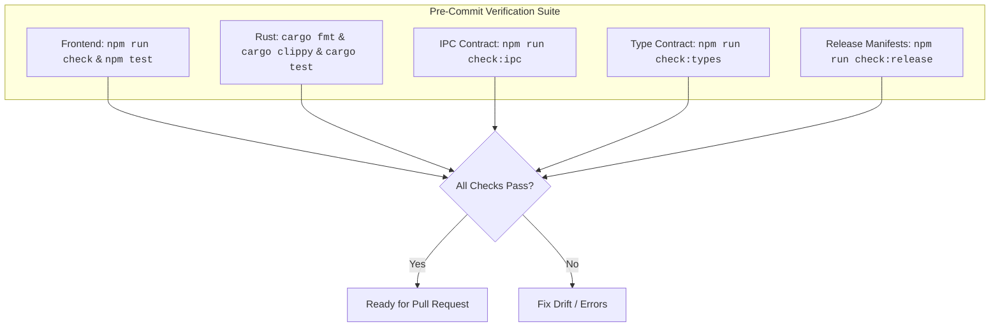

# Contributing to GitPulse

Thank you for contributing to GitPulse! We welcome pull requests, bug reports, and feature proposals.

---

## 1. Development Prerequisites

Ensure you have the following tools installed on your development machine:

- **Node.js**: `22.x` or later (Frontend build tooling)
- **Rust**: `stable` (edition 2021) with `clippy` and `rustfmt` components
- **Git**: Recent version
- **Linux System Dependencies** (Ubuntu/Debian only):
  ```sh
  sudo apt-get install -y libwebkit2gtk-4.1-dev libgtk-3-dev build-essential curl wget file libxdo-dev libssl-dev libayatana-appindicator3-dev librsvg2-dev pkg-config
  ```

---

## 2. Getting Started

Clone the repository and launch the development environment:

```sh
# 1. Clone the repo
git clone https://github.com/bharathvbcr/GitPulse.git
cd GitPulse

# 2. Install frontend dependencies
npm install

# 3. Start Tauri in development mode (hot-reloads Rust & Svelte)
npm run tauri dev
```

> [!NOTE]
> The dev launcher automatically finds a free Vite port (5173, falling back through 5174–5193). Set `GITPULSE_DEV_PORT=<port>` to pin a custom port.

---

## 3. Development & Contract Verification Commands

GitPulse enforces strict contracts between the Rust backend and TypeScript frontend:



| Command | Purpose |
| --- | --- |
| `npm run check` | Runs `svelte-check` and `tsc` type validation |
| `npm test` | Runs the Vitest frontend unit and integration test suite |
| `npm run check:ipc` | Verifies the Rust `cmd_*` registry and frontend `invoke()` calls match with zero untracked orphans |
| `npm run check:types` | Verifies that coverage serde structs in Rust match TypeScript interfaces field-for-field |
| `npm run check:release` | Asserts all version manifests (`package.json`, `tauri.conf.json`, `Cargo.toml`, `Cargo.lock`) are in sync |
| `npm run ci:local` | Executes the complete local CI suite (format, clippy, tests, builds) in one command |
| `cargo clippy --manifest-path src-tauri/Cargo.toml --all-targets -- -D warnings` | Rust linting (warnings treated as errors) |
| `cargo test --manifest-path src-tauri/Cargo.toml` | Rust backend test suite |

---

## 4. Coding Standards

1. **One Canonical Owner**: Do not stand up duplicate registries or utility functions. Use the existing view registry (`src/lib/views/viewRegistry.ts`) and command handlers.
2. **Strict IPC Contracts**: Whenever a new Rust command is added:
   - Implement handler in `src-tauri/src/commands/`.
   - Register it in `src-tauri/src/lib.rs`.
   - Invoke it from the relevant store/component.
   - Run `npm run check:ipc` to confirm zero drift.
3. **Async Hygiene**: Use `createAsyncGuard` for any component-level async operations to avoid race conditions when switching repositories.
4. **No Unchecked Casts**: Avoid `any` or loose casts in TypeScript. Model all IPC payloads with strict types.
5. **Atomic Changes**: Keep PRs focused on one cohesive feature or bugfix.
