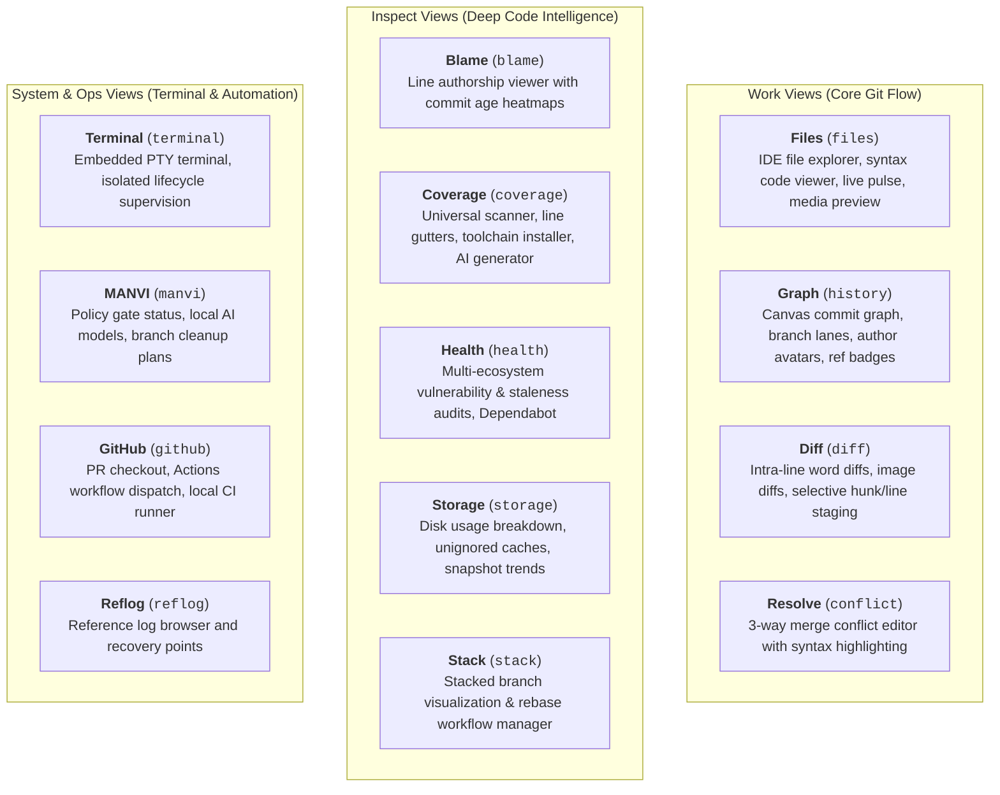

# GitPulse Features & View Catalog

GitPulse provides 13 specialized views categorized into **Work**, **Inspect**, and **System/Ops** groups.



---

## 1. Work Views

### 1.1 Files (`files`)
- **IDE File Explorer**: Recursive directory tree navigation with real-time Git status markers (staged, unstaged, untracked, ignored).
- **Virtualized Code Viewer**: High-performance line-virtualized code viewer supporting tokenized syntax highlighting across 60+ programming languages.
- **In-File Search & Filter**: Search with case-sensitivity toggle (`Aa`), regular expression support (`.*`), match count badges, and keyboard navigation (`Enter` / `Shift+Enter`).
- **Go To Line**: Fast modal overlay to jump directly to any line number (1–N).
- **Line Selection & Range Inspection**: Single-click line selection, shift-click line range highlighting, indentation style detection, and file status bar.
- **Inline Editor**: Instant toggle between read-only syntax viewing and direct in-memory text editing with save feedback.
- **Copy & Formatting Tools**: One-click whole-file or line-range copying with persistent feedback, whitespace character rendering toggle (`·` / `→`), and zoom font scaling (`⌘+` / `⌘-` / `⌘0`).
- **Specialized Media & Binary Previews**:
  - **Markdown / MarkDev**: Rendered document preview with syntax-highlighted code blocks and task lists.
  - **Images & Media**: Visual viewer with dimensions, aspect ratios, and format inspection.
  - **Binary Hex Viewer**: Formatted byte-offset hex dump with ASCII decoded gutters for compiled and binary artifacts.
- **Live Pulse Dashboard**: Uncommitted churn overview, active branch status, and instant staging accelerators.

### 1.2 Graph (`history`)
- **GPU Canvas Rendering**: High-performance commit graph capable of rendering repositories with 100,000+ commits smoothly.
- **Topological Lane Solver**: Rust-powered lane sorting with nogap lookback guarantees to avoid visual discontinuities.
- **Author Avatars & Badges**: Automatic display of author avatars or initials with one-click filter isolation.
- **Branch & Tag Ref Badges**: Visual indicators for local heads, tracking remotes, and release tags.

### 1.3 Diff (`diff`)
- **Intra-Line Word Highlighting**: Pinpoints exact character and token changes within modified lines.
- **Selective Patch Staging**: Stage or unstage individual hunks or selected line ranges directly from the diff view.
- **Image Diffs**: Side-by-side, 2-up, and swipe comparison modes for image assets.

### 1.4 Resolve (`conflict`)
- **3-Way Conflict Editor**: Clear visual distinction between *ours*, *theirs*, and *base* revisions.
- **One-Click Resolution**: Quick actions to accept current, incoming, or combined changes.
- **Marker Navigation**: Jump directly between unresolved conflict markers across changed files.

---

## 2. Inspect Views

### 2.1 Blame (`blame`)
- **Line Authorship Viewer**: Interactive gutter displaying commit author, relative timestamp, and commit SHA for every line.
- **Commit Age Heatmaps**: Visual recency coloration highlighting fresh additions versus mature, historical lines.
- **Commit Navigation**: One-click navigation from any blamed line directly to its full commit diff and history details.

### 2.2 Coverage (`coverage`)
- **Universal Format Scanner**: Discovers coverage reports across all major formats:
  - **LCOV** (`lcov.info`, `coverage.lcov`)
  - **Cobertura XML** (`cobertura.xml`, `coverage.xml`)
  - **Go Cover** (`cover.out`, `profile.out`)
  - **Istanbul / NYC JSON** (`coverage-final.json`, `coverage-summary.json`)
  - **JaCoCo XML** (`jacoco.xml`)
  - **Clover XML** (`clover.xml`)
- **Per-File Line Coverage**: Displays hit counts, uncovered branches, and line gutter markers.
- **Toolchain Installation & Detection**: Automatically detects missing coverage generators (`cargo-llvm-cov`, `pytest-cov`, `vitest`, `nyc`, etc.) and provides 1-click install suggestions.
- **Failure Recovery Hints**: Surfaces actionable diagnostic explanations when test coverage generation fails.
- **Report & Diagnostics Copying**: Persistent copy action to export sanitized coverage metrics directly to your clipboard.
- **MANVI AI Test Generator**: Analyzes coverage gaps and suggests runnable test scripts for Rust, TypeScript/JavaScript, Python, Go, Swift, Dart, Java, etc.

### 2.3 Health (`health`)
- **Multi-Ecosystem Audits**: Automatically detects and scans project manifests:
  - `npm audit` / `npm outdated` (Node.js)
  - `cargo-audit` (Rust)
  - `pip-audit` (Python requirements.txt)
  - `govulncheck` (Go)
  - `composer audit` (PHP)
  - `bundler-audit` (Ruby)
  - GitHub Dependabot alerts (via local `gh` CLI)
- **AI Remediation**: Generates step-by-step upgrade plans with dependency version bump recommendations.

### 2.4 Storage (`storage`)
- **Git Internals Audit**: Analyzes disk usage across packfiles, loose objects, reflogs, LFS assets, and submodules.
- **Build & Cache Auditor**: Detects build directories (`target/`, `node_modules/`, `dist/`, `.venv/`, `.build/`) and unignored cache artifacts.
- **Historical Snapshots**: Records repo size history to plot trend sparklines ("+180 MB this week").

### 2.5 Stack (`stack`)
- **Stacked Branch Management**: Visualizes branch chains and dependencies.
- **Interactive Rebase Helper**: Smooth workflow for updating and rebasing stacked PR branches.

---

## 3. System & Ops Views

### 3.1 Terminal (`terminal`)
- **Embedded PTY**: Native terminal emulator powered by `portable-pty` and `@xterm/xterm`.
- **Strict Isolation**: AI agents and sidecars have zero access to the user terminal PTY or keystrokes.
- **Diagnostic Preservation**: Preserves command output, exit status, and failure context across builds.
- **Lifecycle Supervision**: Clean process lifecycle teardown when closing tabs or switching repositories.

### 3.2 MANVI View (`manvi`)
- **Policy Monitor**: Displays real-time status of the MANVI command and file write gates.
- **Merged Branch Cleanup**: Identifies merged local branches and plans safe deletions without touching active or unmerged heads.
- **Commit Review**: Analyzes outgoing commits before pushing, reporting reviewed vs total counts.
- **Release Publisher**: Preflight checks (clean worktree, synchronized branch) before pushing SemVer tags.

### 3.3 GitHub (`github`) & Local CI
- **PR Management**: List repository PRs with one-click checkout and branch creation.
- **Actions Dispatch**: View workflow runs and manually trigger `workflow_dispatch` events.
- **CI:Local Runner**: Runs full repository CI pipeline locally before pushing commits:
  ```mermaid
  flowchart LR
      Manifests["Detect Manifests<br/>(package.json, Cargo.toml)"] --> Plan["Plan Step Matrix"]
      Plan --> Exec["Sequential Execution<br/>(Svelte Check → Tests → Clippy → Cargo Test)"]
      Exec --> Report["Honest Accounting<br/>(Passed / Failed / Skipped)"]
  ```

### 3.4 Reflog (`reflog`)
- **Reference Log Browser**: Full history of HEAD movements, checkouts, commits, rebases, and resets.
- **Recovery Points**: Instant checkout or branch creation from detached reflog entries to recover discarded commits.

---

## 4. Keyboard Shortcuts Reference

GitPulse provides comprehensive keyboard navigation accelerators across the entire application:

### 4.1 Workspace & Repository Tabs
| Action | macOS | Windows / Linux |
| --- | --- | --- |
| **Open Repository…** | `⌘ O` / `⌘ T` | `Ctrl+O` / `Ctrl+T` |
| **Clone Repository…** | `⌘ ⇧ O` | `Ctrl+Shift+O` |
| **Close Repository Tab** | `⌘ ⇧ W` | `Ctrl+Shift+W` |
| **Reopen Closed Tab** | `⌘ ⇧ Y` | `Ctrl+Shift+Y` |
| **Next Repository Tab** | `Ctrl Tab` | `Ctrl+Tab` |
| **Previous Repository Tab** | `Ctrl ⇧ Tab` | `Ctrl+Shift+Tab` |
| **Jump to Tab 1–9** | `Ctrl ⌥ 1–9` | `Ctrl+Alt+1–9` |
| **Preferences / Settings…** | `⌘ ,` | `Ctrl+,` |

### 4.2 View Switching
| View | macOS | Windows / Linux |
| --- | --- | --- |
| **Files** | `⌘ 1` | `Ctrl+1` |
| **Graph** | `⌘ 2` | `Ctrl+2` |
| **Diff** | `⌘ 3` | `Ctrl+3` |
| **Resolve Conflicts** | `⌘ 4` | `Ctrl+4` |
| **Blame** | `⌘ 5` | `Ctrl+5` |
| **Stack** | `⌘ 6` | `Ctrl+6` |
| **GitHub** | `⌘ 7` | `Ctrl+7` |
| **Coverage** | `⌘ 8` | `Ctrl+8` |
| **Health** | `⌘ 9` | `Ctrl+9` |

### 4.3 Navigation & Search
| Action | macOS | Windows / Linux |
| --- | --- | --- |
| **Command Palette** | `⌘ K` | `Ctrl+K` |
| **Search / Filter Commits** | `⌘ F` | `Ctrl+F` |
| **Shortcuts Cheat Sheet** | `?` or `⌘ /` | `?` or `Ctrl+/` |
| **Zoom In** | `⌘ +` or `⌘ =` | `Ctrl++` or `Ctrl+=` |
| **Zoom Out** | `⌘ -` | `Ctrl+-` |
| **Reset Zoom** | `⌘ 0` | `Ctrl+0` |
| **Toggle Dark / Light Theme** | `⌘ ⇧ T` | `Ctrl+Shift+T` |

### 4.4 Git Operations & Workflow
| Action | macOS | Windows / Linux |
| --- | --- | --- |
| **Refresh Repository** | `⌘ R` | `Ctrl+R` |
| **Fetch from Remote** | `⌘ ⇧ K` | `Ctrl+Shift+K` |
| **Pull from Remote** | `⌘ ⇧ P` | `Ctrl+Shift+P` |
| **Push to Remote** | `⌘ ⇧ U` | `Ctrl+Shift+U` |
| **Quick Commit (Composer)** | `⌘ Enter` | `Ctrl+Enter` |
| **Dismiss Modal / Overlay** | `Esc` | `Esc` |
| **Navigate List Items** | `↑` / `↓` | `↑` / `↓` |
| **Select / Execute Item** | `Enter` | `Enter` |

### 4.5 Command Palette Modes
| Prefix | Mode | Description |
| --- | --- | --- |
| `>` | **Commands** (default) | Run any application action, open views, switch themes, or run audits. |
| `#` | **Jump to Commit** | Instantly search and jump to a commit by SHA prefix or commit message. |
| `@` | **Jump to Branch** | Search local and remote branches and checkout with a single keystroke. |
| `?` | **Help & Shortcuts** | View available keyboard shortcuts and documentation. |
