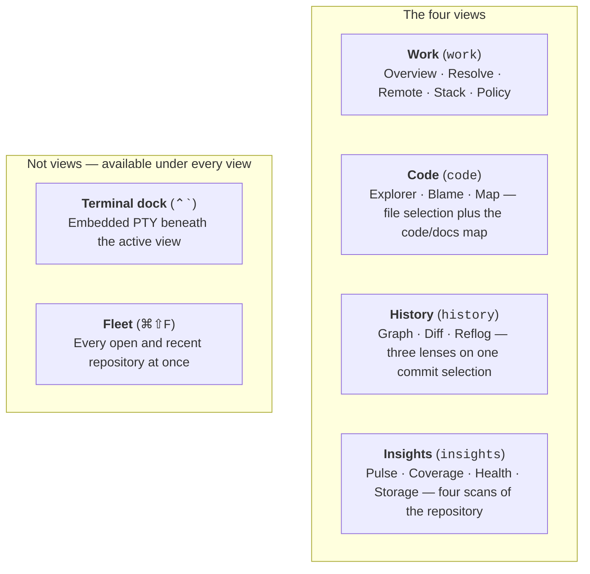

# GitPulse Features & View Catalog

GitPulse provides 4 application views — **Work**, **Code**, **History** and **Insights** — all four of them header tabs. Each holds the lenses on one subject as sections rather than as separate destinations, and the terminal is a dock beneath whichever view is on screen.

On macOS, GitPulse automatically uses [glass surfaces and liquid transitions](MACOS_APPEARANCE.md) over a transparent, desktop-blurring window, with opaque code/diff/graph content and accessibility fallbacks.

The native menu bar contains **GitPulse, File, Edit, View, Go, Repository, Window
and Help**. **Go** opens all 15 sections directly. **View** includes Zoom In,
Zoom Out and Actual Size. **Help** provides documentation, keyboard shortcuts,
diagnostics, optional-tool setup, release notes and issue reporting. Commands
reflect repository availability and running work; checkmarks follow selection
and appearance. Repository menus include staging, branches, parked-operation
actions and copy/reveal/remote utilities. Enable the compact pulse icon in
**Settings → Layout → Menu bar status icon** for a compact popover with repository switching,
changed/staged/conflict cards, last-fetch sync counts, expandable details and
contextual review/recovery actions. Refresh stays in the panel; Open GitPulse
restores the main window. See the [menu inventory](MACOS_MENUS.md).



---

## 1. Work (`work`)

Everything in flight, and the actions that unblock it. Five lenses on the
same worktree row: what is happening, what is stuck, what is on the remote,
how the branches stack, and what policy allows.

### 1.1 Overview

- **One Row Per Place Work Is Happening**: Joins linked worktrees, open pull requests, workflow runs, policy verdicts and grants into one row each. Everything else in GitPulse shows one of these; this shows how they relate.
- **Keyed On What Exists Here**: With a DevCouncil store, the unit is the task. Without one — the ordinary case for a repository driven by Claude Code or by hand — the unit is the **worktree**, because that is where a branch, its uncommitted changes, its parked operation and its pull request actually live. Keying on task regardless collapsed the whole repository into a single row labelled "Not bound to a task".
- **Agent Worktrees Are Named As Such**: A worktree under `/.<agent>/worktrees/` (Claude Code, Cursor, Codex, and any other tool using that layout) is marked, because a stale agent session and a stale hand-made checkout want opposite remedies — resume or merge, versus prune. Detection reads the directory layout, never the branch name, so a human naming a branch `claude/…` is not mislabelled. Git's own `.git/worktrees/` metadata is never labelled an agent session.
- **Blocked Worktrees Sort First**: A worktree parked mid-merge, rebase, cherry-pick or revert is the one thing on the screen that cannot progress without a person, so it outranks rows with more pull requests, and clicking it opens that worktree in the Resolve view.
- **Uncommitted Is Counted, Unscanned Is Not Claimed**: A worktree past the scan cap shows nothing rather than `0`, which would report it as verified clean.
- **Remotes, Submodules And Stash**: Folded in as a collapsed section rather than a separate view — the same repository, reference material rather than work in flight. Remotes can be added, renamed, re-pointed, pruned, or removed; submodules can be initialized, URL-synced, or deinitialized (never force-discarded). A remote, tag, or submodule listing cut by a cap says so, instead of looking complete.
- **Recorded Joins Only**: A worktree is placed on the task the ledger *bound* it to, never on a branch-name coincidence — two worktrees can hold the same branch. Pull requests and runs join through a worktree's branch, because that is the only link GitHub knows about; one matching no worktree stays in the unbound bucket rather than being guessed at. Verdicts and grants carry their own `task_id`, recorded when the gate judged.
- **A Branch on Two Tasks Appears on Both**: Assigning it to one would hide the work from the other with nothing on screen to say so.
- **Where You Are Standing**: A strip above the rows for the checked-out branch itself — tracking state against its upstream, how far behind the default branch it is, and the working tree split into staged, unstaged and conflicted. A branch the progressive branch-stats pass has not reached yet reads *"sync not measured yet"* rather than as `0↑ 0↓`, which is what a pushed, current branch looks like. A parked operation here gets its own line into Resolve, and a probe that could not run says so instead of leaving the same empty space as an idle worktree.
- **The Counts Are Doors**: Each tile in the strip selects exactly the rows it counted, and a filter box matches on branch, path, task and pull request. Strip and list share one predicate, so a tile saying three can never sit above a list showing none of them. A filter matching nothing says so — and offers to clear itself — rather than borrowing the wording of a repository with nothing in flight. Narrowing is dropped on a repository switch.
- **How Long It Has Been Sitting**: Each row carries the age of the most recent commit on its branches. A worktree nobody has touched in three weeks and one from ten minutes ago read identically without it and want opposite things done; a branch the branch list has not measured shows nothing rather than the epoch.
- **Verdict Tally**: Per-row counts of every policy status, with `allowed` folded into the total rather than shown as a chip, so the exceptions are what you see.
- **Unreadable Is Its Own State**: A verdict this build cannot parse is counted as `unreadable`, never as `allowed` — a check that could not be read must never render as one that ran and passed.
- **Incomplete Screens Say So**: Each of the five sources can be present, empty, or unreadable, and a row assembled from an unreadable source looks exactly like one assembled from an empty source. A banner above the rows names what could not be read, and distinguishes "this repository has no DevCouncil store" (ordinary) from "its store could not be opened" (a problem). The absence itself is never the headline: a reader who does not run one is told what *is* here, not what is missing.
- **Shortcut**: `F10`.

### 1.2 Resolve

- **3-Way Conflict Editor**: Clear visual distinction between *ours*, *theirs*, and *base* revisions.
- **One-Click Resolution**: Quick actions to accept current, incoming, or combined changes.
- **Marker Navigation**: Jump directly between unresolved conflict markers across changed files.

### 1.3 Remote & Local CI

- **Two Columns, Not One Ragged Grid**: Pull requests and issues take the wide column because they are what a reader acts on; workflows, the runs they produce, and releases sit together in a CI rail. The five listings used to share one grid whose rows are as tall as their tallest cell, so twenty pull requests left a screen of white space beside a three-line releases card — and Workflows sat a row away from its own runs.
- **PR Management**: List repository PRs with one-click checkout, and a **New pull request** action that opens GitHub's compare form for the current branch onto the default branch.
- **The Queue's Counts Are The Way Into It**: `All / Awaiting review / Failing / Drafts` chips carry their own counts and filter the list, plus a search across number, title and both refs. Chip and list share one predicate. "Failing" means a red verdict only — a run still going and a repository whose checks never start are neither passing nor failing, and neither is folded into the other.
- **Issue List**: Open issues the context already fetched, with `issues_error` shown as a failure rather than an empty list, each carrying when it was last updated, and searchable by number, title, author or label.
- **Actions Dispatch**: View workflow runs and manually trigger `workflow_dispatch` events. Runs carry their age and can be narrowed to the checked-out branch; a run whose timestamp `gh` did not supply carries no age label rather than one dated to the epoch.
- **Fetched, Not Merely Present**: The header stamps how long ago the context on screen was fetched, and a listing hydrated from cache on a repository switch loses the stamp rather than inheriting a fetch that never happened.
- **CI:Local Runner**: Runs the repository CI pipeline locally before pushing commits. When a fresh
  DevMap index can answer, test steps may be scoped to **affected test files** for the change set;
  a stale map, incomplete walk, or unmatched seed **fails closed** to the full suite and says why —
  the run badge never reads "affected tests passed" for a fail-closed full suite:
  ```mermaid
  flowchart LR
      Manifests["Detect Manifests<br/>(package.json, Cargo.toml)"] --> Scope["Affected tests or full suite"]
      Scope --> Plan["Plan Step Matrix"]
      Plan --> Exec["Sequential Execution<br/>(Svelte Check → Tests → Clippy → Cargo Test)"]
      Exec --> Report["Honest Accounting<br/>(Passed / Failed / Skipped · scope named)"]
  ```

### 1.4 Stack

- **The Chain, As A Chain**: The hierarchy renders as a tree — parents above, children indented under them — rather than a flat list with "based on X" on every row, which made the reader rebuild the shape in their head.
- **Each Branch, Joined To What Is Known About It**: How far it is ahead of its parent and behind the default branch, its tracking state (`↑`/`↓`, `upstream gone`, or `untracked` — never `0↑ 0↓` for a branch with no upstream), and when it last moved and by whom.
- **Updating A Stack Cascades**: Rebasing one branch moves every branch above it off the commit it was cut from, so a single restack silently strands the rest of the stack. The action plans the whole subtree from the tree on screen *before* the first rewrite — the last moment those fork points exist — names every branch it will touch in the confirmation, and runs the steps in parent-before-child order. Each step is an independently gated, independently rolled-back rebase; a cascade that stops part-way reports which branches were rebased and which are still on their old base, then reloads so a second attempt cannot plan from a stale tree.
- **Fork Points Are Recorded, Not Recomputed**: Once a parent has been rebased, `merge-base` collapses back to the trunk and would replay the parent's own commits onto the parent. `cmd_restack` accepts the parent tip the stack was read at, refuses one that is not an ancestor of the branch (rather than silently widening the rewrite), and so does not depend on the reflog — which a fresh clone, a bare repository, or `gc.reflogExpire` will not have.
- **What The Hierarchy Cannot See, It Says**: A branch appears as a child only while it sits on its parent's *current* tip. Git records no "cut from" link, so a branch left behind by a rebase of its parent reappears as its own root, not as a stale child — stated on the page, with the local branches the walk placed on no stack listed by name. Otherwise a stack that fell apart reads as a repository that never had one.

### 1.5 Policy (MANVI)

- **Policy Monitor**: Displays real-time status of the MANVI command and file write gates.
- **Merged Branch Cleanup**: Identifies merged local branches and plans safe deletions without touching active or unmerged heads.
- **Commit Review**: Analyzes outgoing commits before pushing, reporting reviewed vs total counts.
- **Release Publisher**: Preflight checks (clean worktree, synchronized branch) before pushing SemVer tags.

---

## 2. Code (`code`)

Three sections under one view. Explorer and Blame are two lenses on one **file**
(`selectedFilePath` survives the switch). Map is the structural navigator over
the DevMap repo map, the code/doc graph, and repository markdown — not a third
reading of the same open file. Sections switch from the segmented control
(`⌥1` / `⌥2` / `⌥3` while Code is active) or by name in the command palette.

### 2.1 Explorer

- **IDE File Explorer**: Recursive directory tree navigation with real-time Git status markers (staged, unstaged, untracked, ignored).
- **Virtualized Code Viewer**: High-performance line-virtualized code viewer. Syntax highlighting has one owner and two backends: MarkDev tree-sitter for rust / JavaScript / TypeScript / Python / JSON / shell, and the existing regex tokenizer for the rest of the supported set.
- **In-File Search & Filter**: Search with case-sensitivity toggle (`Aa`), regular expression support (`.*`), match count badges, and keyboard navigation (`Enter` / `Shift+Enter`).
- **Go To Line**: Fast modal overlay to jump directly to any line number (1–N).
- **Line Selection & Range Inspection**: Single-click line selection, shift-click line range highlighting, indentation style detection, and file status bar.
- **Inline Editor**: Instant toggle between read-only syntax viewing and direct in-memory text editing with save feedback.
- **Copy & Formatting Tools**: One-click whole-file or line-range copying with persistent feedback, whitespace character rendering toggle (`·` / `→`), and zoom font scaling (`⌘+` / `⌘-` / `⌘0`).
- **Specialized Media & Binary Previews**:
  - **Markdown / MarkDev**: Rendered from MarkDev's Rust flat parse model (UTF-16 offsets). Outline, task lists, callouts, tables, validated math / highlight adjacency, and backlinks from the repo docs vault. Commit message bodies and MANVI verdict detail use the same renderer.
  - **Images & Media**: Visual viewer with dimensions, aspect ratios, and format inspection.
  - **Binary Hex Viewer**: Formatted byte-offset hex dump with ASCII decoded gutters for compiled and binary artifacts.
- **Live Pulse Dashboard**: Uncommitted churn overview, active branch status, and instant staging accelerators. The commit composer shows a **what this commit breaks** summary from `devmap preview` over staged paths (shared with the Diff file rail).
- **Language Logo Vector Icons**: High-fidelity vector SVG logos for 34+ programming languages, configuration formats, and markup types rendered across the file tree, tab bar, diff toolbar, and dashboard.
- **Path Hierarchy Formatting**: Dimmed directory hierarchy prefixes with prominent filenames in the sidebar and commit details for scannable navigation.
- **Language mix (status bar)**: Compact segment and popover of repository language shares, ordered by percentage, with programming languages kept on the bar when data files would otherwise crowd them off. The label is the highest-percentage language among what is drawn, not the first programming language. Click a language to filter Code → Explorer.

### 2.2 Blame

- **Line Authorship Viewer**: Interactive gutter displaying commit author, relative timestamp, and commit SHA for every line.
- **Commit Age Heatmaps**: Visual recency coloration highlighting fresh additions versus mature, historical lines.
- **Coverage Gutter**: Per-line hit counts beside the authorship gutter, and an explicit *Coverage unavailable* marker when the lookup fails — a file with no coverage data and a coverage read that failed must not look the same.
- **Commit Navigation**: One-click navigation from any blamed line directly to its full commit diff and history details.
- **Uncommitted Lines Named**: Worktree-only lines carry an all-zero OID and render as `uncommitted` rather than as a link to a commit that does not exist.

### 2.3 Map

- **Repo map navigator**: Reads `.devcouncil/repo_map.json` — subsystems, entry points, critical files, role-file samples with real `role_file_counts`, neighbors / handoff paths, and liveness candidates. Prefer unwired / dead-symbol candidates over `unreachable_files`; ignore unreachable entirely when `liveness_unreachable_unreliable` is set. Every capped list says shown / total / truncated.
- **Code & doc graph canvas**: Renderer-agnostic payloads from DevMap viz / map-preview and the MarkDev doc graph, drawn on the shared canvas stack (not the commit-lane graph). The legend names node caps and truncation rather than implying the picture is the whole graph.
- **Repo docs vault**: Built from `git ls-files` of markdown (git is the authority — no ignored / vendor walk). Full-text search, broken-link report, and backlinks in the markdown viewer. Caps and skips are reported on the status strip.
- **Freshness & build**: Status strip from `devmap status --json` (generation, freshness, `schema_outdated`, coverage gaps). Build / Refresh shell out to the installed `devmap` CLI. Watcher-driven incremental refresh runs when the index is stale, one build per repo at a time.
- **Cross-repo link candidates**: Import-graph candidates across repos registered in DevMap's workspace from open tabs.
- **Honesty**: `walk_incomplete`, schema mismatch, and missing CLI are named. An empty panel with `available: false` is not an all-clear.

---

## 3. History (`history`)

Three lenses on one subject — what happened to this repository — switched by
the segmented control in the view's own header, which also carries the commit
filter. Graph, Diff and Reflog were three top-level tabs; they share
`selectedCommitId`, so switching lens keeps the commit you were looking at.
The split was expensive in a way the code admitted: the Diff tab had to grow
its own commit picker purely so you would not have to walk back to Graph for
the commit you had just selected.

### 3.1 Graph

- **GPU Canvas Rendering**: High-performance commit graph capable of rendering repositories with 100,000+ commits smoothly.
- **Topological Lane Solver**: Rust-powered stable-column lane solving with nogap lookback guarantees to avoid visual discontinuities. The default branch (`main`, or the repository's own default; `origin/main` when it is ahead) is pinned to the leftmost column in one colour for the whole loaded window, so merged feature branches peel off and close back into a straight mainline instead of displacing it. Hovering the rail names the branch it belongs to.
- **Author Avatars & Badges**: Automatic display of author avatars or initials with one-click filter isolation.
- **Branch & Tag Ref Badges**: Visual indicators for local heads, tracking remotes, and release tags. The sidebar tag list names a failed or capped read rather than presenting a partial set as the whole history.
- **Commit Search**: ⌘F (and native Search Commits) focuses the commit filter in History's section bar, which filters all three sections from one walk. From any other view it switches to History first; in Code, ⌘F still searches the open file — in both sections, because Blame's lines are that same file's lines.
- **Filters That Keep The Graph Connected**: Every filter term — `author:`, `sha:`, `type:` or a `fix:`-style prefix, free text, and `path:` — is applied by the backend before lanes are solved. A commit the filter drops hands its lineage to its children, the way `git log --parents -- path` rewrites parents, so the survivors stay connected to their nearest kept ancestors, a survivor with no kept ancestors becomes a root of the filtered view, and the straight main-branch rail stays straight, anchored on the first surviving commit of the default branch's chain. A fading stub therefore always means one thing: the parent is past the loaded window, and the tooltip says so.
- **Cherry-pick & Revert**: Context-menu actions on a commit row replay or invert that commit onto the current branch, parking in the Resolve view if a conflict results.

### 3.2 Diff

- **Identity Read From The Diff**: The header names what the body actually holds — one file by path, or `N files` with the combined `+X −Y` — taken from the patch's own `diff --git` sections rather than from whichever path was last clicked. A commit-wide or worktree-wide diff no longer wears one file's name, icon and line count.
- **True Side-By-Side Split**: Replacement blocks align `del[k]` against `add[k]`, so a three-line rewrite reads across, not down; the longer side spills into rows whose other column is empty, and file/hunk chrome spans both columns instead of leaving one blank. Unified and Split derive from one row model and one intra-line pairing, so the two views cannot disagree about what a change replaced or which words changed.
- **One Horizontal Scroll, Pinned Gutter**: The surface scrolls sideways as a whole with the line-number gutter stuck to the left over an opaque background. Rows used to scroll independently — a scrollbar per line, and the numbers rode away with the code.
- **Both Line Numbers**: Old and new columns, sized to the file's widest number, instead of one column that meant `oldNo` on deletions and `newNo` on additions.
- **Syntax Colouring**: The same dual-backend highlighter the code viewer uses (tree-sitter where MarkDev has a grammar; regex otherwise), composed under the intra-line word diff and the search highlight so all three read at once. Bounded by line length and by diff size, and toggleable.
- **Blast radius & rung filter**: Change-set layered impact by hop (sample size *and* omitted counts). Flat per-file impact offers a min-rung filter and a rung histogram; layered impact and min-rung are never offered together. `walk_incomplete` is shown when the walk stopped early.
- **Pre-commit preview markers**: The file rail shares the commit composer's `devmap preview` batch — per-file markers for broken callers / unreliable preview, not a second query path.
- **Find In Diff**: ⌘F, case and regex toggles, match count, F3 / ⇧F3 stepping, and highlighting that follows the rendered text rather than the raw `+`/`-` column. A pattern whose nesting can backtrack exponentially (`(a+)+`) is refused with a message rather than run — a JavaScript regex cannot be interrupted once it starts.
- **Change Stepping & Sticky Context**: Alt+PgUp/PgDn walk block to block, and a strip above the rows names the file and hunk you are inside once its header has scrolled away.
- **Embedded File Rail & Commit Picker**: Browse changed files and move between recent commits without leaving the section. Rows carry the shortest path suffix that tells them apart (`analyzer/mod.rs` beside `codeintel/mod.rs`), filter as you type, group into a directory tree on request, virtualize past sixty entries, and the rail resizes. Uncommitted changes stay a first-class entry, and history truncation is surfaced rather than passed off as a whole list.
- **A Frame That Survives Empty**: The rail, the toolbars and the file stepper stay put through an empty diff, an image diff and a pending fetch. Each of those used to replace the entire pane, so a clean merge or a `.png` left no way to reach the next file.
- **Precision Word Wrap & Normal-Flow Reflow**: Toggleable word-wrapping that gracefully disables row virtualization (`virtualize={false}`) up to `WRAP_MAX_LINES`, allowing long lines to reflow naturally without clipping or row overlap.
- **Intra-Line Word Highlighting**: Pinpoints exact character and token changes within modified lines.
- **Selective Patch Staging**: Stage or unstage individual hunks or selected line ranges, from either layout. Only the action that applies to this side of the index is offered, and a selection is cleared when the diff text changes underneath it — indices into a replaced patch would stage lines nobody picked.
- **Honest Map**: The minimap projects the list actually on screen (unified lines or split rows), marks each file boundary, shows the viewport band, and centres what you click instead of scrolling past it.
- **Image Diffs**: Side-by-side, 2-up, and swipe comparison modes for image assets, inside the same frame.

### 3.3 Reflog

- **Reference Log Browser**: Full history of HEAD movements, checkouts, commits, rebases, and resets.
- **Recovery Points**: Instant checkout or branch creation from detached reflog entries to recover discarded commits.

---

## 4. Insights (`insights`)

Four scans of one subject — this repository — behind one segmented control.
They were four separate header entries, and every one of them is empty until
someone runs it: over half the Inspect menu costing attention every session
and paying occasionally. They also share a shape, which is the real reason to
gather them: each is an on-demand measurement that must say when it was capped
rather than presenting a floor as a total.

### 4.1 Pulse

- **Contribution heatmap**: 53-week calendar of local-day activity, toggling commit count vs churn. Includes unpushed and all-branch commits. Click a day to filter Graph with `date:YYYY-MM-DD`.
- **Rhythm**: current streak, longest run and longest gap in the last 90 days, plus active-day rate. A bounded history is labelled as such; a gap is never an artifact of where the scan stopped.
- **Punch card**: hour-of-week grid with after-hours share. Defaults to every author on every local and remote branch; an author filter is required before reading it as personal.
- **Line changes and LOC**: weekly additions vs deletions, reconstructed LOC trend from today's language-scan total walking numstat backwards, and churn-by-extension from the same walk. A partial or failed language scan is not shown as `0` LOC.
- **Commit hygiene**: conventional-commit rate (same type set the backend parser accepts), median non-merge churn, signed-commit rate, merge rate, co-author rate from `Co-authored-by:` trailers in the commit body.
- **Hotspot risk**: files ranked by churn × coverage. Unscanned coverage is "unknown", not "untested".
- **Knowledge and age**: blame-bounded bus factor, orphaned files, line-age distribution. Truncation is visible.
- **Local DORA**: deploy frequency and lead time from tags and `git describe --contains`. Change-failure rate and restore time are labelled approximations; a missing estimate is "—" not a invented number.
- **Export card**: a standalone SVG summary of the same window, sized for a README. Every tile carries its own definition rather than a bare label, each caveat sits on the tile it applies to (`CAPPED` commit scan, `PARTIAL` language or blame scan), and a metric whose scan did not run renders as an em dash with the reason — [an unscanned card](assets/screenshot-pulse-card-unscanned.png) and [a single-commit repository](assets/screenshot-pulse-card-solo.png) show both. The commit count and its active days always come from one population, so an author filter cannot leave the card mixing two.
- **Honesty**: payload-budget truncation is data, not an error. Scan Deeper raises the commit cap only when the byte budget was not the limiter. No `.mailmap` is announced, because per-author tiles are otherwise split across emails.

### 4.2 Coverage

- **Universal Format Scanner**: Discovers coverage reports across all major formats:
  - **LCOV** (`lcov.info`, `coverage.lcov`)
  - **Cobertura XML** (`cobertura.xml`, `coverage.xml`)
  - **Go Cover** (`cover.out`, `profile.out`)
  - **Istanbul / NYC JSON** (`coverage-final.json`, `coverage-summary.json`)
  - **JaCoCo XML** (`jacoco.xml`)
  - **Clover XML** (`clover.xml`)
- **Per-File Line Coverage**: Displays hit counts, uncovered branches, and line gutter markers.
- **Toolchain Installation & Detection**: Automatically detects missing coverage generators (`cargo-llvm-cov`, `pytest-cov`, `vitest`, `nyc`, etc.) and provides 1-click install suggestions. Separately, Settings → Agents (and Code → Map / MANVI when missing) can install or update the `devmap` and `manvi` CLIs from a sibling checkout.
- **Failure Recovery Hints**: Surfaces actionable diagnostic explanations when test coverage generation fails.
- **Report & Diagnostics Copying**: Persistent copy action to export sanitized coverage metrics directly to your clipboard.
- **MANVI AI Test Generator**: Analyzes coverage gaps and suggests runnable test scripts for Rust, TypeScript/JavaScript, Python, Go, Swift, Dart, Java, etc.

### 4.3 Health

- **Multi-Ecosystem Audits**: Automatically detects and scans project manifests:
  - `npm audit` / `npm outdated` (Node.js)
  - `cargo-audit` (Rust)
  - `pip-audit` (Python requirements.txt)
  - `govulncheck` (Go)
  - `composer audit` (PHP)
  - `bundler-audit` (Ruby)
  - GitHub Dependabot alerts (via local `gh` CLI)
  - GitHub Code Scanning alerts (CodeQL / GHAS, via the same `gh` CLI)
- **Code map status & dead symbols**: When a DevMap store is present (schema 19), Health surfaces graph availability and budgeted dead-symbol candidates. A query that stopped at its token budget is a floor, not an all-clear; a missing or schema-mismatched map is named rather than shown as empty-and-fine.
- **AI Remediation**: Generates step-by-step upgrade plans with dependency version bump recommendations.

### 4.4 Storage

- **Git Internals Audit**: Analyzes disk usage across packfiles, loose objects, reflogs, LFS assets, and submodules.
- **Build & Cache Auditor**: Detects build directories (`target/`, `node_modules/`, `dist/`, `.venv/`, `.build/`) and unignored cache artifacts.
- **Historical Snapshots**: Records repo size history to plot trend sparklines ("+180 MB this week").
- **Repository Hygiene**: Reviews stale generated output across Rust, Go, Python, JavaScript, JVM, CMake and .NET projects, with retention, activity checks, expiring previews and cancellation. Shared Go/npm/uv/pnpm caches use their owning tools. Weekly cache review is opt in; deletion always requires a reviewed action. See [Repository hygiene](REPOSITORY_HYGIENE.md) for adapters and limits.
- **Global build cleaner**: Fleet and Settings share explicit project roots, exclusions, retention, byte/target limits, opt-in schedules, cancellation and durable history. Closed repositories are discovered beneath selected roots. macOS bundles can opt into a per-user headless background job. Partial scans and unavailable checks refuse cleanup; DevCouncil supplies the portable Rust policy and agent guidance.

---

## 5. Beside the views

Three surfaces that are deliberately **not** views: two live under every
view, and one is scoped to the workspace rather than to a repository.

### 5.1 Terminal — a dock, not a view (`⌃\``)

The terminal is **not** one of the 4 views. It renders as a resizable dock
*beneath* whichever view is on screen, reached with `⌃\``, the status bar's
Terminal chip, the command palette, or **View → Terminal**.

It was a view until the shape gave itself away: a PTY has to survive a view
switch, so the pane was already mounted once and hidden thereafter — a page you
could never leave without closing it. As a dock it is what it always behaved
like, and command output can be read *against* the thing that prompted it: a
Health remediation plan, a failing test, the diff you are about to commit.

- **Embedded PTY**: Native terminal emulator powered by `portable-pty` and `@xterm/xterm`.
- **Strict Isolation**: AI agents and sidecars have zero access to the user terminal PTY or keystrokes.
- **Diagnostic Preservation**: Preserves command output, exit status, and failure context across builds.
- **Lifecycle Supervision**: Clean process lifecycle teardown when closing tabs or switching repositories. Hiding the dock never ends the session — only closing the repository does.
- **Resizable**: Drag the separator or nudge it with `↑`/`↓`; the height is remembered, and clamped so the dock can never grow to swallow the view above it.

### 5.2 Agents (MCP 2.0 / Codex / Agent Plugins 1.0)

- **Protocol**: `gitpulse-mcp` implements [MCP 2026-07-28](https://modelcontextprotocol.io/specification/2026-07-28) — `server/discover`, per-request `_meta`, `resultType` on results, cacheable tool lists. Dual-era: legacy `initialize` (2024-11-05 / 2025-11-25) still works.
- **Package**: one canonical package at `plugins/gitpulse/` — native Codex `.codex-plugin/plugin.json` + `.mcp.json`, Claude Code compatibility files, closed Agent Plugins 1.0 manifests, and one shared `skills/` tree. The Tauri app copies this package into `Contents/Resources/plugin`.
- **Tools**: `gitpulse_insights`, `gitpulse_collision_risk`, `gitpulse_change_context`, `gitpulse_active_changes`, plus ledger, tasks, codeintel, provenance. Read-only.
- **Work view**: insight strip (worktrees, agent sessions, blocked operations) and a collision banner that never treats a failed scan as “no overlap”.
- **Settings**: copies `.codex-plugin/plugin.json` / `.mcp.json` and names the binary path, or why it could not be found.

### 5.3 Fleet — the whole workspace at once (`⌘⇧F`)

Fleet is not a view. Every view in the catalog above answers a question about
*one* repository, is persisted on that repository's session, and lives inside
the pane keyed on the active repository. Fleet answers a question about the
**workspace**, so it sits above the repository tab strip and is reached from
the strip's leftmost chip, the command palette, or **View → Fleet**. Toggling
it hides the repository pane rather than unmounting it, so live terminal
sessions survive and nothing re-hydrates on the way back.

- **One row per repository, open and recent.** Open repositories show live
  state; a repository that is only in your recents list is dimmed, marked *not
  open*, and shows only what its own ledger already recorded — never a live
  number it cannot have.
- **Three tiers, priced honestly.** Changes, sync, conflicts, stash and parked
  operations are already in memory and cost nothing. Worktrees, agent sessions,
  commit rhythm and last activity cost two `git` calls per repository — three
  for one that has been quiet all quarter — and refresh whenever the set of
  open repositories changes. Lines of code, language mix, disk usage,
  dependency audits and coverage cost minutes and **never run on their own** —
  the same opt-in posture as automatic coverage generation and the release
  check.
- **Fleet Pulse.** A collapsible panel above the grid showing the workspace's
  commit rhythm: every open repository's 90-day commit series summed bucket for
  bucket into one chart, the 7-day trend against the 7 days before it, which
  repositories are moving and which have gone silent for the whole window, and
  the fleet's language mix drawn from the cached language scans. Everything in
  it carries what it could not count: a repository whose history failed to read
  is named in the coverage clause rather than flattening the chart, and a
  percentage is never stated against an empty prior period — "5 in 7d, after
  none in the 7 before", never "+100%".
- **Commit statistics per repository.** A sparkline of the last 90 days, the
  window total, and how many of those commits landed in the last 7. Author
  counts and active days ride in the tooltip. A repository nobody has touched
  this quarter renders a measured zero — a real finding — never "not scanned".
- **Language statistics.** The Lines column carries the repository's language
  mix as a proportional bar under its total, and the Pulse panel merges every
  cached breakdown into one fleet mix. Shares are recomputed from summed lines
  rather than averaged: a 200-line all-Rust repository and a 200,000-line
  all-TypeScript one do not make a workspace that is half Rust.
- **Sort, search, and scan one repository.** Any column sorts, and repositories
  with no measurement stay at the bottom in *both* directions — "not scanned"
  is not a low score. The filter box matches name, path, branch and any
  language in the mix, as plain text rather than a pattern. And every "not
  scanned" or "could not read" cell is itself the button that scans just that
  repository for just that column, so filling one gap does not mean re-running
  a sweep across the whole workspace.
- **Every cell has three states, never two.** A measured value, *not scanned*,
  or *could not read* with its reason. A repository nobody has audited shows
  "not scanned", never a reassuring zero; an audit that ran but could not
  finish is marked as a floor, so partial coverage cannot read as a clean bill
  of health.
- **Totals say what they could not count.** "1.50 GB — counted across 14 of
  21, 1 failed, 6 not scanned" rather than a bare number that implies the
  whole workspace. A total covering everything says nothing extra.
- **A verdict is never made over a check that could not run.** A repository
  whose sweep failed is reported *unknown*, never *clean* — but a repository
  with real conflicts stays at conflicts, because unreadability must not
  downgrade a worse problem.
- **Sweeps report what actually happened.** "Scan all" for a family runs at a
  bounded width (two at a time for storage and audits, which walk the tree and
  spawn your package manager) and reports successes, failures and skips
  separately, attributing each failure to the repository and column it
  happened in.
- **Change since the last measurement.** Where the ledger holds an earlier
  reading, a cell carries a small chip saying how far it moved and names the day
  it is measuring from — families are scanned independently, so "since
  yesterday" is often months wrong on the same row. Direction is coloured by the
  column's own goal, not by the sign: fewer vulnerabilities is an improvement,
  less coverage is not, and more lines of code is neither. A first scan shows no
  chip at all, because "unchanged" the first time something is measured is a
  claim about a past nobody observed. The baseline is the previous distinct day
  that family was actually measured; a day nobody scanned has no row, and none
  is interpolated.
- **A rescan never blanks what it is replacing.** A cell being rescanned keeps
  showing its last measurement with a running marker beside it; only the two
  absent states, which have nothing to preserve, are replaced by *scanning*. And
  a *queued* repository is not a scanning one — the marker follows the handful
  actually in flight, so a sweep of twenty-four never claims to be scanning all
  twenty-four at once.
- **Severity bands instead of a filter.** The grid groups itself by severity —
  *Blocked by conflicts*, *Parked mid-operation*, *Uncommitted work* — worst
  first, so "what needs attention" is how the list reads rather than a mode to
  switch into and back out of. The bands only insert boundaries into the
  existing order; the grouped and flat views can never disagree about which
  repository comes first.
- **Columns you can hide, and a notice when hiding costs you something.**
  Every measurable column can be hidden and the grid can be made compact, both
  remembered across restarts. Repository and severity are not on the menu — a
  grid of measurements with nothing to attribute them to is not a smaller grid.
  If a hidden column is concealing a *could not read*, the grid says so by
  column and by count, because letting a failure vanish with its column is the
  same lie as a blank cell, one level up.
- **Bulk and single fetch.** Fetch or pull every open repository at a bounded
  width, or fetch one row from its own control; the single-row path goes through
  the identical skip rules, so a repository with no remote is skipped and said
  to be skipped either way.
- **A commit window you choose.** 30, 90 or 180 days, applied to the whole
  sweep at once. Every repository in a sweep shares one anchor instant, which is
  what makes the per-repository series summable bucket for bucket; a series
  recorded against a different window is counted as mismatched rather than
  silently mis-added.
- **Keyboard.** With focus anywhere in Fleet: `/` jumps to the filter, `s`
  cycles the sort through the columns actually on screen, `p` toggles Pulse, `r`
  refreshes, and `1`–`9` jump to a row. Text fields keep every key — the
  shortcuts never intercept typing — and each one is an accelerator for an
  action that also has a real control.
- **Remove from Fleet (`Delete` / `Backspace` or remove icon).** Any open or
  recent repository can be removed directly from the Fleet grid. Removing an
  open repository closes its tab and drops it from the workspace; removing a
  recent repository purges it from workspace history so stale or moved project
  paths stay clean without lingering.

---

## 6. Keyboard Shortcuts Reference

GitPulse provides comprehensive keyboard navigation accelerators across the entire application:

### 6.1 Workspace & Repository Tabs

| Action | macOS | Windows / Linux |
| --- | --- | --- |
| **Open Repository…** | `⌘ O` / `⌘ T` | `Ctrl+O` / `Ctrl+T` |
| **Clone Repository…** | `⌘ ⇧ O` | `Ctrl+Shift+O` |
| **Close Repository Tab** | `⌘ ⇧ W` | `Ctrl+Shift+W` |
| **Reopen Closed Tab** | `⌘ ⇧ Y` | `Ctrl+Shift+Y` |
| **Next Repository Tab** | `Ctrl Tab` | `Ctrl+Tab` |
| **Previous Repository Tab** | `Ctrl ⇧ Tab` | `Ctrl+Shift+Tab` |
| **Jump to Tab 1–9** | `Ctrl ⌥ 1–9` | `Ctrl+Alt+1–9` |
| **Preferences / Settings…** | `⌘ ,` | `Ctrl+,` |

### 6.2 View Switching

| View | macOS | Windows / Linux |
| --- | --- | --- |
| **Work** | `F10` | `F10` |
| **Code** | `⌘ 1` | `Ctrl+1` |
| **History** | `⌘ 2` | `Ctrl+2` |
| **Insights** | `⌘ 3` | `Ctrl+3` |
| **Fleet** | `⌘ ⇧ F` | `Ctrl+Shift+F` |
| **Terminal dock** | `⌃ \`` | `Ctrl+\`` |

Sections within a view — Code's Explorer / Blame / Map, History's Graph / Diff /
Reflog, Insights' Pulse / Coverage / Health / Storage — are switched by that
view's segmented control (`⌥` + section digit while the view is active),
or by name from the command palette. **Go → view → section** also opens every
section directly, including all five Work sections.

### 6.3 Inside Fleet

These fire while focus is anywhere in the Fleet grid, and never while typing:
a text field keeps every key, and modified or IME-composing keys are left
alone. Each is an accelerator for something that also has a visible control.

| Action | macOS | Windows / Linux |
| --- | --- | --- |
| **Filter repositories** | `/` | `/` |
| **Clear filter, return to grid** | `Esc` | `Esc` |
| **Cycle sort through visible columns** | `s` | `s` |
| **Toggle Fleet Pulse** | `p` | `p` |
| **Refresh the sweep** | `r` | `r` |
| **Jump to row 1–9** | `1`–`9` | `1`–`9` |
| **Remove repository from Fleet** | `Delete` / `⌫` | `Delete` / `Backspace` |

### 6.4 Navigation & Search

| Action | macOS | Windows / Linux |
| --- | --- | --- |
| **Command Palette** | `⌘ K` | `Ctrl+K` |
| **Search / Filter Commits** | `⌘ F` | `Ctrl+F` |
| **Shortcuts Cheat Sheet** | `?` or `⌘ /` | `?` or `Ctrl+/` |
| **Zoom In** | `⌘ +` or `⌘ =` | `Ctrl++` or `Ctrl+=` |
| **Zoom Out** | `⌘ -` | `Ctrl+-` |
| **Reset Zoom** | `⌘ 0` | `Ctrl+0` |
| **Toggle Dark / Light Theme** | `⌘ ⇧ T` | `Ctrl+Shift+T` |

### 6.5 Git Operations & Workflow

| Action | macOS | Windows / Linux |
| --- | --- | --- |
| **Refresh Repository** | `⌘ R` | `Ctrl+R` |
| **Fetch from Remote** | `⌘ ⇧ K` | `Ctrl+Shift+K` |
| **Pull from Remote** | `⌘ ⇧ P` | `Ctrl+Shift+P` |
| **Push to Remote** | `⌘ ⇧ U` | `Ctrl+Shift+U` |
| **Quick Commit (Composer)** | `⌘ Enter` | `Ctrl+Enter` |
| **Dismiss Modal / Overlay** | `Esc` | `Esc` |
| **Navigate List Items** | `↑` / `↓` | `↑` / `↓` |
| **Select / Execute Item** | `Enter` | `Enter` |

### 6.6 Command Palette Modes

| Prefix | Mode | Description |
| --- | --- | --- |
| `>` | **Commands** (default) | Run any application action, open views, switch themes, or run audits. |
| `#` | **Jump to Commit** | Instantly search and jump to a commit by SHA prefix or commit message. |
| `@` | **Jump to Branch** | Search local and remote branches and checkout with a single keystroke. |
| `:` | **Symbols (this repo)** | Search the DevMap symbol index for the active repository. |
| `::` | **Symbols (workspace)** | Cross-repo symbol search over tabs registered in DevMap's workspace. Append `~` for TF-IDF name ranking. Unavailable repos and truncation are named on the result strip. |
| `?` | **Help & Shortcuts** | View available keyboard shortcuts and documentation (including Map / docs tips). |
