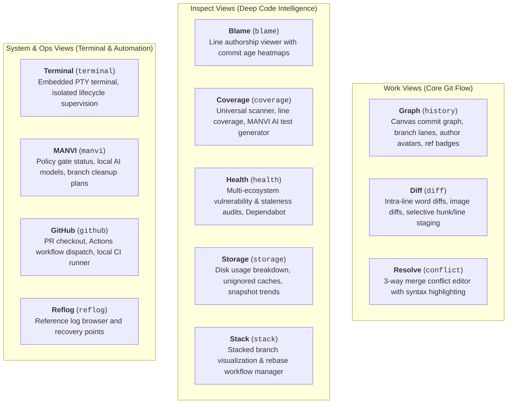

# GitPulse Features & View Catalog

GitPulse provides 12 specialized views categorized into **Work**, **Inspect**, and **System/Ops** groups.



---

## 1. Work Views

### 1.1 Graph (`history`)
- **GPU Canvas Rendering**: High-performance commit graph capable of rendering repositories with 100,000+ commits smoothly.
- **Topological Lane Solver**: Rust-powered lane sorting with nogap lookback guarantees to avoid visual discontinuities.
- **Author Avatars & Badges**: Automatic display of author avatars or initials with one-click filter isolation.
- **Branch & Tag Ref Badges**: Visual indicators for local heads, tracking remotes, and release tags.

### 1.2 Diff (`diff`)
- **Intra-Line Word Highlighting**: Pinpoints exact character and token changes within modified lines.
- **Selective Patch Staging**: Stage or unstage individual hunks or selected line ranges directly from the diff view.
- **Image Diffs**: Side-by-side, 2-up, and swipe comparison modes for image assets.

### 1.3 Resolve (`conflict`)
- **3-Way Conflict Editor**: Clear visual distinction between *ours*, *theirs*, and *base* revisions.
- **One-Click Resolution**: Quick actions to accept current, incoming, or combined changes.
- **Marker Navigation**: Jump directly between unresolved conflict markers across changed files.

---

## 2. Inspect Views

### 2.1 Coverage (`coverage`)
- **Universal Format Scanner**: Discovers coverage reports across all major formats:
  - **LCOV** (`lcov.info`, `coverage.lcov`)
  - **Cobertura XML** (`cobertura.xml`, `coverage.xml`)
  - **Go Cover** (`cover.out`, `profile.out`)
  - **Istanbul / NYC JSON** (`coverage-final.json`, `coverage-summary.json`)
  - **JaCoCo XML** (`jacoco.xml`)
  - **Clover XML** (`clover.xml`)
- **Per-File Line Coverage**: Displays hit counts, uncovered branches, and line gutter markers.
- **MANVI AI Test Generator**: Analyzes coverage gaps and suggests runnable test scripts for Rust, TypeScript/JavaScript, Python, Go, Swift, Dart, Java, etc.

### 2.2 Health (`health`)
- **Multi-Ecosystem Audits**: Automatically detects and scans project manifests:
  - `npm audit` / `npm outdated` (Node.js)
  - `cargo-audit` (Rust)
  - `pip-audit` (Python requirements.txt)
  - `govulncheck` (Go)
  - `composer audit` (PHP)
  - `bundler-audit` (Ruby)
  - GitHub Dependabot alerts (via local `gh` CLI)
- **AI Remediation**: Generates step-by-step upgrade plans with dependency version bump recommendations.

### 2.3 Storage (`storage`)
- **Git Internals Audit**: Analyzes disk usage across packfiles, loose objects, reflogs, LFS assets, and submodules.
- **Build & Cache Auditor**: Detects build directories (`target/`, `node_modules/`, `dist/`, `.venv/`, `.build/`) and unignored cache artifacts.
- **Historical Snapshots**: Records repo size history to plot trend sparklines ("+180 MB this week").

### 2.4 Stack (`stack`)
- **Stacked Branch Management**: Visualizes branch chains and dependencies.
- **Interactive Rebase Helper**: Smooth workflow for updating and rebasing stacked PR branches.

---

## 3. System & Ops Views

### 3.1 Terminal (`terminal`)
- **Embedded PTY**: Native terminal emulator powered by `portable-pty` and `@xterm/xterm`.
- **Strict Isolation**: AI agents and sidecars have zero access to the user terminal PTY or keystrokes.
- **Lifecycle Supervision**: Clean process lifecycle teardown when closing tabs or switching repositories.

### 3.2 MANVI View (`manvi`)
- **Policy Monitor**: Displays real-time status of the MANVI command and file write gates.
- **Merged Branch Cleanup**: Identifies merged local branches and plans safe deletions without touching active or unmerged heads.
- **Commit Review**: Analyzes outgoing commits before pushing, reporting reviewed vs total counts.
- **Release Publisher**: Preflight checks (clean worktree, synchronized branch) before pushing SemVer tags.

### 3.3 GitHub (`github`) & Local CI
- **PR Management**: List repository PRs with one-click checkout and branch creation.
- **Actions Dispatch**: View workflow runs and manually trigger `workflow_dispatch` events.
- **CI:Local Runner**: Runs full repository CI pipeline locally before pushing commits:
  ```mermaid
  flowchart LR
      Manifests["Detect Manifests<br/>(package.json, Cargo.toml)"] --> Plan["Plan Step Matrix"]
      Plan --> Exec["Sequential Execution<br/>(Svelte Check → Tests → Clippy → Cargo Test)"]
      Exec --> Report["Honest Accounting<br/>(Passed / Failed / Skipped)"]
  ```
