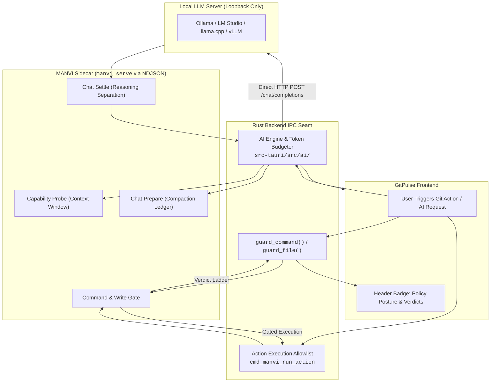
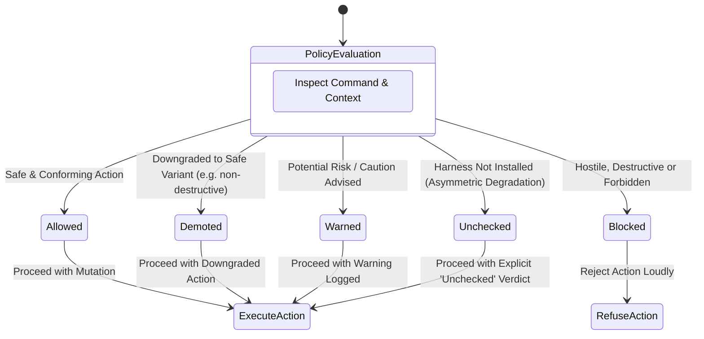
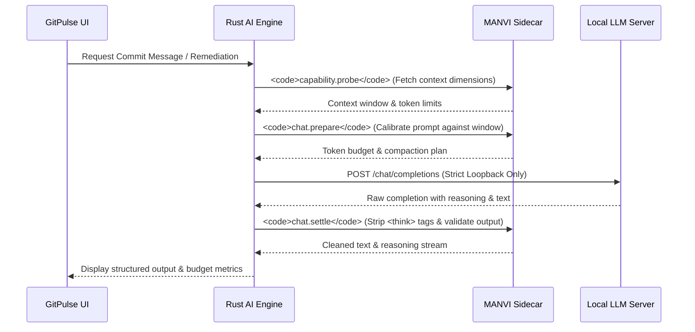
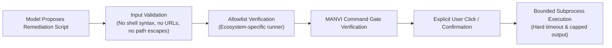

# MANVI Harness & Local AI Integration

GitPulse integrates with the **MANVI coding-agent harness** as an embedded sidecar process (`manvi serve`) communicating over standard I/O via NDJSON.

---

## 1. Policy Verdict Ladder

Every mutating Git operation (commit, push, rebase, branch deletion, worktree prune) passes through the MANVI policy gate. Verdicts fall onto a strict 5-stage ladder:

### Verdict Definitions
- **`Allowed`**: Operation complies with security policy and repo bounds.
- **`Demoted`**: Operation is transformed or downgraded to a safer variant.
- **`Warned`**: Operation proceeds with an explicit advisory logged in the agent activity journal.
- **`Blocked`**: Operation is rejected. Refusal explanation is presented in the UI modal.
- **`Unchecked`**: Harness binary is absent. GitPulse records the verdict explicitly as *unchecked* (never falsely reported as "allowed").

### Asymmetric Degradation Design
- **Missing Harness**: Mutating commands proceed with explicit `unchecked` status.
- **Wedged or Unreachable Harness**: If MANVI is installed but encounters errors or drops connection, mutations are **refused immediately** rather than silently falling back to unchecked execution.

---

## 2. On-Device AI Engine & Budget Planning

GitPulse features on-device AI assistance for commit messages, commit explanations, branch naming, and remediation plans for dependency health and test coverage.

### Self-Calibrating Token Ledger
The AI engine maintains an in-memory token calibration ledger scoped per feature (`commit-message`, `explain-commit`, `branch-name`, `health-fix`, `coverage-report`) and repo path. Observed prompt tokens reported by the local server feed back into the compaction estimator to prevent context-window overflow.

### Loopback-Only Transport Security
All HTTP requests to local model endpoints are hard-coded to loopback interfaces (`127.0.0.1`, `localhost`, `[::1]`). Requests to remote IP addresses or external hostnames are strictly rejected at the transport layer, ensuring diffs and repository context never leave the machine.

---

## 3. Scoped Remediation Allowlist (`cmd_manvi_run_action`)

Remediation scripts proposed by AI for coverage generation or dependency vulnerabilities are executed through a purpose-limited command allowlist:

- **Strict Executables**: Only known ecosystem tools (`npm`, `cargo`, `pip`, `pytest`, `go`, `swift`, `dart`, `mvn`, `gradle`, etc.) are permitted.
- **Direct Argv Only**: Commands are executed directly without spawning an intermediary shell (`sh -c` or `cmd.exe`).
- **Bounded Resources**: Subprocesses enforce strict timeouts (e.g. 60s) and bounded output capture buffers to prevent memory exhaustion.
- **Zero Autonomous Execution**: Nothing runs automatically; each step requires explicit user interaction.
