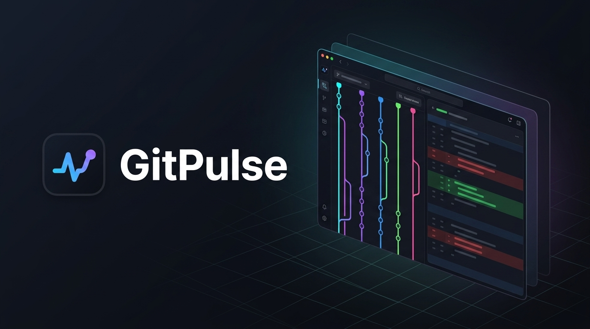

# GitPulse — Social Media & Project Showcase



---

## 🚀 LinkedIn Posts

### Option 1: The High-Impact Launch & Engineering Story (Recommended)

> Most desktop Git clients have a common problem: they consume hundreds of megabytes of RAM, struggle with massive commit histories, leak your repository context to third-party cloud AI APIs, and leave you context-switching between 5 different tools for diffs, merge conflicts, test coverage, and security audits.
>
> That’s why I built **GitPulse** ⚡ — a high-performance, local-first native Git desktop client built from the ground up with **Rust (Tauri 2)** and **Svelte 5**.
>
> 💡 **Why GitPulse?**
>
> 🔹 **Blazing Fast Performance:** Native Rust backend powered by Rayon with a GPU-accelerated HTML5 Canvas commit graph that renders 100,000+ commits at 60/120 FPS with topological lane sorting and nogap lookback guarantees.
> 🔹 **Local-First & Zero Telemetry:** 100% on-device operation. Your source code and git credentials never leave your machine.
> 🔹 **12 Purpose-Built Specialized Views:**
> • **Work:** Canvas commit graph, precision intra-line word diffs, selective line/hunk staging, and a dedicated 3-way merge conflict editor.
> • **Inspect:** Universal test coverage viewer (supporting LCOV, Cobertura, Go cover, Istanbul/NYC, JaCoCo, Clover), multi-language LOC analyzer (60+ languages), repository storage & packfile auditor, and multi-ecosystem vulnerability audits (`cargo-audit`, `npm audit`, `pip-audit`, `govulncheck`, etc.).
> • **System & Ops:** Embedded isolated PTY terminal (`portable-pty`), stacked branch manager, and a 1-click pre-flight `CI:local` matrix runner.
> 🔹 **Safe On-Device AI (MANVI Gate):** Integrated with local LLMs (Ollama, LM Studio, llama.cpp) protected by a 5-stage policy safety ladder (*Allowed*, *Demoted*, *Warned*, *Blocked*, *Unchecked*) and strict command allowlists with asymmetric degradation.
> 🔹 **Zero-Drift IPC Contracts:** 94 native Rust command handlers validated against TypeScript interfaces with strict CI contract checking.
>
> 🛠️ **Tech Stack:** Rust (Tauri 2, Tokio, Rayon) • Svelte 5 (Runes) • TypeScript • Tailwind CSS • Vite
> 
> 📦 Cross-platform builds available for **macOS** (Apple Silicon & Intel), **Linux** (.AppImage, .deb), and **Windows** (.msi, .exe).
>
> The project is completely open source under the MIT License! 🌟
>
> 🔗 **GitHub Repository & Releases:** https://github.com/bharathvbcr/GitPulse
>
> Would love to hear your thoughts, feedback, and feature requests!
>
> #Rust #Svelte #Tauri #Git #OpenSource #DevTools #SoftwareEngineering #WebDevelopment #LocalFirst #AI

---

### Option 2: The Deep-Dive Systems & Frontend Architecture Post

> How do you build a desktop Git client that feels instant on multi-gigabyte repositories with 100K+ commits?
>
> Here is how we engineered the architecture behind **GitPulse** using **Rust (Tauri 2)** and **Svelte 5**:
>
> 1️⃣ **Native Graph Solver + GPU Canvas Pipeline:**
> Rather than rendering heavy DOM nodes for git history, GitPulse computes topological branch lanes and nogap lookback bounds natively in Rust via Rayon. The frontend viewport paints directly to an HTML5 Canvas using batch frame scheduling and author avatar caching.
>
> 2️⃣ **Universal Coverage & Multi-Language Engine:**
> Engineered a zero-config test coverage scanner that parses 6 major industry formats (LCOV, Cobertura XML, Go cover, Istanbul JSON, JaCoCo, and Clover) down to line-level gutter indicators, alongside comment-aware LOC analysis across 60+ programming languages.
>
> 3️⃣ **Type-Safe IPC Contracts & Async Hygiene:**
> With 94 IPC command handlers between Rust and TypeScript, we implemented automated pre-commit and CI verification scripts (`check:ipc` and `check:types`) ensuring Serde structs and TypeScript interfaces match field-for-field. In-flight requests are protected by custom async cancellation guards to eliminate race conditions during rapid repo switching.
>
> 4️⃣ **Safe Local-First AI Harness:**
> Built a sidecar integration with local LLMs (Ollama / LM Studio) guarded by the MANVI 5-verdict policy gate. Every mutating git action is evaluated before execution, failing closed safely if the sidecar connection is compromised.
>
> 5️⃣ **Embedded Isolated Terminal:**
> Built-in native PTY terminal supervision using `portable-pty` and `@xterm/xterm` with clean OS process lifecycle management.
>
> Check out the architecture docs and give it a spin:
> 📂 **Repo:** https://github.com/bharathvbcr/GitPulse
>
> #RustLang #Svelte5 #SystemsProgramming #SoftwareArchitecture #TypeScript #Tauri #DevTools

---

## 📂 LinkedIn Project Profile Section

### **Project Details**
* **Project Name:** GitPulse — High-Performance Local-First Native Git Desktop Client
* **Role:** Creator & Lead Engineer
* **Project URL:** `https://github.com/bharathvbcr/GitPulse`
* **Skills / Technologies:** `Rust`, `Tauri 2`, `Svelte 5`, `TypeScript`, `Git Internals`, `Canvas API`, `Systems Programming`, `Cross-Platform Desktop Apps`, `Local AI / LLMs`, `CI/CD Automation`, `Tailwind CSS`, `Vite`

### **Project Description**

```markdown
Architected and developed GitPulse, an open-source, high-performance native desktop Git client combining a Rust backend (Tauri 2) with a reactive Svelte 5 frontend, designed for zero-latency repository management, deep code intelligence, and privacy-first local workflows.

Key Architectural & Engineering Highlights:
• GPU-Accelerated Commit Graph: Implemented a native Rust topological lane solver using Rayon for parallel commit traversal, paired with an HTML5 Canvas renderer capable of rendering 100,000+ commits at 60/120 FPS with avatar caching and nogap lookback bounds.
• Universal Code Coverage & Multi-Language Analysis: Engineered a cross-ecosystem test coverage engine supporting 6 formats (LCOV, Cobertura, Go cover, Istanbul/NYC, JaCoCo, Clover) with line gutters, alongside comment-aware line-of-code classification for 60+ languages.
• Strict IPC Contracts & Async Hygiene: Designed 94 type-safe IPC command handlers with automated pre-commit contract validation (`check:ipc`, `check:types`) aligning Rust Serde structs with TypeScript interfaces, backed by async cancellation guards.
• Local-First AI & Policy Gate: Integrated on-device LLMs (Ollama, LM Studio) governed by a 5-verdict safety ladder (Allowed, Demoted, Warned, Blocked, Unchecked) with asymmetric degradation and strict action allowlists.
• Comprehensive Suite of 12 Purpose-Built Views: Including 3-way merge conflict resolution, intra-line word diffs, repository storage/hygiene auditing, stacked branch management, embedded native PTY terminal (`portable-pty`), and pre-flight local CI matrix runner (`CI:local`).
• Cross-Platform Delivery: Configured automated GitHub Actions release matrix for macOS (Universal dmg), Linux (.AppImage, .deb), and Windows (.msi, .exe).
```
