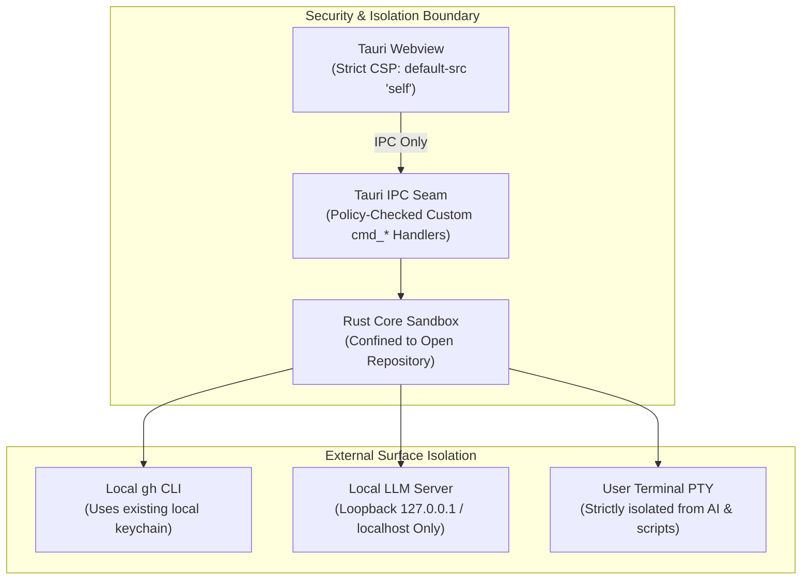

# GitPulse Security Model & Policy

GitPulse is architected from the ground up as a **100% local, zero-telemetry** developer desktop application.

---

## 1. Core Security Guarantees

### Zero Telemetry & No Remote Phoning Home
- GitPulse has no centralized backend or analytics tracking.
- No network requests are made without explicit user action.
- The webview does not load external CDN scripts, styles, or telemetry trackers.

### Local `gh` Credential Safety
- GitPulse never requests, reads, stores, or transmits your GitHub personal access tokens or passwords.
- All GitHub operations (PR inspection, workflow dispatch, Dependabot queries) delegate exclusively to your locally installed and authenticated `gh` CLI.

### Loopback-Only Local AI Transport
- All AI completions and model probing requests are restricted to local loopback addresses (`127.0.0.1`, `localhost`, `[::1]`).
- Any attempt to configure a remote address is rejected at the transport layer, ensuring diffs and file contents never leave your machine.

### Terminal & Process Isolation
- The embedded interactive terminal (`src-tauri/src/terminal/`) runs user shell processes directly via `portable-pty`.
- AI models and the MANVI sidecar have **zero access** to the terminal PTY, its file descriptors, or keystrokes.
- Model-assisted remediation actions (`cmd_manvi_run_action`) are restricted to a strict command allowlist and require explicit user confirmation.

### Webview Content Security Policy (CSP)
The webview operates under a strict CSP configured in `src-tauri/tauri.conf.json`:
- `default-src 'self'`
- `connect-src 'self' ipc: http://ipc.localhost`
- Remote scripts and inline `eval` are strictly disallowed.

---

## 2. Reporting a Vulnerability

If you discover a security vulnerability in GitPulse, please report it via GitHub Security Advisories rather than filing a public issue:

👉 **[Open a Security Advisory](https://github.com/bharathvbcr/GitPulse/security/advisories/new)**

We take security issues seriously and will respond promptly to investigate and patch confirmed vulnerabilities.
