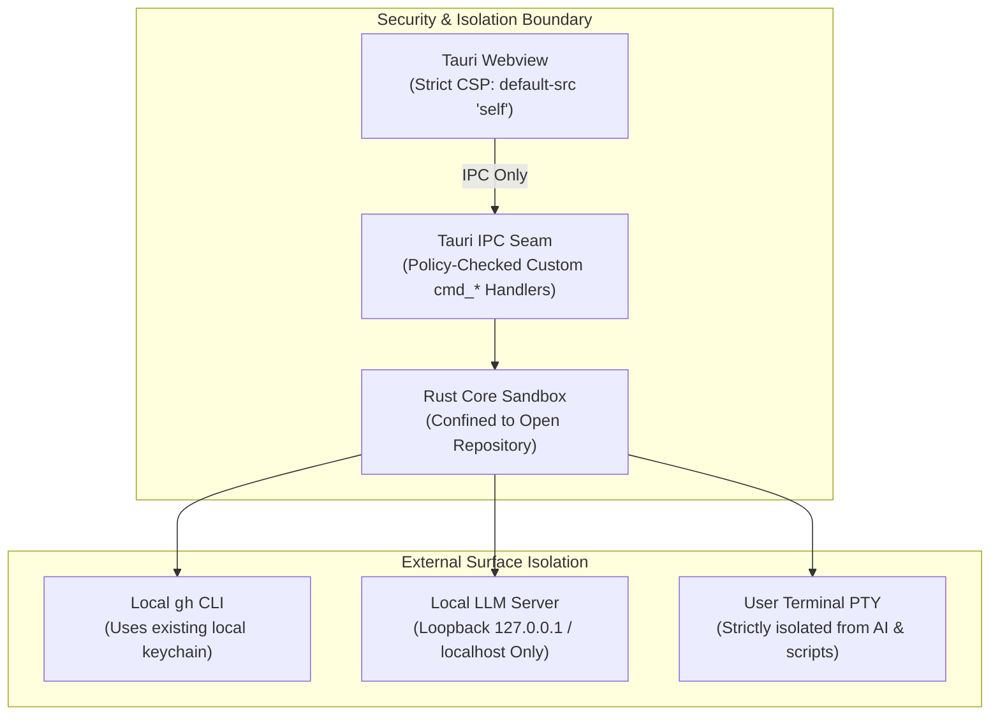

# GitPulse Security Model & Policy

GitPulse is architected from the ground up as a **100% local, zero-telemetry** developer desktop application.



---

## 1. Core Security Guarantees

### Zero Telemetry & No Remote Phoning Home
- GitPulse has no centralized backend or analytics tracking.
- No network requests are made without explicit user action.
- The webview does not load external CDN scripts, styles, or telemetry trackers.

### Local `gh` Credential Safety
- GitPulse never requests, reads, stores, or transmits your GitHub personal access tokens or passwords.
- All GitHub operations (PR inspection, workflow dispatch, Dependabot and code scanning queries) delegate exclusively to your locally installed and authenticated `gh` CLI.

### Loopback-Only Local AI Transport
- All AI completions and model probing requests are restricted to local loopback addresses (`127.0.0.1`, `localhost`, `[::1]`).
- Any attempt to configure a remote address is rejected at the transport layer, ensuring diffs and file contents never leave your machine.

### Terminal & Process Isolation
- The embedded interactive terminal (`src-tauri/src/terminal/`) runs user shell processes directly via `portable-pty`.
- AI models and the MANVI sidecar have **zero access** to the terminal PTY, its file descriptors, or keystrokes.
- Model-assisted remediation actions (`cmd_manvi_run_action`) are restricted to a strict command allowlist and require explicit user confirmation.

### Opt-In Release Checks
- GitPulse does not auto-update and makes zero network checks by default.
- When explicitly enabled under **Settings → Updates**, GitPulse compares public release tags once a day via `git ls-remote` against the upstream repository.
- No user tokens, repository paths, or hardware telemetry are ever sent.
- GitPulse never downloads or installs binaries automatically; checks only notify the user with a direct link to GitHub releases.

### Webview Content Security Policy (CSP)
The webview operates under a strict CSP configured in `src-tauri/tauri.conf.json`:
- `default-src 'self'`
- `connect-src 'self' ipc: http://ipc.localhost`
- Remote scripts and inline `eval` are strictly disallowed.

---

## 2. Reporting a Vulnerability

If you discover a security vulnerability in GitPulse, please report it via GitHub Security Advisories rather than filing a public issue:

👉 **[Open a Security Advisory](https://github.com/bharathvbcr/GitPulse/security/advisories/new)**

We take security issues seriously and will respond promptly to investigate and patch confirmed vulnerabilities.

## 3. Unresolved Dependency Advisory

As of 2026-09-08, **GHSA-wrw7-89jp-8q8g / RUSTSEC-2024-0429 remains
unresolved** in `src-tauri/Cargo.lock` (`glib 0.18.5`). The upstream advisory
describes undefined behavior in `VariantStrIter` and identifies `0.20.0` as the
first fixed version. See the [RustSec advisory](https://rustsec.org/advisories/RUSTSEC-2024-0429.html)
and [upstream fix](https://github.com/gtk-rs/gtk-rs-core/pull/1343).

**Verified:** Tauri's Linux GTK3/WebKitGTK stack resolves `gtk 0.18.2` and
`webkit2gtk 2.0.2`, which require `glib 0.18` and `^0.18.0` respectively.
`0.18.5` is the latest published release on that compatible line. Cargo rejects
the suggested `0.20.0` update with `failed to select a version for the requirement
glib = "^0.18"`. Reproduce without changing the lockfile:

```sh
cargo tree --manifest-path src-tauri/Cargo.toml --locked --target all -i glib@0.18.5
cargo update --manifest-path src-tauri/Cargo.toml -p glib@0.18.5 --precise 0.20.0 --dry-run
```

The Apple Silicon macOS dependency graph has no `glib` edge; this does not clear
the advisory for Linux builds. The [Wry GTK4 port](https://github.com/tauri-apps/wry/pull/1767)
and [Tauri GTK4 port](https://github.com/tauri-apps/tauri/pull/14684) were still
unmerged when checked. A resolution requires either a compatible maintained
backport of the upstream fix or a compatible migration of the parent stack.
Adding `glib 0.20` directly cannot replace GTK3's incompatible dependency.

**Unverified:** reachability of the affected iterator in a running Linux build.
The alert remains open; no advisory suppression or version override is applied.
