# GitPulse Security Model & Policy

GitPulse is a **local-first, zero-telemetry** developer desktop application.
Repository and task state stay in local stores. Git remotes, GitHub operations,
optional tool installation and configured agent providers can use the network.

**Product stack.** DevCouncil is components and modules. Manvi wraps them.
GitPulse uses Manvi for policy, workbench, and agent hosting, and selected
DevCouncil modules for code intelligence. Take or update only the modules this
app needs.

```mermaid
flowchart TD
    subgraph Boundary["Security & Isolation Boundary"]
        Webview["Tauri Webview<br/>(Strict CSP: default-src 'self')"]
        IPCBoundary["Tauri IPC Seam<br/>(Policy-Checked Custom cmd_* Handlers)"]
        LocalEngine["Rust Core<br/>(Validated paths and command gates)"]
        
        Webview -->|IPC Only| IPCBoundary
        IPCBoundary --> LocalEngine
    end

    subgraph ExternalSurfaces["External Surface Isolation"]
        LocalGH["Local <code>gh</code> CLI<br/>(Uses existing local keychain)"]
        LocalAI["Local LLM Server<br/>(Loopback 127.0.0.1 / localhost Only)"]
        PTY["User Shell / Explicit Agent PTYs<br/>(Separate sessions)"]
    end

    LocalEngine --> LocalGH
    LocalEngine --> LocalAI
    LocalEngine --> PTY
    LocalEngine --> ProfileManvi["Profile Manvi Host<br/>(Configured provider / managed runs)"]
```

---

## 1. Core Security Guarantees

### Zero Telemetry & No Remote Phoning Home
- GitPulse has no centralized backend or analytics tracking.
- Network-capable features run through user actions or explicitly enabled settings,
  including scheduled release checks, automatic task suggestions, and the
  default-on GitHub alert scan (Dependabot and code scanning via the local `gh`
  CLI when a repository opens). A failed GitHub check does not toast.
- The webview does not load external CDN scripts, styles, or telemetry trackers.

### Explicit Repository Trust
- Opening a checkout first requires an explicit **Trust and Open** decision.
  Path inspection does not run Git; canceled or failed approval does not start
  watchers, status hydration, dependency scans, or code indexing.
- Trust permits this checkout's Git hooks, helpers, and project tools to run
  with the user's account permissions, including code in submodules. It is an
  execution decision, not an OS sandbox or a claim that the project is safe.
- GitPulse stores remembered grants in its application configuration directory,
  outside repository policy and task files. Grants bind canonical checkout,
  private Git directory, common Git directory, and filesystem identities.
  Replacing the checkout or redirecting a gitfile requires fresh approval.
- Linked worktrees need separate approval. Shared Git-directory discovery is
  filesystem-only; removing a worktree requires trust for the target as well
  as the parent because Git may scan the target internally.
- Native Git, background analysis, DevMap, PTY startup, and MCP reads enforce
  trust. MCP cannot grant it. A refusal is an explicit error or unavailable
  result, never a successful empty scan.
- Global tool probes run from a neutral filesystem root. Local source-tool
  installation requires approval for the checkout used to build the tool.
- Use the repository tab's **Revoke repository trust** action to close the tab
  and block subsequent operations. Already-started terminals and agent tasks
  retain the authority they were given; stop them separately when needed.
- Filesystems that cannot supply a stable creation identity are refused with
  an explanation. Trust decisions are local to this installation and are not
  portable project metadata.

### File Save Boundaries
- Ordinary editor and documentation saves replace file entries atomically
  under pinned, symlink-free parent directories. Saving one hard link does
  not truncate the inode shared by its other names.
- Saves enforce the existing 8 MiB file budget. Nested paths, empty files,
  internal symlinks, and executable permissions remain supported; external
  symlinks and special files are refused.
- macOS metadata copying, Linux ownership and extended-attribute copying,
  and Windows replacement preserve supported file metadata. If preservation
  fails, the save fails rather than silently dropping that metadata. Linux
  saves clear set-id and file-capability privileges as ordinary content writes
  do; metadata work is bounded to 512 attributes and 1 MiB of values.
- Concurrent changes can make a save fail. If a change races publication,
  the error identifies retained recovery content for review. This is not an
  OS sandbox against another process already running with the user's rights.

### Local `gh` Credential Safety
- GitPulse never requests, reads, stores, or transmits your GitHub personal access tokens or passwords.
- All GitHub operations (PR inspection, workflow dispatch, Dependabot and code scanning queries) delegate exclusively to your locally installed and authenticated `gh` CLI.

### Loopback-Only Local AI Transport
- Built-in local AI completions (commit messages, explanations and branch names)
  and local model probes restrict their transport to loopback addresses
  (`127.0.0.1`, `localhost`, `[::1]`); remote base URLs are rejected on that path.
- Task enhancement and agent execution use the separately configured profile Manvi
  provider or agent CLI. Their network and filesystem access follow that provider
  and the selected run settings. The local-completion transport restriction does
  not establish containment for an explicitly launched agent.

### Terminal & Process Isolation
- The embedded interactive terminal (`src-tauri/src/terminal/`) runs user shell processes directly via `portable-pty`.
- Local AI suggestions and the policy sidecar do not read/write ordinary shell
  sessions. Explicit Claude, Manvi, Codex and task launches create dedicated PTY
  sessions; the launched process receives that session's input.
- Terminal handoffs remain user-controlled. Managed Codex runs use the separate
  Manvi configuration/decision protocol. A worktree is not an OS sandbox, and
  native launch validation alone does not prove the provider's effective policy.
  See [Tasks and workspaces](TASKS_AND_WORKSPACES.md) for the verification limits.
- Model-assisted remediation actions (`cmd_manvi_run_action`) are restricted to a strict command allowlist and require explicit user confirmation.

### GitHub Alert Scans
- Opening a repository fetches Dependabot and code scanning alerts through the
  locally authenticated `gh` CLI. This is on by default under **Settings →
  Analysis**. GitPulse still does not read or store GitHub tokens.
- Only critical and high findings raise a warning. A check that could not run
  (missing `gh`, not a GitHub remote, API error) is listed in Health and recorded
  in diagnostics, never presented as an all-clear.
- **Scan local** on the Health panel does not call GitHub. The **Check GitHub
  alerts** button remains a manual refresh.

### Opt-In Release Checks
- Automatic application release checks are off by default; GitPulse does not
  automatically install application updates.
- When explicitly enabled under **Settings → Updates**, GitPulse compares public release tags once a day via `git ls-remote` against the upstream repository.
- No user tokens, repository paths, or hardware telemetry are ever sent.
- Release checks only notify with a link to GitHub releases. Optional-tool setup
  is a separate, explicitly requested install/update workflow.

### Webview Content Security Policy (CSP)
The webview operates under a strict CSP configured in `src-tauri/tauri.conf.json`:
- `default-src 'self'`
- `connect-src 'self' ipc: http://ipc.localhost`
- Remote scripts and inline `eval` are strictly disallowed.

---

## 2. Reporting a Vulnerability

If you discover a security vulnerability in GitPulse, please report it via GitHub Security Advisories rather than filing a public issue:

👉 **[Open a Security Advisory](https://github.com/bharathvbcr/GitPulse/security/advisories/new)**

We take security issues seriously and will respond promptly to investigate and patch confirmed vulnerabilities.

## 3. Dependency Advisory Status

The September 2026 GTK migration replaced the old `glib 0.18.5` dependency
with `glib 0.22.9`; the previous unresolved RUSTSEC-2024-0429 note no longer
matches the lockfile. The maintained GTK consumer patches and their validation
are documented in [Dependency Health](DEPENDENCY_HEALTH.md).

On 2026-09-12, the pinned revision `ac84b24` passed `cargo audit --deny warnings`
for 550 Rust dependencies and `npm audit` for 175 npm dependencies, with no
reported advisories. These are dated advisory-database checks, not exhaustive
source or runtime security verification. Re-run both checks for a release.
