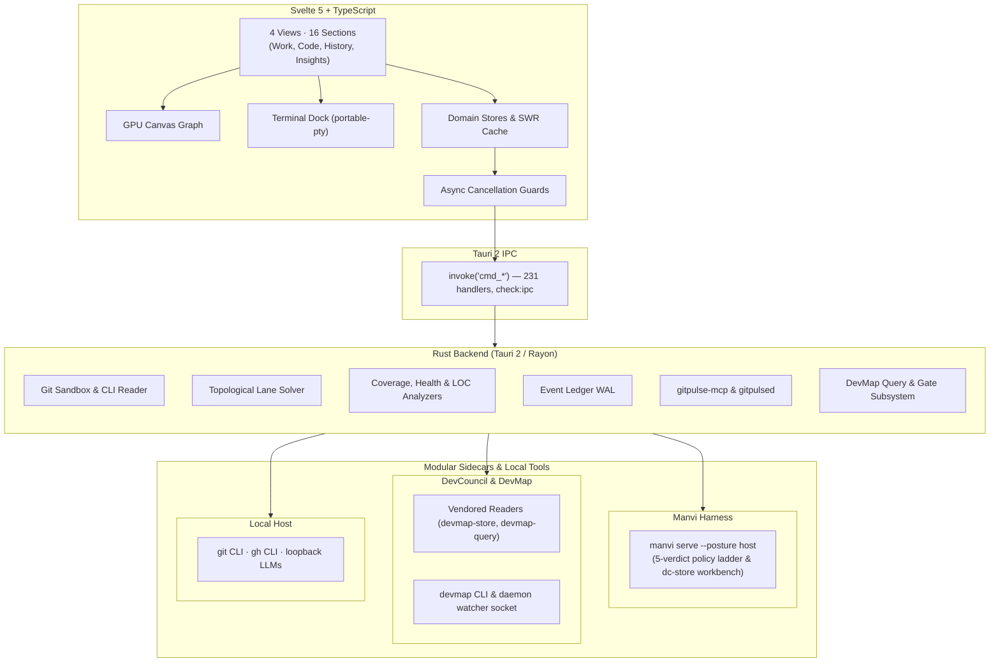
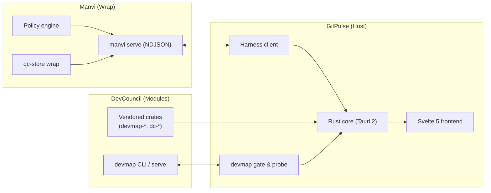

# Architecture

GitPulse is a Tauri 2 desktop app: **Rust owns privileged work**, **Svelte 5 owns rendering**, and they meet at one machine-checked seam: `invoke("cmd_*")`.

**Product stack.** DevCouncil is components and modules. Manvi wraps them. GitPulse uses Manvi (`manvi serve`) for policy, workbench, and agent hosting, and selected DevCouncil crates plus the `devmap` CLI for code intelligence. See [Module integration](https://github.com/bharathvbcr/GitPulse/blob/main/docs/MODULE_INTEGRATION.md).



The 231-handler count is the registered `tauri::generate_handler!` list in `src-tauri/src/lib.rs`, enforced by `npm run check:ipc`.

## Layout

```
GitPulse/
├── src/                  Svelte 5 + TypeScript
│   ├── lib/stores/       repo, graph, filter, theme, …
│   ├── lib/components/   UI
│   ├── lib/canvas/       commit-graph renderer
│   ├── lib/views/        routerless view registry (4 views)
│   └── lib/<domain>/     pure logic: files, diff, coverage, health, …
└── src-tauri/src/        Rust core
    ├── commands/         the only IPC entry points
    ├── engine/           git reader/writer, worktrees, sandbox
    ├── graph/            lanes, mainline pin, filter simplification
    ├── analyzer/         languages, LOC, coverage, deps
    ├── harness/          MANVI policy gate
    ├── mcp/              read-only MCP surface
    ├── ledger/           durable WAL
    └── bin/              gitpulse-mcp, gitpulsed, gitpulse-hook
```

There is no virtual-DOM router. View ids are the `ViewTab` union in `src/lib/repos/persist.ts`, registered in `src/lib/views/viewRegistry.ts`, rendered from `App.svelte`. Adding a view means changing all three.

## Why Fleet is not a view

A `ViewTab` is stored on the **active repository's** session and its pane lives inside `{#key currentPath}`. Fleet answers a question about the **workspace**. If it were a view it would be scoped wrong and destroyed on every repo switch — taking the live terminal PTY with it.

Fleet is swapped by **hiding, never unmounting**. Open state is a UI preference, not part of the persisted workspace blob.

## DevCouncil, Manvi, and DevMap integration

DevCouncil supplies components and modules, Manvi wraps them, and GitPulse integrates them through in-process readers, the CLI, and a background sidecar.



## Headless binaries

| Binary | Transport | Role |
| --- | --- | --- |
| `gitpulse-mcp` | MCP JSON-RPC over stdio | **Read** the control plane. Never mutates git. |
| `gitpulsed` | NDJSON, interval loop | **Write** attribution catch-up into the ledger when the GUI is closed. Serves no requests and never takes a lease. |
| `gitpulse-hook` | Host hook JSON on stdin/stdout | Agent hook dispatcher; failures report no decision and leave host permissions in control. |

```sh
gitpulsed --interval 300 /path/to/repo
```

Catch-up is idempotent against a ledger watermark; interrupting a cycle is safe.

## Profile tasks and workspaces

Global, saved-workspace and repository boards share Manvi-owned task records.
`cmd_workbench_request` bounds requests and runs storage off the UI thread; the
`dc-store` workbench API owns schema, revisions, membership and receipts. These
records are separate from read-only repository execution tasks and leases.

Saved briefs bind revisions. Task editor copying distinguishes saved records from
new unsaved drafts, and Manvi title/description proposals need selected acceptance.
Terminal handoffs and managed runs retain separate permission and lifecycle
contracts. See [Tasks and workspaces](https://github.com/bharathvbcr/GitPulse/blob/main/docs/TASKS_AND_WORKSPACES.md).

## Vendored crates

DevCouncil (`dc-*`, `devmap-*`) and MarkDev (`markdev`) crates are copied into `src-tauri/vendored/` so a lone GitPulse checkout builds. Manvi is the wrap around those components at runtime (`manvi serve`), not a vendor origin. Do not edit those copies. Fix upstream, then `npm run vendor`. `npm run vendor:check` reports an upstream that is not checked out as **unavailable**, never **matches**. `npm run check:vendor-schema` pins the vendored store schema against the installed `devmap` CLI when present.

## Contracts

The IPC, serde field, version-manifest, coverage-floor, and a large set of drift tests under `scripts/` exist because types alone cannot see a renamed event, a gate that does not wrap a writer, or a count in the docs that no longer matches the code.

Canonical write-up: [docs/ARCHITECTURE.md](https://github.com/bharathvbcr/GitPulse/blob/main/docs/ARCHITECTURE.md) and [[Development]].
