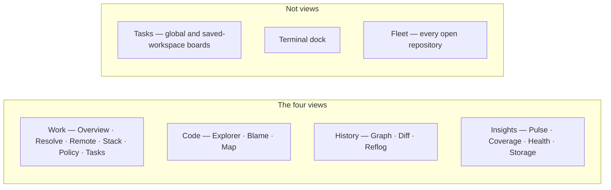

# GitPulse Wiki

**GitPulse** is a high-performance, local-first Git desktop client. A native Rust backend (Tauri 2) owns every privileged operation; a Svelte 5 frontend renders the graph, diffs, and audits. Nothing is sent to a GitPulse server — there isn't one.

[Website](https://gitpulse.vbcr.dev/) · [Releases](https://github.com/bharathvbcr/GitPulse/releases) · [Repository](https://github.com/bharathvbcr/GitPulse)

## Start here

| I want to… | Go to |
| --- | --- |
| Install a pre-built app | [[Installation]] |
| Open a repository and find my way around | [[Getting Started]] |
| Understand the four views | [[Views]] |
| Organize tasks and saved workspaces | [Tasks and workspaces](https://github.com/bharathvbcr/GitPulse/blob/main/docs/TASKS_AND_WORKSPACES.md) |
| Look up a shortcut | [[Keyboard Shortcuts]] |
| Connect an agent (MCP) | [[MCP and Agents]] |
| Contribute or build from source | [[Development]] |
| Understand the security model | [[Security]] |

## How the app is organized

Four **views**, each a header tab. Sections inside a view are lenses on the same subject — switching Graph → Diff keeps the commit you selected.

**Fleet** (`Command/Ctrl+Shift+F`), **Tasks** and the **terminal dock** (`Ctrl+\``) are not views. Fleet is workspace-scoped; the terminal survives view switches because it is a dock, not a page.

## Design rules you will see on screen

GitPulse refuses to present a missing measurement as a clean result:

- A worktree that was not scanned does not show `0` dirty files.
- A coverage or audit cell is a **value**, **not scanned**, or **could not read** — never a reassuring zero.
- A policy check that could not run is **unchecked**, never **allowed**.
- Totals name what they could not count.

## In-repo documentation

This wiki is the GitHub-facing guide. Longer technical write-ups live in the repository:

- [README](https://github.com/bharathvbcr/GitPulse/blob/main/README.md)
- [Architecture](https://github.com/bharathvbcr/GitPulse/blob/main/docs/ARCHITECTURE.md)
- [Tasks and workspaces](https://github.com/bharathvbcr/GitPulse/blob/main/docs/TASKS_AND_WORKSPACES.md)
- [Features catalog](https://github.com/bharathvbcr/GitPulse/blob/main/docs/FEATURES.md)
- [Contributing](https://github.com/bharathvbcr/GitPulse/blob/main/CONTRIBUTING.md)
- [Security](https://github.com/bharathvbcr/GitPulse/blob/main/docs/SECURITY.md)
- [Changelog](https://github.com/bharathvbcr/GitPulse/blob/main/CHANGELOG.md)
