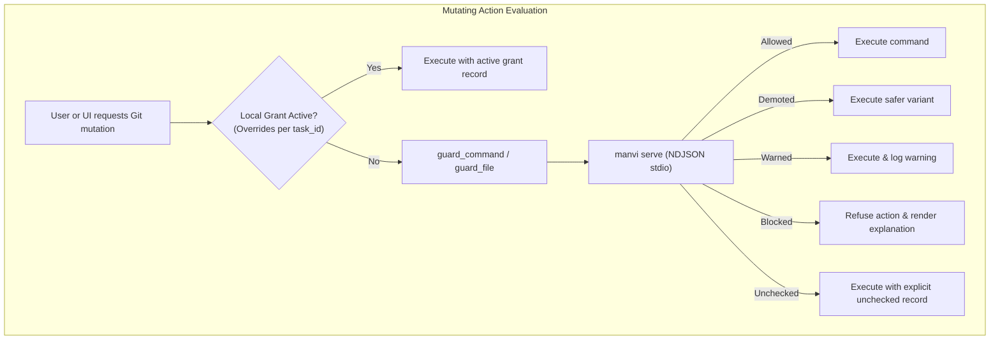
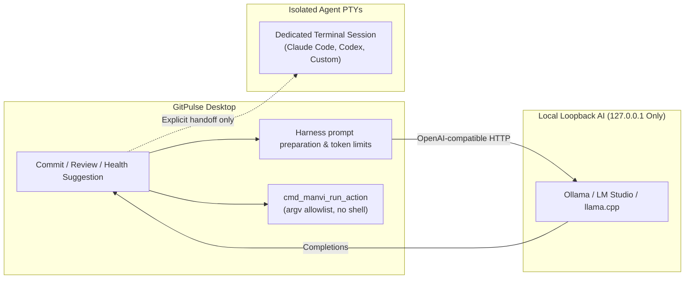

# Policy and AI

Mutating Git (commit, push, rebase, branch delete, worktree prune, …) is evaluated by the **Manvi** wrap of DevCouncil policy when it is running. GitPulse talks to `manvi serve` over stdio (NDJSON). Code intelligence uses DevCouncil's `devmap` module directly and is not the same sidecar.

## Verdict ladder

| Verdict | Meaning |
| --- | --- |
| **Allowed** | Conforms to policy and repo bounds |
| **Demoted** | Transformed to a safer variant, then executed |
| **Warned** | Proceeds; advisory recorded |
| **Blocked** | Rejected; the UI explains why |
| **Unchecked** | Harness missing or that rung could not run. Recorded as unchecked — **never reported as allowed** |

Asymmetric degradation: a wedged sidecar fails closed in the sense that the UI does not pretend the gate passed. Work → Policy shows posture and recent verdicts.

## Local AI

Completions (commit messages, commit explanations, branch names, health/coverage suggestions) go to a **loopback** OpenAI-compatible server: Ollama, LM Studio, llama.cpp, vLLM. Remote URLs are rejected.

Commit messages are classified in the app directly from the staged patch into a structured brief (type, scope, subject). When no loopback model is active, supported Macs can use on-device Apple Intelligence to phrase the subject from the classified brief (without sending the raw patch). If Apple Intelligence is unavailable or the subject fails validation, GitPulse falls back to the deterministic patch-based draft. See [[Security]].

Suggested remediation scripts run only through `cmd_manvi_run_action`: a purpose-limited argv allowlist (npm, cargo, pytest, go, swift, dart, …), no shell string, explicit confirmation, hard timeout and capped output.

Ordinary shell sessions are outside this remediation path. Local AI suggestions
and the policy sidecar do not read/write them. Explicit agent launchers and saved
task handoffs start dedicated CLI sessions in the terminal dock, under those
providers' permissions. Managed runs (Codex and Claude Code) use a separate Manvi protocol.

Task title/description suggestions use the profile Manvi provider/model, are bound
to saved revisions, respect field locks and require selected acceptance. See
[Tasks and workspaces](https://github.com/bharathvbcr/GitPulse/blob/main/docs/TASKS_AND_WORKSPACES.md).

## Grants

Temporary overrides are first-class and recorded. The Work view joins verdicts and grants by the `task_id` written when the gate judged — not by guessing from a branch name.

Longer write-up: [policy and AI features](https://github.com/bharathvbcr/GitPulse/blob/main/docs/FEATURES.md).
