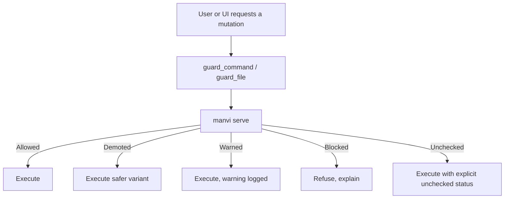

# Policy and AI

Mutating Git (commit, push, rebase, branch delete, worktree prune, …) is evaluated by the **MANVI** harness when it is running. GitPulse talks to `manvi serve` over stdio (NDJSON).

## Verdict ladder

| Verdict | Meaning |
| --- | --- |
| **Allowed** | Conforms to policy and repo bounds |
| **Demoted** | Transformed to a safer variant, then executed |
| **Warned** | Proceeds; advisory recorded |
| **Blocked** | Rejected; the UI explains why |
| **Unchecked** | Harness missing or that rung could not run. Recorded as unchecked — **never reported as allowed** |

Asymmetric degradation: a wedged sidecar fails closed in the sense that the UI does not pretend the gate passed. Work → Policy shows posture and recent verdicts.

## Local AI

Completions (commit messages, commit explanations, branch names, health/coverage suggestions) go to a **loopback** OpenAI-compatible server: Ollama, LM Studio, llama.cpp, vLLM. Remote URLs are rejected. See [[Security]].

Suggested remediation scripts run only through `cmd_manvi_run_action`: a purpose-limited argv allowlist (npm, cargo, pytest, go, swift, dart, …), no shell string, explicit confirmation, hard timeout and capped output.

The terminal PTY is not on this path. Models cannot read keystrokes or inject into the dock.

## Grants

Temporary overrides are first-class and recorded. The Work view joins verdicts and grants by the `task_id` written when the gate judged — not by guessing from a branch name.

Longer write-up: [docs/MANVI.md](https://github.com/bharathvbcr/GitPulse/blob/main/docs/MANVI.md).
