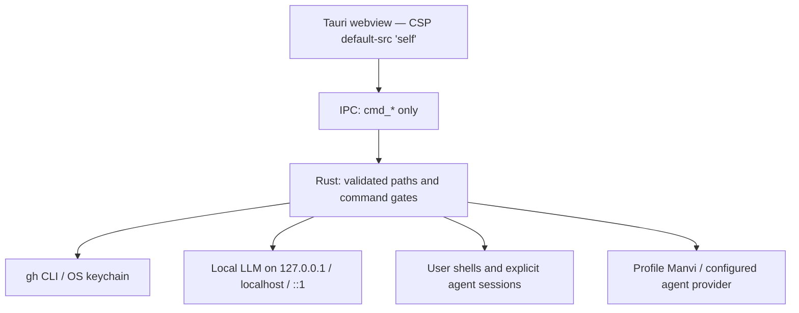

# Security

GitPulse is a **local-first, zero-telemetry** desktop app. It has no GitPulse backend and no analytics.

## Guarantees

**No remote phoning home.** Network-capable features follow user actions or opt-in settings, including scheduled release checks, automatic task suggestions, and the default-on GitHub alert scan. The webview does not load CDN scripts or trackers.

**GitHub credentials.** GitPulse never requests, reads, stores, or transmits GitHub tokens. PR / Actions / Dependabot / code scanning features delegate to the `gh` CLI you already authenticated. Dependabot and code scanning alerts are fetched when a repository opens (Settings → Analysis; on by default). Critical and high findings warn; a check that did not run is not an all-clear.

**Local AI transport.** Built-in local completions and model probes reject remote base URLs. Profile Manvi task suggestions and explicitly launched agents use their configured provider and run settings; the loopback restriction does not apply to those separate execution paths.

**Terminal sessions.** Local AI suggestions and the policy sidecar do not read/write ordinary shells. Explicit agent launchers and task handoffs start dedicated PTY sessions under the provider's permissions. Worktrees are not OS sandboxes. Remediation actions (`cmd_manvi_run_action`) use a command allowlist and require confirmation. See [Tasks and workspaces](https://github.com/bharathvbcr/GitPulse/blob/main/docs/TASKS_AND_WORKSPACES.md).

**Opt-in release checks.** Off by default. When enabled: `git ls-remote` against public tags, at most once a day. No tokens, repo paths, or hardware telemetry. Never downloads an installer.

**CSP** (from `src-tauri/tauri.conf.json`): `default-src 'self'`; `connect-src 'self' ipc: http://ipc.localhost`. Remote scripts and `eval` are disallowed.

**Policy fail-closed.** A missing MANVI harness yields **unchecked**, not **allowed**. A check that could not run must never look like a check that passed. See [[Policy and AI]].

**MCP is read-only.** `gitpulse-mcp` does not checkout, write files, or take leases. See [[MCP and Agents]].

## Reporting a vulnerability

Do not open a public issue.

**[Open a GitHub Security Advisory](https://github.com/bharathvbcr/GitPulse/security/advisories/new)**

Full policy: [docs/SECURITY.md](https://github.com/bharathvbcr/GitPulse/blob/main/docs/SECURITY.md).
